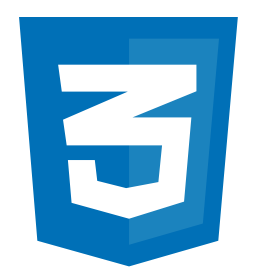

> Create experiences. Not just apps.

# What is Divblox?

Divblox is a full stack web and mobile app development framework that allows anyone, from designers and analysts, to hard core developers, to collaborate and create amazing experiences in no time.

With Divblox you can build progressive web apps that can also seemlessly be converted to native mobile apps, all with ONE code base.

# Core Ingredients

> Front End

> Back End

&nbsp;&nbsp;
 &nbsp;&nbsp;
 &nbsp;&nbsp;

 

Check out the [getting started](getting-started.md) section.
OIEnbweoihwefoih weoifh woiefj wef
ewf
