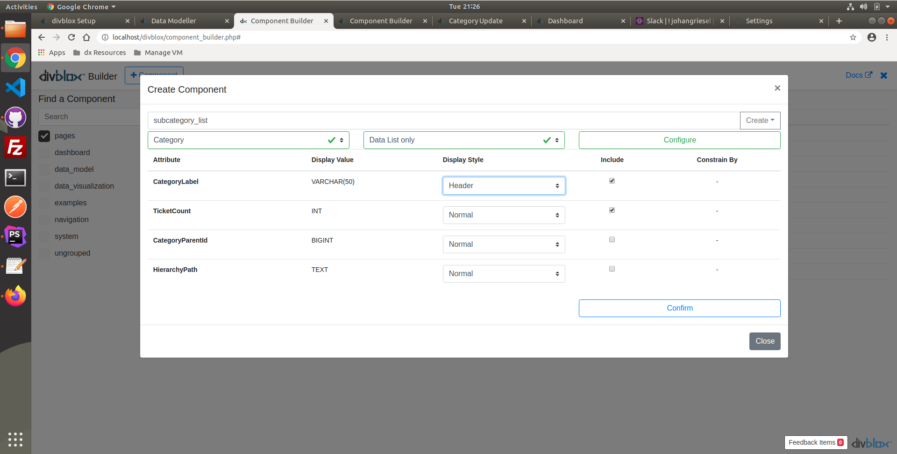
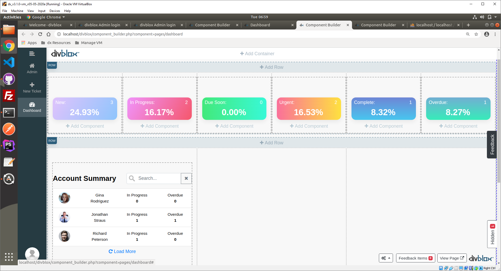
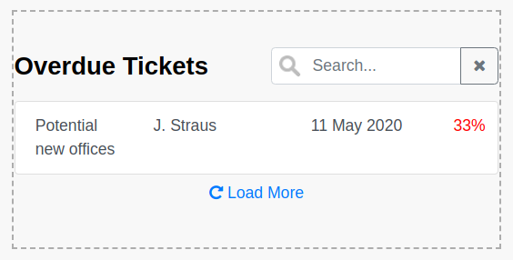

# Advanced Training Exercise

### Introduction

In this exercise we will be continuing with the example established in the basic training exercise.
Specifically, we will be extending the basic exercise functionality with the following:

-   Categories will now have the ability to have sub-categories using a self reference
-   We will add the ability to add notes and file attachments to tickets to understand how the default file uploader works and how it can be customized
-   We will allow for tickets to have sub tasks. These sub tasks will enable the ability to track a ticket's progress.
-   We will build a dashboard that will give us a nice overview of our tickets and their progress.

The new data model we will be making is as follows:


As you can see, the data model is starting to look more complicated. Let's break this down:

-   Adding the `Note` entity:
    -   A note needs to be attached to a `Ticket`, and may have an attachment (linked to the `FileDocument` entity)
    -   The attributes in the `Note` entity are NoteDescription and NoteCreatedDate
-   Adding the `SubTask` entity:
    -   Each ticket can have many subtasks
    -   The attributes in the `SubTask` entity are Description, SubTaskStatus and SubTaskDueDate.
    -   SubTaskStatus will have the same drop down as TicketStatus
-   Updating the `Category` entity:
    -   Add the attributes CategoryParentId and HierarchyPath.
    -   This is done in order to allow for self referencing, where each category can have many subcategories.
    -   The added attributes allow for relative and absolute identification of the category relationships.

### Category Functionality

Let us begin with the changes to the `Category` entity. As seen in the new data model, we have added new attributes.
Our old CRUD components will not reflect the changes unless we add them manually (or create new CRUD components).

In our case, this will not even be necassary as the attributes added need to be defined by the programmer.
We want the CategoryParentId to be assigned automatically, depending on what category we were in when we clicked '+ Category'.
Similarly with the HierarchyPath, we want this to be automatically generated for each category based on the trail of parent IDs.
This HierarchyPath value will be used in the frontend to indicate the actual category, including its entire hierarchy, for the ticket.


In the 'category_crud_create' component we can immediately add the code to auto-populate the two new attributes accordingly.
In the javascript component.js file, we override the `saveEntity()` function to NOT set the global constrain ID to the current one. This is because we want to keep the constrainID we initially started with in that variable. The rest of the code is default Divblox functionality.

```js
saveEntity() {
    let current_component_obj = this.updateValues();
    this.resetValidation();
    if (!this.validateEntity()) {
        return;
    }

    // The parameter object we will send to the backend via dxRequestInternal()
    let parameters_obj = {
        f: "saveObjectData",
        ObjectData: JSON.stringify(current_component_obj),
        Id: this.getLoadArgument("entity_id")
    };

    // Checks if the component is constrained by an entity and subsequently honours the constraint
    if (this.constrain_by_array.length > 0) {
        this.constrain_by_array.forEach(function (relationship) {
            parameters_obj['Constraining' + relationship + 'Id'] = getGlobalConstrainById(relationship);
        })
    }

    // Communication to the backend
    dxRequestInternal(
        getComponentControllerPath(this),
        parameters_obj,
        function (data_obj) {
            if (this.getLoadArgument("entity_id") != null) {
                // THIS LINE IS REMOVED
                // setGlobalConstrainById(this.entity_name, data_obj.Id);
                pageEventTriggered(this.lowercase_entity_name + "_updated", {"id": data_obj.Id});
            } else {
                // THIS LINE IS REMOVED
                // setGlobalConstrainById(this.entity_name, data_obj.Id);
                pageEventTriggered(this.lowercase_entity_name + "_created", {"id": data_obj.Id});
            }
            this.loadEntity();
            this.resetValidation();
        }.bind(this),
        function (data_obj) {
            showAlert("Error saving " + this.lowercase_entity_name + ": " + data_obj.Message,
                "error",
                "OK",
                false);
        }.bind(this));
}
```

On the PHP side, we override the empty-by-default function `doAfterSaveActions()` to save both the CategoryParentId as well as the HierarchyPath.
The constraining (i.e. parent) category object is loaded from the database, and if this is not null, it's ID is saved into the CategoryParentId
attribute of the current category object. The `doAfterSaveActions()` is meant for exactly this type of functionality, which needs to query dadtabase values after the input is saved.

We then use the `getBreadCrumbsRecursive()` function (defined shortly) to return an array of the parental hierarchy of categories. Here is the function we add to the component.php file:

```php
public function doAfterSaveActions($EntityToUpdateObj = null) {
    if (is_null($EntityToUpdateObj)) {
        return;
    }

    // Query the parent category object based on constraining ID
    $ParentCategoryObj = Category::Load(
        $this->getInputValue("ConstrainingCategoryId", true)
    );

    // If the category does have a parent, save it's ID in the CategoryParentId attribute


    if (!is_null($ParentCategoryObj)) {
        $EntityToUpdateObj->CategoryParentId = $ParentCategoryObj->Id;
        $EntityToUpdateObj->Save();
        // Then call the getBreadCrumbsRecursive() function on the current category object.
        // This function will return an array of the hierarchical parent categories
        $ReturnArr = ProjectFunctions::getBreadCrumbsRecursive($EntityToUpdateObj);
        // We inverse the array as it is not in the order we need, and create a HierarchyPath
        // string from the array
        $ReturnArr = array_reverse($ReturnArr);
        $HierarchyPathStr = "";
        foreach($ReturnArr as $CategoryLabel => $CategoryId) {
            if (strlen($HierarchyPathStr) > 0) {
                $HierarchyPathStr .= ' / ';
            }
            $HierarchyPathStr .= $CategoryLabel;
        }
        $EntityToUpdateObj->HierarchyPath = $HierarchyPathStr;
    } else {
        $EntityToUpdateObj->HierarchyPath = $EntityToUpdateObj->CategoryLabel;
    }
    $EntityToUpdateObj->Save();
}
```

The function `getBreadCrumbsRecursive()` was defined in the `ProjectFunctions` class to reduce code duplication, as we will be using it again when displaying the breadcrumb trail on our 'category_update' page. The `ProjectFunctions` class (`project/assets/php/project_functions.php`) is created for this very reason, and is where you should house all your functions that will have multiple calls in your project. The function `getBreadCrumbsRecursive()` is just a recursive function that returns the parental hierarchy of the input category in a key-value pair array.

```php
public static function getBreadCrumbsRecursive(Category $CategoryObj = null, $BreadCrumbsArray = []) {
    if (is_null($CategoryObj)) {
        return $BreadCrumbsArray;
    }
    // Append a key-value pair to the return array
    $BreadCrumbsArray[$CategoryObj->CategoryLabel] = $CategoryObj->Id;
    // This will only return if the current category does not have a parent
    if (is_null($CategoryObj->CategoryParentId) || ($CategoryObj->CategoryParentId < 1)) {
        return $BreadCrumbsArray;
    }
    // Set the parent category ID, and rerun function with that ID
    $ParentCategoryObj = Category::Load($CategoryObj->CategoryParentId);
    return self::getBreadCrumbsRecursive($ParentCategoryObj, $BreadCrumbsArray);
}
```

Now that our create component correctly saves all necessary information to the database, let us set up a 'category_update' page, a screenshot of which is presented below. It will house 3 components:

-   Breadcrumb trail for subcategories (yellow)
-   The update component (blue)
-   SubCategory list, based on the currently clicked category (green)


This is the page a user will be redirected to only by clicking on a category to edit on the main page, and will not be accessible via navigation bar. The reason we would want a seperate page to display and update our categories is because of their hierarchical nature, and it may be a lot easier for the user to visualize parent child relationships of categories in this way.


#### Breadcrumbs

The breadcrumb basic component can be easily added via Divblox's component builder. We will do this in the 'category_update' page component. The following default HTML code:

```html
<nav aria-label="breadcrumb">
    <ol class="breadcrumb">
        <li class="breadcrumb-item"><a href="#">Home</a></li>
        <li class="breadcrumb-item"><a href="#">Library</a></li>
        <li class="breadcrumb-item active" aria-current="page">Data</li>
    </ol>
</nav>
```

will be replaced with our custom HTML frame, ID'ed accordingly so we can populate it dynamically from our database based on which category is selected.

```html
<nav aria-label="breadcrumb">
    <ol id="CategoryBreadcrumbs" class="breadcrumb">
        <li class="breadcrumb-item">
            <a id="AllCategories" href="#">All Categories</a>
        </li>
        <!-- BREADCRUMBS TO FOLLOW-->
    </ol>
</nav>
```

The following code will be added to the 'category_update' page component's javascript component.js file. We add two event handlers, which are defined in the `initCustomFunctions()` function. This function is run only once upon initialization of the component.

1. The first event handler is to navigate back to the admin page when 'All Categories' is clicked
2. The second is to reset the global constraining ID for the entity 'Category' to the clicked on category and then refresh the page to load it up accordingly

!> Note how we attach the event to a click on the document, after which we specify where on the document the click should be.
This is because if we set the event handler to listen directly for a click on '.category-breadcrumb', we will get unexpected
output because during page load-up, this sub component is not defined yet.

```js
initCustomFunctions() {
    super.initCustomFunctions();
    // Event handler navigating back to admin page
    getComponentElementById(this, "AllCategories").on("click", function () {
        loadPageComponent("admin");
    });
    // Event handler refreshing the page with a new category constraint
    $(document).on("click", ".category-breadcrumb", function () {
        // Fetches the stored category ID of form "CategoryId_categoryname"
        // and stored only the name in a variable
        let category_id = $(this).attr("id").replace("CategoryId_", "");
        // Sets new constraint ID and reloads page
        setGlobalConstrainById("Category", category_id);
        loadPageComponent("category_update");
    });
}
```

The `updateBreadCrumbs()` function handles the request to the server using Divblox's `dxRequestInternal()` function. The parameters we send to the backend are the function name we want to call and the category ID. The success function deals with formatting the returned array into HTML and displaying it.

```js
updateBreadCrumbs() {
    // Communication to the backend
    dxRequestInternal(getComponentControllerPath(this), {
            // Parameter object received by backend
            f: "getBreadCrumbs",
            category_id: getGlobalConstrainById("Category")
        },
        function (data_obj) {
            // Success function: adding relevant breadcrumbs
            let html = "";
            let category_keys = Object.keys(data_obj.ReturnData);
            let count = 1;

            category_keys.forEach(function (key) {
                if (count === (category_keys.length)) {
                    html = "<li class=\"breadcrumb-item active\">" + key + "</li>";
                } else {
                    html = "<li class=\"breadcrumb-item\"><a id=\"CategoryId_" + data_obj.ReturnData[key] + "\" class=\"category-breadcrumb\" href=\"#\">" + key + "</a></li>";
                }
                getComponentElementById(this, "CategoryBreadcrumbs").append(html);
                count++;
            }.bind(this));
        }.bind(this),
        function (data_obj) {
            // Failure function
            dxLog("dxRequestInternal() failure.");
        });
}
```

The `updateBreadCrumbs()` function is the called in the page component's `reset()` function, meaning that every time the page or component refreshes, it will execute. We make use of this functionality in conjunction with the `setGlobalConstrainById()` and `getGlobalConstrainById()` functions to very easily and dynamically update components based on constraints.

```js
reset(inputs, propagate) {
    setActivePage("category_update", "Category Update");
    super.reset(inputs, propagate);
    this.updateBreadCrumbs();
}
```

Now in the component.php file, we define the `getBreadCrumbs()` function referenced in the javascript. It receives the category ID, and loads the category by ID. We then call the `getBreadCrumbsRecursive()` function we defined in the class `ProjectFunctions` previously and order the array.

```php
   public function getBreadCrumbs() {
        $InputCategoryInt = $this->getInputValue("category_id", true);
        $CategoryObj = Category::Load($InputCategoryInt);
        $ReturnArr = ProjectFunctions::getBreadCrumbsRecursive($CategoryObj);
        $ReturnArr = array_reverse($ReturnArr);

        $this->setReturnValue("Result", "Success");
        $this->setReturnValue("ReturnData", $ReturnArr);
        $this->presentOutput();
    }
```

#### Sub Category List

On the 'category_update' page we want to also be able to display and manage the sub categories for the current category. In this section we will build the subcategory_list component displayed below.


We will also to create a modal pop up that will allow us to create more subcategories. (Note that this will have to reference the constraining category to make sure the hierarchy is correct).


For this, we will create a new list-only CRUD component for the 'Category' entity using the component builder, displaying only the category name and subsequent ticket count.



The component created is not constrained in any way. We need to constrain it to only display child categories of the category currently defined on the page. (That we defined using the `setGlobalConstrainById()` function). We do this by overriding the `getPage()` function in the component.php file to only query the constrained array of categories from the database. The getPage() function is quite long, and you can go through it on your own time. Below is the adaptation we made to the query.

```php
// Change logic in the getPage function
public function getPage() {
    // Code that remains the same

    // -------- Removed Code ---------- //
    // -- $QueryCondition = dxQ::All(); //
    // ---------------------------------//

    // Redefined constraining query
    $QueryCondition = dxQ::Equal(
        dxQN::Category()->CategoryParentId,
        $this->getInputValue("ConstrainingCategoryId", true)
    );

    // Code that remains the same
}
```

On the javascript side, we do a few things. Below you will see the whole javascript.js file. We will break the changes into 3 things:

1. We change the behaviour of the `on_item_clicked()` function to reload the current page with the new category constraint ID.
2. There is a lot of auto-generated boilerplate code relating to the modal, which we will not use. However, we do want to put a 'category_create' component in the modal. This is again as easy as a few clicks in the the component builder.
3. Change the outcome of the event 'category_created'. Divblox has built in boilerplate code for such events, which we fill in to both hide the modal and refresh the page.

```js
if (typeof component_classes['data_model_subcategory_list'] === "undefined") {
    class data_model_subcategory_list extends DivbloxDomEntityDataListComponent {
        constructor(inputs,supports_native,requires_native) {
            super(inputs,supports_native,requires_native);
            // Sub component config start
            this.sub_component_definitions =
                [{"component_load_path":"data_model/category_crud_create","parent_element":"4XscR","arguments":{}}];
            // Sub component config end
            this.included_attributes_object =
            {"CategoryLabel":"Normal","TicketCount":"Normal"};
            this.included_relationships_object =
            [];
            this.constrain_by_array = ["Category"];
            this.initDataListVariables("Category");
        }

      // Overrride on_clicked function to reload the current page (with new ConstrainById)
      on_item_clicked(id) {
         super.on_item_clicked(id);
         loadPageComponent("category_update");
      }

    initCustomFunctions() {
        // IfZRa_modal Related functionality
        ////////////////////////////////////////////////////////////////////////////////////////////////////////////////
        getComponentElementById(this,"IfZRa_btn-close").on("click", function() {
            // Your custom code here
        }.bind(this));

        // Modal functions
        // Show the modal using javascript
        //getComponentElementById(this,"IfZRa_modal").modal("show");
        // Hide the modal using javascript
        //getComponentElementById(this,"IfZRa_modal").modal("hide");
        // Toggle the modal using javascript
        //getComponentElementById(this,"IfZRa_modal").modal("toggle");
        // Modal events
        getComponentElementById(this,"IfZRa_modal").on("show.bs.modal", function(e) {
            // Your custom code here
        }.bind(this));
        getComponentElementById(this,"IfZRa_modal").on("shown.bs.modal", function(e) {
            // Your custom code here
        }.bind(this));
        getComponentElementById(this,"IfZRa_modal").on("hide.bs.modal", function(e) {
            // Your custom code here
        }.bind(this));
        getComponentElementById(this,"IfZRa_modal").on("hidden.bs.modal", function(e) {
            // Your custom code here
        }.bind(this));
        ////////////////////////////////////////////////////////////////////////////////////////////////////////////////
    }

    // Change the event triggered by the case outcome of creating a category to hide the modal and refresh the page
    eventTriggered(event_name,parameters_obj) {
        switch(event_name) {
        case 'category_created':
            getComponentElementById(this,"IfZRa_modal").modal("hide");
            this.reset();
            break;
        default:
            dxLog("Event triggered: "+event_name+": "+JSON.stringify(parameters_obj));
        }
        // Let's pass the event to all sub components
        this.propagateEventTriggered(event_name,parameters_obj);
    }
}

component_classes['data_model_subcategory_list'] = data_model_subcategory_list;
```

With this, we have updated all the functionality needed for the `Category` entity, created a page to edit the categories as well as have visual aid with regard to the hierarchical structure of the categories. Here is a quick replay of waht we built:

<video id="category_full_walkthrough" muted="" playsinline="" preload="auto" autoplay>
  <source src="_advanced-training-exercise-media/category_full_walkthrough.mp4" type="video/mp4">
  Video is not supported
</video>
<button onclick="replayVideo('category_full_walkthrough')" type="button" class="video-control-button">
<i class="fa fa-repeat"></i>
</button>
<button onclick="fullScreenVideo('category_full_walkthrough')" type="button" class="video-control-button">
<i class="fa fa-expand"></i>
</button>

### Ticket Functionality

Now we will focus on the changes to the `Ticket` entity and its pages, which will be split into 3 parts:

-   Updating the 'ticket_crud_update' component with `SubTask` and `Note` CRUD
-   Customizing the sub tasks
-   Customizing the notes and attachments

#### Update Component Changes

We have already set up our 'create' and 'update' components to work in a streamline way:

-   When creating a ticket, only having to input the ticket name and description,
-   after which you are navigated to the ticket_update page where you can complete all other relevant fields.

We now want to have a sub tasks list and a notes list in this component.
We first create the CRUD components for each using the Divblox Component Builder,
after which we just insert them into our ticket_crud_update' component (in their own row, taking up equal 6 columns each in bootstrap terms).

<video id="component-builder-makingnote+subtask_puttingInTicketUpdate" muted="" playsinline="" preload="auto" autoplay>
  <source src="_advanced-training-exercise-media/component-builder-makingnote+subtask_puttingInTicketUpdate.mp4" type="video/mp4">
  Video is not supported
</video>
<button onclick="replayVideo('component-builder-makingnote+subtask_puttingInTicketUpdate.mp4')" type="button" class="video-control-button">
<i class="fa fa-repeat"></i>
</button>
<button onclick="fullScreenVideo('component-builder-makingnote+subtask_puttingInTicketUpdate.mp4')" type="button" class="video-control-button">
<i class="fa fa-expand"></i>
</button>

#### Ticket progression functionality

The ticket progression idea is somewhat loosely defined as a concept, so we need to define what we actually mean by it. The definition we will follow is as follows:

1. If a ticket has no subtasks, then if it's status is completed its TicketProgression will be 100% and if it is anything else it will be 0%.
2. If a ticket has subtasks, then the ticket's status is ignored and the number of subtasks with status Complete divided by the number of subtasks that are not complete will give us the percentage TicketProgression.

This logic will be defined directly in the Ticket entity `Save()` function, which can be overridden in the Ticket.class.php file (`divblox/config/database/data_model_orm/Ticket.class.php`). Below are the `Save()` and `Delete()` functions with the changes made. You will also see the changes made to store the categoryCount value as explained in the basic training exercise.

```php

public function Save($blnForceInsert = false, $blnForceUpdate = false) {
    $ExistingObj = Ticket::Load($this->intId);

    // Calculating TicketProgression ///////////////////////////////////////
    // Total number of subtasks (int)
    $TotalInt = SubTask::QueryCount(
        dxQ::Equal(
            dxQN::SubTask()->TicketObject->Id,
            $this->intId
        )
    );

    // Completed number of subtasks (int)
    $CompletedInt = SubTask::QueryCount(
        dxQ::AndCondition(
            dxQ::Equal(
            dxQN::SubTask()->TicketObject->Id,
            $this->intId
            ), dxQ::Equal(
            dxQN::SubTask()->SubTaskStatus,
            "Complete"
        )
        )
    );


    $TicketProgress = 0;
    if ($ExistingObj) {
        // If there are SubTasks
        if ($TotalInt !== 0) {
            $TicketProgress = round(($CompletedInt / $TotalInt) * 100);
        // if there aren't subtasks, and TicketStatus is Complete
        } else if ($ExistingObj->TicketStatus == "Complete") {
            $TicketProgress = 100;
        }
        // If it is not Complete, the default value of 0 remains
    }
    ////////////////////////////////////////////////////////////////////

    $this->intTicketProgress = $TicketProgress;
    $mixToReturn = parent::Save($blnForceInsert, $blnForceUpdate);

    // Category Count logic /////////////////////////////////////
    // Count the number of tickets in each category
    $CategoryObj = Category::Load($this->intCategory);
    if (!is_null($CategoryObj)) {
        $TicketCount = Ticket::QueryCount(
            dxQ::Equal(
            dxQN::Ticket()->CategoryObject->Id,
            $CategoryObj->Id
            )
        );
        $CategoryObj->TicketCount = $TicketCount;
        $CategoryObj->Save();
    }
    ///////////////////////////////////////////////////////////////
    return $mixToReturn;
}

public function Delete() {
    // Update category count when tickets are deleted.
    $CategoryObj = Category::Load($this->intCategory);
    parent::Delete();
    if (!is_null($CategoryObj)) {
        $TicketCount = Ticket::QueryCount(
            dxQ::Equal(
            dxQN::Ticket()->CategoryObject->Id,
            $CategoryObj->Id
            )
        );
        $CategoryObj->TicketCount = $TicketCount;
        $CategoryObj->Save();
    }
}
```

#### Customizing the SubTask CRUD

The sub tasks are already constrained by the parent Ticket ID, so all we need to do is make the HTML formatting a little bit more to our liking.
You can make the input boxes full-width and arrange them in a bootstrap layout to your liking. We change the create layout to maximize the space we have:


#### Customizing the Note CRUD

The `Note` section is a bit more complicated, for a few reasons. Firstly, we want to be able to attach files here, which need to be constrained to the currently opened ticket. Let's start off by creating a 'note_attachment_uploader' component which we will tailor to our needs, based off of the default 'native_file_uploader' component.
This is done via the component builder. Below is a video walk through, followed by a breakdown of the code changes made.

<video id="component-builder-makingnote+subtask_puttingInTicketUpdate" muted="" playsinline="" preload="auto" autoplay>
  <source src="_advanced-training-exercise-media/component-builder-makingnote+subtask_puttingInTicketUpdate.mp4" type="video/mp4">
  Video is not supported
</video>
<button onclick="replayVideo('component-builder-makingnote+subtask_puttingInTicketUpdate.mp4')" type="button" class="video-control-button">
<i class="fa fa-repeat"></i>
</button>
<button onclick="fullScreenVideo('component-builder-makingnote+subtask_puttingInTicketUpdate.mp4')" type="button" class="video-control-button">
<i class="fa fa-expand"></i>
</button>

As before, there is a lot of background code functionality we will not discuss here, but encourage you to sift through to understand. We will outline the changes made and why we made them. In the component.js file, we just had to add an additional input parameter (note_id) into the Jquery upload in the `initFileUploader()` function, as we need this ID so as to constrain the attachment to the current note.

```js
initFileUploader() {
   let uid = this.uid;
   let this_component = this;
   $('#'+uid+'_file_uploader').fileuploader({
      changeInput: // Default input
      onSelect: function(item) {
         // Default functionality
      },
      upload: {
         url: getComponentControllerPath(this_component),
         data: {f:"handleFilePost",
                AuthenticationToken:getValueFromAppState('dxAuthenticationToken'),
                // NEW INPUT PARAMETER DEFINED
                note_id: this_component.getLoadArgument("note_id")},
         type: 'POST',
         enctype: 'multipart/form-data',
         start: false,
         synchron: true,
         beforeSend: function(item) {
            // Default functionality

         },
         onSuccess: function(result, item) {
            // Default functionality
         },
         onError: function(item) {
            // Default functionality
         },
         onProgress: function(data, item) {
            // Default functionality
         },
         onComplete: function() {
            // Default functionality
         },
      },
      onRemove: function(item) {
        // Default functionality
      },
      captions: {
         // Default captions
      },
      enableApi: true
   });
}
```

On the PHP side, we override the default functionality of the `handleFilePost()` function, adding the code snippet indicated below. We query the Note table by the note_id passed, and proceed with a few checks. If the Note object is null, we delete the corresponding file upload (this is to prevent having orphaned data). If the Note object exists, we delete whatever file (if any) was uploaded before and save the new file. With this simple set up each note will only be able to have none or one attachment.

```php
public function handleFilePost() {
    // initialize FileUploader
    $FileUploader = new FileUploader('files', array(
        'uploadDir' => $this->UploadPath,
        'title' => 'auto'
    ));
    $this->setReturnValue("Result","Success");
    // call to upload the files
    $data = $FileUploader->upload();
    $this->setReturnValue("Message",$data);
    foreach($data["files"] as $file) {
        $FileDocumentObj = new FileDocument();
        $FileDocumentObj->FileName = $file["name"];
        $FileDocumentObj->Path = $file["file"];
        $FileDocumentObj->UploadedFileName = $file["old_name"];
        $FileDocumentObj->FileType = $file["type"];
        $FileDocumentObj->SizeInKilobytes = round(doubleval(preg_replace('/[^0-9.]+/', '', $file["size2"])),2);
        $FileDocumentObj->Save();

        // START NEW CODE
        $NoteObj = Note::Load($this->getInputValue("note_id", true));
        if (is_null($NoteObj)) {
            $FileDocumentObj->Delete();
        } else {
            if (!is_null($NoteObj->FileDocumentObject)) {
                $NoteObj->FileDocumentObject->Delete();
            }
            $NoteObj->FileDocumentObject = $FileDocumentObj;
            $NoteObj->Save();
        }
        // END NEW CODE
    }
    foreach($data as $key=>$value) {
        $this->setReturnValue($key,$value);
    }
    $this->presentOutput();
}
```

Now that we have prepared our file uploader to link to the current note, let's dig into the actual `Note` CRUD.
Firstly, we want to follow a similar approach as with the `Ticket` and `Category` create CRUD components,
whereby the initial create only requires limited fields, after which you are navigated to the update component to complete the process.
We do this by shifting the 'note_created' case of the `eventTriggered()` function in the 'note_crud' component to above the 'note_clicked' case, as before.

We can then add the two buttons we want via the component builder. These are:

-   A modal popup housing the custom file uploader
-   A download link, appearing only when there is actually an attachment.

First, we add a row with two columns in the update component.
We then add the modal using the component builder, and change relevant text and button text as well as make the modal button have classes
'full-width' and 'btn-link'. Below is a walk through of the step we take in the component builder:

<video id="update-note-crud" muted="" playsinline="" preload="auto" autoplay>
  <source src="_advanced-training-exercise-media/update-note-crud.mp4" type="video/mp4">
  Video is not supported
</video>
<button onclick="replayVideo('update-note-crud')" type="button" class="video-control-button">
<i class="fa fa-repeat"></i>
</button>
<button onclick="fullScreenVideo('update-note-crud')" type="button" class="video-control-button">
<i class="fa fa-expand"></i>
</button>

We can also go ahead and remove the modal footer as those buttons are not needed.


Now we will proceed to inspect the necessary code changes applied to create the functionality we need. Starting with the update component javascript:

1. Firstly we want to make sure that the modal will always be closed until clicked, we do this in the component's `reset()` function
2. We then add functionality to our modal boilerplate code. We wish to pass the current note's note_id to the note_attachment_uploader inside the modal. This is done in the `initFunctions()` function. This note_id is how we are able to constrain attachments to the current note.
3. We also decide to override the `eventTriggered()` 'FileUploaded' case to reset the component, from a UX point of view. If i have described my note and added an attachment, I am most likely done with that note.
4. Finally, we also want to override the `onAfterLoadEntity()` function to populate our right column with a download link if and only if the attachment exists.

```js
if (typeof component_classes["data_model_note_crud_update"] === "undefined") {
    class data_model_note_crud_update extends DivbloxDomEntityInstanceComponent {
        constructor(inputs, supports_native, requires_native) {
            super(inputs, supports_native, requires_native);
            // Sub component config start
            this.sub_component_definitions = [];
            // Sub component config end
            this.included_attribute_array = ["NoteDescription"];
            this.included_relationship_array = [];
            this.constrain_by_array = ["Ticket"];
            this.data_validation_array = [];
            this.custom_validation_array = [];
            this.required_validation_array = ["NoteDescription"];
            this.initCrudVariables("Note");
        }
        reset(inputs, propagate) {
            if (typeof inputs !== "undefined") {
                this.setEntityId(inputs);
            }
            super.reset(inputs, propagate);
            // Make sure modal is always initially hidden
            getComponentElementById(this, "HPxt9_modal").modal("hide");
        }
        initCustomFunctions() {
            // HPxt9_modal Related functionality
            ////////////////////////////////////////////////////////////////////////////////////////////////////////////////
            getComponentElementById(this, "HPxt9_btn-close").on(
                "click",
                function () {
                    // Your custom code here
                }.bind(this)
            );

            // Modal functions
            // Show the modal using javascript
            //getComponentElementById(this,"HPxt9_modal").modal("show");
            // Hide the modal using javascript
            //getComponentElementById(this,"HPxt9_modal").modal("hide");
            // Toggle the modal using javascript
            //getComponentElementById(this,"HPxt9_modal").modal("toggle");
            // Modal events

            getComponentElementById(this, "HPxt9_modal").on(
                "show.bs.modal",
                function (e) {
                    // The loadComponent() function was added in the component builder,
                    // We just want to add the note_id parameter
                    loadComponent(
                        "system/note_attachment_uploader",
                        this.getUid(),
                        "XLGKu",
                        { note_id: this.getEntityId() },
                        true
                    );
                }.bind(this)
            );
            getComponentElementById(this, "HPxt9_modal").on(
                "shown.bs.modal",
                function (e) {
                    // Your custom code here
                }.bind(this)
            );
            getComponentElementById(this, "HPxt9_modal").on(
                "hide.bs.modal",
                function (e) {
                    // Your custom code here
                }.bind(this)
            );
            getComponentElementById(this, "HPxt9_modal").on(
                "hidden.bs.modal",
                function (e) {
                    // Your custom code here
                }.bind(this)
            );
            ////////////////////////////////////////////////////////////////////////////////////////////////////////////////
        }

        eventTriggered(event_name, parameters_obj) {
            switch (event_name) {
                case "FileUploaded":
                    this.reset();
                    break;
                default:
                    dxLog(
                        "Event triggered: " +
                            event_name +
                            ": " +
                            JSON.stringify(parameters_obj)
                    );
            }
            // Let's pass the event to all sub components
            this.propagateEventTriggered(event_name, parameters_obj);
        }

        onAfterLoadEntity(data_obj) {
            // Check to see if there is an attachment. Only display download button if it does exist
            getComponentElementById(this, "DownloadWrapper").html("");
            if (typeof data_obj.AttachmentPath !== "undefined") {
                if (data_obj.AttachmentPath.length > 0) {
                    getComponentElementById(this, "DownloadWrapper").html(
                        '<a href="' +
                            data_obj.AttachmentPath +
                            '" target="_blank" class="btn btn-link fullwidth">Download Attachment</a>'
                    );
                }
            }
        }
    }
    component_classes[
        "data_model_note_crud_update"
    ] = data_model_note_crud_update;
}
```

Now for the backend side. Below is the note update component.php file.

Firstly, we override the default `getObjectData()` function. What we added here is backend validation for the existence and validity of the attachment by checking the relational entity `FileDocument`. The only return values the front end can receive is an empty string or a valid attachment path string that points to a file that exists in the database.

Secondly, we need to make sure that if we delete any notes, we do not accidentally leave behind any orphaned files/images.
This is done using Divblox's `doBeforeDeleteActions()` function.

```php
<?php
require("../../../../divblox/divblox.php");
class NoteController extends EntityInstanceComponentController {
    protected $EntityNameStr = "Note";
    protected $IncludedAttributeArray = ["NoteDescription",];
    protected $IncludedRelationshipArray = [];
    protected $ConstrainByArray = ["Ticket",];
    protected $RequiredAttributeArray = [];
    protected $NumberValidationAttributeArray = [];
    public function __construct($ComponentNameStr = 'Component') {
        parent::__construct($ComponentNameStr);
    }
    public function getObjectData() {
        $EntityObj = $this->EntityNameStr::Load(
            $this->getInputValue("Id",true)
        );
        $EntityJsonDecoded = array();
        // Set the attachment string to "" as default
        $AttachmentPathStr = "";
        if (!is_null($EntityObj)) {
            $EntityJsonDecoded = json_decode($EntityObj->getJson());
            // Check if the FIleDocumentObject actually exists and is valid,
         // only then set $AttachmentPathStr to the string
            if (!is_null($EntityObj->FileDocumentObject)) {
                if (file_exists(DOCUMENT_ROOT_STR.SUBDIRECTORY_STR.$EntityObj->FileDocumentObject->Path)) {
                    $AttachmentPathStr = ProjectFunctions::getBaseUrl().$EntityObj->FileDocumentObject->Path;
                }
            }
        }
        $this->setReturnValue("Object",$EntityJsonDecoded);
        foreach ($this->IncludedRelationshipArray as $Relationship => $DisplayValue) {
            $RelationshipList = $this->getRelationshipList($EntityObj,$Relationship);
            $this->setReturnValue($Relationship."List",$RelationshipList);
        }
        $this->setReturnValue("Result","Success");
        $this->setReturnValue("Message","");
        $this->setReturnValue("AttachmentPath", $AttachmentPathStr);
        $this->presentOutput();
    }
    public function doBeforeDeleteActions($EntityToUpdateObj = null) {
        if (is_null($EntityToUpdateObj)) {
            return;
        }
        // Delete FileDocumentObject before Note is deleted
        if (!is_null($EntityToUpdateObj->FileDocumentObject)) {
            $EntityToUpdateObj->FileDocumentObject->Delete();
        }
    }
}
$ComponentObj = new NoteController("note_crud_update");
?>
```

And that is it! We have now finished the Ticket functionality we require.

# Dashboard

We will now build a dashboard which should give us a summary overview of the tickets we have and their distribution into categories and statuses. The first step is to create a page from the 'page_with_side_nav' template, and then proceed to add the necessary link into the menu we created.

Once we have our page set up and navigation configured, we can proceed with our dashboard. The final product will look something like this:


To create the dashboard we will create a few individual components, that can be reused anywhere:

1. The 6 status tiles seen in the top row
2. The account summary list
3. The overdue ticket list
4. Graphs using GraphJS

## Status Tile

Let's create the tiles that display a summary of the breakdown of statuses of all tickets.

<video id="dashboard-frame-and-status-tile" muted="" playsinline="" preload="auto" autoplay>
  <source src="_advanced-training-exercise-media/dashboard-frame-and-status-tile.mp4" type="video/mp4">
  Video is not supported
</video>
<button onclick="replayVideo('dashboard-frame-and-status-tile')" type="button" class="video-control-button">
<i class="fa fa-repeat"></i>
</button>
<button onclick="fullScreenVideo('dashboard-frame-and-status-tile')" type="button" class="video-control-button">
<i class="fa fa-expand"></i>
</button>

As you can see, we will create a single component, and reuse it on our Dashboard page with different input parameters. These input parameters are specified in the javascript of the parent element, i.e. our dashboard page itself. This is done in the subcomponent definitions of the page by adding a secondary load argument as seen below:


Now, to build our component. Once created, we add a fullwidth container and two rows, the first split into a 9-width bootstrap column and a 3-width bootstrap column, and the second a full 12-width column. These 3 sections will be the sections for the:

1. Status name
2. Number of tickets
3. Percentage of total tickets that status represents

<video id="status-tile-frame" muted="" playsinline="" preload="auto" autoplay>
  <source src="_advanced-training-exercise-media/status-tile-frame.mp4" type="video/mp4">
  Video is not supported
</video>
<button onclick="replayVideo('status-tile-frame')" type="button" class="video-control-button">
<i class="fa fa-repeat"></i>
</button>
<button onclick="fullScreenVideo('status-tile-frame')" type="button" class="video-control-button">
<i class="fa fa-expand"></i>
</button>

We will look at the relevant component files individually. These are:

-   component.html
-   component.js
-   component.php
-   component.json (unedited)
-   component.css (unedited)

The full HTML file looks like this:

```html
<div
    xmlns="http://www.w3.org/1999/xhtml"
    id="ComponentWrapper"
    class="component-wrapper"
>
    <div
        id="ComponentPlaceholder"
        class="component_placeholder component_placeholder_general"
    >
        <div id="ComponentFeedback"></div>
    </div>
    <div id="ComponentContent" class="component-content" style="display:none;">
        <div xmlns="" class="container-fluid">
            <div id="StatusWrapper" class="dashboard-tile">
                <div class="row">
                    <div class="col-9">
                        <div
                            id="StatusLabel"
                            class="StatusLabel float-left ml-1"
                        >
                            {Status}
                        </div>
                    </div>
                    <div class="col-3">
                        <div
                            id="StatusCount"
                            class="StatusCount float-right mr-4"
                        >
                            {X}
                        </div>
                    </div>
                </div>
                <div class="row">
                    <div class="col-12">
                        <div id="StatusPercentage" class="StatusPercentage">
                            {StatusPercentage}
                        </div>
                    </div>
                </div>
            </div>
        </div>
    </div>
</div>
```

Note the IDs and class names which will be used to input information from the backend and deal with CSS styling. We also use built-in bootstrap classes such as float-left and ml-1, mr-4, etc to position our text as needed. Further CSS classes can and will be added if needed.

Now taking a look at the javascript file:

```js
if (
    typeof component_classes["dashboard_ticket_status_indicator"] ===
    "undefined"
) {
    class dashboard_ticket_status_indicator extends DivbloxDomBaseComponent {
        constructor(inputs, supports_native, requires_native) {
            super(inputs, supports_native, requires_native);
            // Sub component config start
            this.sub_component_definitions = [];
            // Sub component config end
        }

        // The reset() function (which is called ever time the component is refreshed) is altered
        // to include the two additionally defined functions
        reset(inputs, propagate) {
            super.reset(inputs, propagate);
            this.applyStatusCssClass();
            this.loadStatusTotals();
        }

        // Function to add necessary CSS classes to our 3 display nodes
        applyStatusCssClass() {
            let status = this.getLoadArgument("ticket_status")
                .replace(" ", "-")
                .toLowerCase();
            getComponentElementById(this, "StatusWrapper").addClass(
                "dashboard-tile-" + status
            );
            getComponentElementById(this, "StatusCount").addClass(
                "status-count-" + status
            );
            getComponentElementById(this, "StatusPercentage").addClass(
                "status-percentage-" + status
            );
        }

        // Function to retrieve necessary information from the backend. Notice how nothing is
        // status-specific, as we will be using the same component for 6 Statuses
        loadStatusTotals() {
            // Function dealing with backend communication
            dxRequestInternal(
                // Associated PHP script for this component
                getComponentControllerPath(this),
                // Parameter object
                {
                    f: "loadStatusTotals",
                    ticket_status: this.getLoadArgument("ticket_status"),
                },
                function (data_obj) {
                    // Success function: Writes information onto relevant DOM nodes
                    getComponentElementById(this, "StatusLabel").html(
                        "<p>" + this.getLoadArgument("ticket_status") + ":</p>"
                    );
                    let status = this.getLoadArgument("ticket_status")
                        .replace(" ", "-")
                        .toLowerCase();
                    // JQuery animate function: Creates a linear animation from 0 to
                    // the relevant value
                    $({ Counter: 0 }).animate(
                        {
                            Counter: data_obj.Count,
                        },
                        {
                            duration: 1500,
                            easing: "linear",
                            step: function () {
                                $(".status-count-" + status).html(
                                    Math.ceil(this.Counter)
                                );
                            },
                        }
                    );
                    $({ Counter: 0 }).animate(
                        {
                            Counter: data_obj.Percentage,
                        },
                        {
                            duration: 2000,
                            easing: "linear",
                            step: function () {
                                $(".status-percentage-" + status).html(
                                    (this.Counter * 100).toFixed(2) + "%"
                                );
                            },
                        }
                    );
                }.bind(this),
                function (data_obj) {
                    // Failure function
                    dxLog(
                        "dxRequestInternal Failure. Data Object returned: " +
                            JSON.stringify(data_obj)
                    );
                }
            );
        }
    }

    component_classes[
        "dashboard_ticket_status_indicator"
    ] = dashboard_ticket_status_indicator;
}
```

Moving onto the backend side, looking at the ticket_status_indicator component.php file:

```php
<?php
require("../../../../divblox/divblox.php");
class TicketStatusIndicatorController extends ProjectComponentController {
    public function __construct($ComponentNameStr = 'Component') {
        parent::__construct($ComponentNameStr);
    }

    // Function that is called by the frontend, and returns the necessary information
    public function loadStatusTotals() {
        $StatusStr = $this->getInputValue("ticket_status");

        // Query the database using the input parameter (this is how each component displays
        // different information)
        $StatusTicketCountInt = Ticket::QueryCount(
            dxQ::Equal(
                dxQN::Ticket()->TicketStatus,
                $StatusStr
            )
        );

        $TotalTicketCountInt = Ticket::QueryCount(
            dxQ::All()
        );

        $StatusPercentage = $StatusTicketCountInt/$TotalTicketCountInt;

        // Set and present required data
        $this->setReturnValue("Result", "Success");
        $this->setReturnValue("Count", $StatusTicketCountInt);
        $this->setReturnValue("Percentage", $StatusPercentage);
        $this->presentOutput();
    }
}
$ComponentObj = new TicketStatusIndicatorController("ticket_status_indicator");
?>
```

## Account Summary

For any custom data list, there are quite a few things to consider, but when you understand those, using a default entity data list to construct anything you need becomes very quick and easy.

Firstly, we create a data list from the component builder for the Account entity, including the attributes:

-   FirstName
-   LastName
-   ProfilePicturePath

Then we will edit the default `addRow()` function in the component.js file (to change the generated HTML rows) as well as the `getPage()` function in the component.php (to add the 'In Progress' and 'Overdue' ticket counts to the information passed to the front end)

<video id="account-summary-adding" muted="" playsinline="" preload="auto" autoplay>
  <source src="_advanced-training-exercise-media/account-summary-adding.mp4" type="video/mp4">
  Video is not supported
</video>
<button onclick="replayVideo('account-summary-adding')" type="button" class="video-control-button">
<i class="fa fa-repeat"></i>
</button>
<button onclick="fullScreenVideo('account-summary-adding')" type="button" class="video-control-button">
<i class="fa fa-expand"></i>
</button>

Again, we will look at each of the 5 components individually (omitting the unchanged .css and .json files).

Looking at the HTML that is generated by the component builder, we see that there isn't really anything we want to change. The HTML file gives us a template for the structure or the component, including pagination and search functionality. The only thing we do add is a heading describing the component purpose.

```html
<div id="ComponentWrapper" class="component-wrapper">
    <div
        id="ComponentPlaceholder"
        class="component_placeholder component_placeholder_data_list"
    >
        <div id="ComponentFeedback"></div>
    </div>
    <div id="ComponentContent" class="component-content" style="display:none">
        <div class="container-fluid container-no-gutters">
            <div class="row">
                <div class="col-md-6">
                    // Added heading
                    <p class="heading">Account Summary</p>
                </div>
                <div class="col-md-6">
                    <div class="input-group mb-3">
                        <input
                            type="text"
                            id="DataListSearchInput"
                            class="form-control data_table_search_icon"
                            placeholder="Search..."
                            aria-label="Search"
                            aria-describedby="btnResetSearch"
                        />
                        <div class="input-group-append">
                            <button
                                class="btn btn-outline-secondary"
                                type="button"
                                id="btnResetSearch"
                            >
                                <i class="fa fa-times" aria-hidden="true"></i>
                            </button>
                        </div>
                    </div>
                </div>
            </div>
            <div class="row">
                <div class="col-12">
                    <div id="DataList" class="list-group"></div>
                    <div id="DataListLoading">Loading...</div>
                </div>
            </div>
            <div class="row">
                <div class="col-md-4"></div>
                <div class="col-md-4">
                    <button
                        type="button"
                        id="DataListMoreButton"
                        class="btn btn-link fullwidth"
                    >
                        <i class="fa fa-repeat" aria-hidden="true"></i> Load
                        More
                    </button>
                </div>
                <div class="col-md-4"></div>
            </div>
        </div>
    </div>
</div>
```

You might think that you need to restructure how your list will be displayed here, but that is done in the javascript and just written into the necessary DOM node. So looking at our javascript file, we note that the only changes we make to the default functionality lies in the `addRow()` function, where we will create each row to display the information we need in the format we want it.

```js
if (
    typeof component_classes["data_model_account_summary_list"] === "undefined"
) {
    class data_model_account_summary_list extends DivbloxDomEntityDataListComponent {
        constructor(inputs, supports_native, requires_native) {
            super(inputs, supports_native, requires_native);
            // Sub component config start
            this.sub_component_definitions = [];
            // Sub component config end
            this.included_attributes_object = {
                FullName: "Normal",
                FirstName: "Normal",
                LastName: "Normal",
                ProfilePicturePath: "Normal",
                Title: "Normal",
            };
            this.included_relationships_object = { UserRole: "Normal" };
            this.constrain_by_array = [];
            this.initDataListVariables("Account");
        }

        // The addrow() function writes each row dynamically into the data list
        addRow(row_data_obj) {
            let current_item_keys = Object.keys(this.current_page_array);
            let must_add_row = true;
            current_item_keys.forEach(
                function (key) {
                    if (
                        this.current_page_array[key]["Id"] == row_data_obj["Id"]
                    ) {
                        must_add_row = false;
                    }
                }.bind(this)
            );
            if (!must_add_row) {
                return;
            }
            this.current_page_array.push(row_data_obj);
            let row_id = row_data_obj["Id"];
            let included_keys = Object.keys(this.included_all_object);

            // Create a wrapper for all the information we will be displaying. These two strings create the anchor uniform look and feel of the list
            // using both Divblox classes as well as bootstrap classes.
            let wrapping_html =
                '<a href="#" id="' +
                this.getUid() +
                "_row_item_" +
                row_id +
                '" class="list-group-item' +
                " list-group-item-action flex-column align-items-start data_list_item data_list_item_" +
                this.getUid() +
                ' dx-data-list-row">';

            // Here we create our custom DOM node frame for the information we want to display
            let profile_picture_html = '<div class="col-2">';
            let account_info_html = '<div class="col-4">';
            let status_summary_html = '<div class="col-6">';

            // We append the necessary formatting and information
            // The col-2 section for the profile picture
            profile_picture_html +=
                '' +
                "</div>";

            // The col-4 section for the account holders full name
            account_info_html +=
                '<div class="row"> <div class="col-12 dashboard-tile-list">' +
                row_data_obj["FirstName"] +
                "<br>" +
                row_data_obj["LastName"] +
                "</div>";
            account_info_html += "</div>" + "</div>";

            // The col-6 section displaying number of tickets that are overdue or
            // in progress
            status_summary_html += '<div class="row">';
            let status_array = ["In Progress", "Overdue"];
            status_array.forEach(function (status) {
                status_summary_html +=
                    '<div class="col-6 dashboard-tile-list">' +
                    status +
                    " <br> <strong>" +
                    row_data_obj["StatusCounts"][status] +
                    "</strong></div>";
            });
            status_summary_html += "</div>";

            // Appending all necessary strings to create the final HTML to be inserted into the DOM
            wrapping_html +=
                '<div class="row">' +
                profile_picture_html +
                account_info_html +
                status_summary_html +
                "</div>" +
                "</div>";
            wrapping_html += "</a>";

            // Writing to the DOM node by ID
            getComponentElementById(this, "DataList").append(wrapping_html);
        }
    }

    component_classes[
        "data_model_account_summary_list"
    ] = data_model_account_summary_list;
}
```

Adding this component to our dashboard is shown below. Note that all of the CSS will be shown at the end, but is not the purpose of this exercise, so we encourange you to style it as you see fit.



Now looking at the component.php file. This is a long one. Feel free to browse through the entire code to familiarize yourself with the background process, but the changes we have made will be defined with prepended comments.

```php

class AccountController extends EntityDataSeriesComponentController
{
    protected $EntityNameStr = "Account";
    protected $IncludedAttributeArray = ["FullName", "FirstName", "LastName", "ProfilePicturePath", "Title",];
    protected $IncludedRelationshipArray = [];
    protected $ConstrainByArray = [];
    protected $RequiredAttributeArray = [];
    protected $NumberValidationAttributeArray = [];

    public function __construct($ComponentNameStr = 'Component')
    {
        parent::__construct($ComponentNameStr);
    }

    public function getPage() {
        error_log("Constrain by values: " . json_encode($this->ConstrainByArray));
        $EntityNodeNameStr = $this->EntityNameStr;
        $DefaultSortAttribute = $this->IncludedAttributeArray[0];

        if (is_null($this->getInputValue("ItemsPerPage"))) {
            $this->setReturnValue("Result", "Failed");
            $this->setReturnValue("Message", "No items per page provided");
            $this->presentOutput();
        }
        $AccessArray = ProjectAccessManager::getObjectAccess(ProjectFunctions::getCurrentAccountId(), $this->EntityNameStr);
        if (!in_array(AccessOperation::READ_STR, $AccessArray)) {
            $this->setReturnValue("Result", "Failed");
            $this->setReturnValue("Message", "Read access denied");
            $this->presentOutput();
        }
        $Offset = $this->getInputValue("CurrentOffset", true);
        if ($Offset < 0) {
            $Offset = ($this->getInputValue("CurrentPage", true) - 1) * $this->getInputValue("ItemsPerPage", true);
        }
        if ($Offset < 0) {
            $Offset = 0;
        }

        $QueryCondition = dxQ::All();

        foreach ($this->ConstrainByArray as $Relationship) {
            $RelationshipNodeStr = $Relationship . 'Object';
            $QueryCondition = dxQ::AndCondition(
                $QueryCondition,
                dxQ::Equal(
                    dxQN::$EntityNodeNameStr()->$RelationshipNodeStr->Id, $this->getInputValue('Constraining' . $Relationship . 'Id', true)
                )
            );
        }
        $this->setReturnValue("This1", $this->getInputValue("SearchText"));
        if (!is_null($this->getInputValue("SearchText"))) {
            if (strlen($this->getInputValue("SearchText")) > 0) {
                $SearchInputStr = "%" . $this->getInputValue("SearchText") . "%";
                $this->setReturnValue("This", $SearchInputStr);
                $QueryOrConditions = null;
                foreach ($this->IncludedAttributeArray as $Attribute) {
                    if (is_null($QueryOrConditions)) {
                        $QueryOrConditions = dxQ::Like(dxQueryN::$EntityNodeNameStr()->$Attribute, $SearchInputStr);
                    } else {
                        $QueryOrConditions = dxQ::OrCondition($QueryOrConditions,
                            dxQ::Like(dxQueryN::$EntityNodeNameStr()->$Attribute, $SearchInputStr));
                    }
                };
                foreach ($this->IncludedRelationshipArray as $Relationship => $DisplayAttribute) {
                    $RelationshipNodeStr = $Relationship . 'Object';
                    if (is_null($QueryOrConditions)) {
                        $QueryOrConditions = dxQ::Like(dxQueryN::$EntityNodeNameStr()->$RelationshipNodeStr->$DisplayAttribute, $SearchInputStr);
                    } else {
                        $QueryOrConditions = dxQ::OrCondition($QueryOrConditions,
                            dxQ::Like(dxQueryN::$EntityNodeNameStr()->$RelationshipNodeStr->$DisplayAttribute, $SearchInputStr));
                    }
                };
            }
        }


        $OrderByClause = dxQ::OrderBy(dxQueryN::$EntityNodeNameStr()->$DefaultSortAttribute);
        if (!is_null($this->getInputValue("SortOptions"))) {
            if (ProjectFunctions::isJson($this->getInputValue("SortOptions"))) {
                $SortOptionsArray = json_decode($this->getInputValue("SortOptions"));
                if (is_array($SortOptionsArray)) {
                    if (ProjectFunctions::getDataSetSize($SortOptionsArray) == 2) {
                        $AttributeStr = $SortOptionsArray[0];
                        $OrderByClause = dxQ::OrderBy(dxQueryN::$EntityNodeNameStr()->$AttributeStr, $SortOptionsArray[1]);
                    }
                }
            }
        }

        $EntityArray = $EntityNodeNameStr::QueryArray(
            $QueryCondition,
            dxQ::Clause(
                $OrderByClause,
                dxQ::LimitInfo($this->getInputValue("ItemsPerPage", true), $Offset)
            )
        );

        $EntityReturnArray = [];

        foreach ($EntityArray as $EntityObj) {
            $CompleteReturnArray = ["Id" => $EntityObj->Id];
            foreach ($this->IncludedAttributeArray as $Attribute) {
                if (in_array($this->DataModelObj->getEntityAttributeType($this->EntityNameStr, $Attribute), ["DATE", "DATETIME"])) {
                    $CompleteReturnArray[$Attribute] = is_null($EntityObj->$Attribute) ? 'N/A' : $EntityObj->$Attribute->format(DATE_TIME_FORMAT_PHP_STR . " H:i:s");
                } else if ($Attribute == 'ProfilePicturePath') {
                    $AttachmentPathStr = ProjectFunctions::getBaseUrl(). "/project/assets/images/divblox_profile_picture_placeholder.svg";
                    if (!is_null($EntityObj->ProfilePicturePath)) {
                        if (file_exists(DOCUMENT_ROOT_STR . SUBDIRECTORY_STR . $EntityObj->ProfilePicturePath)) {
                            $AttachmentPathStr = ProjectFunctions::getBaseUrl() . $EntityObj->ProfilePicturePath;
                        }
                    }
                    $CompleteReturnArray[$Attribute] = $AttachmentPathStr;
                } else {
                    $CompleteReturnArray[$Attribute] = is_null($EntityObj->$Attribute) ? 'N/A' : $EntityObj->$Attribute;
                }
            }
            foreach ($this->IncludedRelationshipArray as $Relationship => $DisplayAttribute) {
                $RelationshipReturnStr = "N/A";
                $RelationshipNodeStr = $this->DataModelObj->getEntityRelationshipPathAsNode($EntityObj, $this->EntityNameStr, $Relationship, []);
                if (!is_null($RelationshipNodeStr)) {
                    if (!is_null($RelationshipNodeStr->$DisplayAttribute)) {
                        if (in_array($this->DataModelObj->getEntityAttributeType($Relationship, $DisplayAttribute), ["DATE", "DATETIME"])) {
                            $RelationshipReturnStr = $RelationshipNodeStr->$DisplayAttribute->format(DATE_TIME_FORMAT_PHP_STR . " H:i:s");
                        } else {
                            $RelationshipReturnStr = is_null($RelationshipNodeStr->$DisplayAttribute) ? 'N/A' : $RelationshipNodeStr->$DisplayAttribute;
                        }
                    }
                }
                $CompleteReturnArray[$Relationship] = $RelationshipReturnStr;
            }

            // All we want to do is add additional information to the return array
            // Fill up an array of number of tickets in each status
            $StatusCountArray = [];
            $StatusKeys = ["New", "In Progress", "Due Soon", "Urgent", "Complete",  "Overdue"];
            foreach ($StatusKeys as $Key) {
                $StatusCountInt = Ticket::QueryCount(
                    dxQ::AndCondition(
                        dxQ::Equal(
                            dxQN::Ticket()->AccountObject->Id,
                            $EntityObj->Id
                        ),
                        dxQ::Equal(
                            dxQN::Ticket()->TicketStatus,
                            $Key
                        )
                    )
                );
                $StatusCountArray[$Key] = $StatusCountInt;
            }

            // Append our array of status counts to the final return array (nested array)
            $CompleteReturnArray["StatusCounts"] = $StatusCountArray;
            array_push($EntityReturnArray, $CompleteReturnArray);
        }

        $this->setReturnValue("Result", "Success");
        $this->setReturnValue("Message", "");
        $this->setReturnValue("Page", $EntityReturnArray);
        $this->setReturnValue("TotalCount", $EntityNodeNameStr::QueryCount($QueryCondition));
        $this->presentOutput();
    }
}

$ComponentObj = new AccountController("account_summary_list");
?>
```

Done! It is normal for your components to look very bad until you add the CSS necessary to scale the profile pictures, center the text, etc. You can spend some time to make it look as you please. You can do this in the one of three places:

1. In the current component's component.css file
2. In the parent (dashboard page) component.css file (These classes will be accessible to all child components in the page)
3. In the file themes.css (Accessible across your project)

Where you define your classes is obviously dependant on the scope in which you will be using them.

## Overdue Tickets

This component is constructed exactly the same way we constructed the account summary list. We create a list component using the component builder (including all the attributes we need).

Below is the component.js file, in which we again altered the `addRow()` function to display the information we want neatly. Since all the information we want to display is already directly stored in the database, we do not need to edit the component.php file.

```js
if (
    typeof component_classes["data_model_ticket_summary_list"] === "undefined"
) {
    class data_model_ticket_summary_list extends DivbloxDomEntityDataListComponent {
        constructor(inputs, supports_native, requires_native) {
            super(inputs, supports_native, requires_native);
            // Sub component config start
            this.sub_component_definitions = [];
            // Sub component config end
            this.included_attributes_object = {
                TicketName: "Normal",
                TicketDueDate: "Normal",
                TicketStatus: "Normal",
                TicketProgress: "Normal",
            };
            this.included_relationships_object = {
                Account: "Normal",
                Category: "Normal",
            };
            this.constrain_by_array = [];
            this.initDataListVariables("Ticket");
        }

        addRow(row_data_obj) {
            let current_item_keys = Object.keys(this.current_page_array);
            let must_add_row = true;
            current_item_keys.forEach(
                function (key) {
                    if (
                        this.current_page_array[key]["Id"] == row_data_obj["Id"]
                    ) {
                        must_add_row = false;
                    }
                }.bind(this)
            );

            if (!must_add_row) {
                return;
            }

            this.current_page_array.push(row_data_obj);

            let row_id = row_data_obj["Id"];
            let included_keys = Object.keys(this.included_all_object);
            let wrapping_html =
                '<a href="#" id="' +
                this.getUid() +
                "_row_item_" +
                row_id +
                '" class="list-group-item' +
                " list-group-item-action flex-column align-items-start data_list_item data_list_item_" +
                this.getUid() +
                ' dx-data-list-row">';
            let header_wrapping_html =
                '<div class="d-flex w-100 justify-content-between">';

            let ticket_name_html = '<div class="col-3">';
            let account_name_html = '<div class="col-4">';
            let ticket_date_html = '<div class="col-4">';
            let ticket_progress_html =
                '<div class="col-1 float-right" style="color: red;">';

            let account_names = row_data_obj["Account"].split(" ");
            let return_account_name =
                account_names[0].slice(0, 1) + ". " + account_names[1];

            ticket_name_html += row_data_obj["TicketName"] + "</div>";
            account_name_html += return_account_name + "</div>";
            ticket_date_html += row_data_obj["TicketDueDate"] + "</div>";
            ticket_progress_html += row_data_obj["TicketProgress"] + "%</div>";
            wrapping_html +=
                '<div class="row">' +
                ticket_name_html +
                account_name_html +
                ticket_date_html +
                ticket_progress_html +
                "</div>" +
                "</div>";
            wrapping_html += "</a>";
            getComponentElementById(this, "DataList").append(wrapping_html);
        }
    }

    component_classes[
        "data_model_ticket_summary_list"
    ] = data_model_ticket_summary_list;
}
```



## Graph components

We will now look at the two graph components we want to create for our dashboard. Divblox uses the chatJS library, and further documentation can be found [here](https://www.chartjs.org/). Divblox has a default chart component which is designed to be used as boilerplate code to be tweaked to create the necessary graph instead of having to create new ones. Below is a video of how to create new graph components via the component builder.

<video id="graphs_by_default" muted="" playsinline="" preload="auto" autoplay>
  <source src="_advanced-training-exercise-media/graphs_by_default.mp4" type="video/mp4">
  Video is not supported
</video>
<button onclick="replayVideo('graphs_by_default')" type="button" class="video-control-button">
<i class="fa fa-repeat"></i>
</button>
<button onclick="fullScreenVideo('graphs_by_default')" type="button" class="video-control-button">
<i class="fa fa-expand"></i>
</button>

Now that we have created (identical to the default) graph components, let's go through the changes we make to display the correct data and graph types.

### Ticket Status Graph

This component is a bar chart showing the number of tickets in each of the status's.


We will not discuss the chartJS-specific code, as their documentation is thorough and well-defined. Below we show the ticket_status_graph component's component.js and component.php files.

```js
if (
    typeof component_classes["data_visualization_status_bar_chart"] ===
    "undefined"
) {
    class data_visualization_status_bar_chart extends DivbloxDomBaseComponent {
        constructor(inputs, supports_native, requires_native) {
            super(inputs, supports_native, requires_native);
            // Sub component config start
            this.sub_component_definitions = {};
            // Sub component config end
            this.chart_obj = null;
            this.prerequisite_array = [
                "project/assets/js/chartjs/Chart.min.js",
            ];
        }

        reset(inputs, propagate) {
            super.reset(inputs, propagate);
            this.initChart();
        }

        updateChart() {
            dxRequestInternal(
                getComponentControllerPath(this),
                { f: "getData" },
                function (data_obj) {
                    this.chart_obj.data = data_obj.Data;
                    this.chart_obj.update();
                }.bind(this),
                function (data_obj) {
                    throw new Error(data_obj.Message);
                }
            );
        }

        initChart() {
            let ctx = this.uid + "_ComponentChart";
            this.chart_obj = new Chart(ctx, {
                type: "bar",
                data: {
                    /* server data */
                },
                options: {
                    scales: {
                        yAxes: [
                            {
                                ticks: {
                                    beginAtZero: true,
                                },
                            },
                        ],
                    },
                    legend: {
                        display: false,
                    },
                },
            });
            this.updateChart();
        }
    }
    component_classes[
        "data_visualization_status_bar_chart"
    ] = data_visualization_status_bar_chart;
}
```

```php
<?php
require("../../../../divblox/divblox.php");
class StatusBarChartController extends ProjectComponentController {
    public function __construct($ComponentNameStr = 'Component') {
        parent::__construct($ComponentNameStr);
    }

    // Query relevant data
    public function getData() {
        // This is the actual graph data we query from database and set into an array
        $TicketStatusArray = ["New", "In Progress", "Due Soon", "Urgent", "Complete", "Overdue"];
        foreach($TicketStatusArray as $TicketStatus) {
            $TicketStatusCountArray[] = Ticket::QueryCount(
              dxQ::Equal(
                  dxQN::Ticket()->TicketStatus,
                  $TicketStatus
              )
            );
        }
        // ReturnData is the array of data + other parameters sent to the front-end
        $ReturnData = array(
            "labels" => $TicketStatusArray,
            "datasets" =>
                array(["label" => "Dataset 1 label",
                        "data" => $TicketStatusCountArray,
                        "backgroundColor" => [
                                                'rgba(255, 99, 132, 0.2)',
                                                'rgba(54, 162, 235, 0.2)',
                                                'rgba(255, 206, 86, 0.2)',
                                                'rgba(75, 192, 192, 0.2)',
                                                'rgba(153, 102, 255, 0.2)',
                                                'rgba(255, 159, 64, 0.2)'],
                        "borderColor" => [
                                        'rgba(255,99,132,1)',
                                        'rgba(54, 162, 235, 1)',
                                        'rgba(255, 206, 86, 1)',
                                        'rgba(75, 192, 192, 1)',
                                        'rgba(153, 102, 255, 1)',
                                        'rgba(255, 159, 64, 1)'],
                        "borderWidth" => 1],));
        $this->setReturnValue("Result","Success");
        $this->setReturnValue("Data",$ReturnData);
        $this->presentOutput();
    }
}
$ComponentObj = new StatusBarChartController("status_bar_chart");
?>
```

### Main Category Graph

This pie chart is supposed to show us the proportion of tickets in each of the main categories, i.e. Work, Sport and Leisure.


Below we show the category_pie_chart's component's component.js and component.php files:

```js
if (
    typeof component_classes["data_visualization_category_pie_chart"] ===
    "undefined"
) {
    class data_visualization_category_pie_chart extends DivbloxDomBaseComponent {
        constructor(inputs, supports_native, requires_native) {
            super(inputs, supports_native, requires_native);
            // Sub component config start
            this.sub_component_definitions = {};
            // Sub component config end
            this.chart_obj = null;
            this.prerequisite_array = [
                "project/assets/js/chartjs/Chart.min.js",
            ];
        }

        reset(inputs, propagate) {
            super.reset(inputs, propagate);
            this.initChart();
        }

        updateChart() {
            // Call to the backend
            dxRequestInternal(
                getComponentControllerPath(this),
                { f: "getData" },
                function (data_obj) {
                    this.chart_obj.data = data_obj.Data;
                    this.chart_obj.update();
                    dxLog("AA: " + data_obj.DataArray);
                }.bind(this),
                function (data_obj) {
                    throw new Error(data_obj.Message);
                }
            );
        }

        // Changed the graph type to ""pie"
        initChart() {
            let ctx = this.uid + "_ComponentChart";
            this.chart_obj = new Chart(ctx, {
                type: "pie",
                data: {
                    /* Server Data */
                },
                options: {
                    scales: {
                        yAxes: [
                            {
                                ticks: {
                                    beginAtZero: true,
                                },
                                gridLines: {
                                    display: false,
                                },
                            },
                        ],
                        xAxes: [
                            {
                                gridLines: {
                                    display: false,
                                },
                            },
                        ],
                    },
                },
            });
            this.updateChart();
        }
    }
    component_classes[
        "data_visualization_category_pie_chart"
    ] = data_visualization_category_pie_chart;
}
```

```php
<?php
require("../../../../divblox/divblox.php");
class CategoryPieChartController extends ProjectComponentController {
    public function __construct($ComponentNameStr = 'Component') {
        parent::__construct($ComponentNameStr);
    }

    // Query the relevant data
    public function getData() {
        // Graph data we query from database and set into an array
        $CategoryLabelCountArray = [];
        $CategoryLabelArray = ["Sport", "Leisure", "Work"];
        foreach($CategoryLabelArray as $Category) {
            $CategoryLabelCountArray[] = Ticket::QueryCount(
                dxQ::Equal(
                    dxQN::Ticket()->CategoryObject->CategoryLabel,
                    $Category
                )
            );
        }

        // Removed the default 2 datasets and replaced it with our actual data
        $ReturnData = array(
            "labels" => $CategoryLabelArray,
            "datasets" =>
                array(["label" => "Categories",
                        "data" => $CategoryLabelCountArray,
                        "backgroundColor" => [
                                                'rgba(255, 99, 132, 0.2)',
                                                'rgba(54, 162, 235, 0.2)',
                                                'rgba(255, 206, 86, 0.2)',
                                                'rgba(75, 192, 192, 0.2)',
                                                'rgba(153, 102, 255, 0.2)',
                                                'rgba(255, 159, 64, 0.2)'],
                        "borderColor" => [
                                        'rgba(255,99,132,1)',
                                        'rgba(54, 162, 235, 1)',
                                        'rgba(255, 206, 86, 1)',
                                        'rgba(75, 192, 192, 1)',
                                        'rgba(153, 102, 255, 1)',
                                        'rgba(255, 159, 64, 1)'],
                        "borderWidth" => 1],));
        $this->setReturnValue("Result","Success");
        $this->setReturnValue("Data",$ReturnData);
        $this->setReturnValue("DataArray",$CategoryLabelCountArray);
        $this->presentOutput();
    }
}
$ComponentObj = new CategoryPieChartController("category_pie_chart");
?>
```

# Conclusion

That's the end of the advanced training exercise! You should now be more familiar with core DIvblox concepts:

-   How frondend/backend communication is handled with `dxRequestInternal()`
-   Inheritance of parameters through child components
-   Page setup and navigation
-   How to create custom components as well as use prebuilt defaults to ease your workflow

In the next section there will be an advanced training evaluation testing the understanding developed in the exercise. To obtain an advanced Divblox certification, attempt the exercise and send your attempt to us at support@divblox.com.
