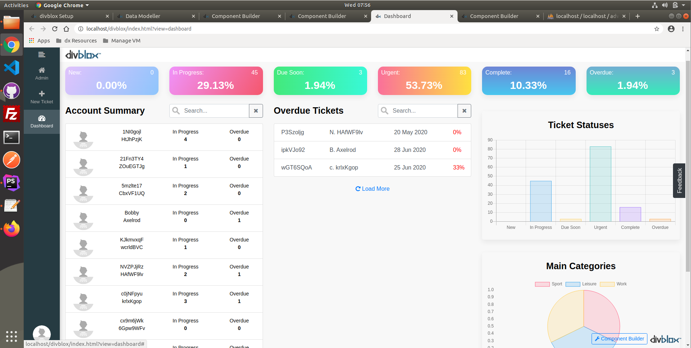

# Advanced Training Exercise

### Introduction

In this exercise we will be continuing with the example established in the basic training exercise.
Specifically, we will be extending the basic exercise functionality with the following:

-   Categories will now have the ability to have sub-categories using a self reference
-   We will add the ability to add notes and file attachments to tickets to understand how the default file uploader works and how it can be customized
-   We will allow for tickets to have sub tasks. These sub tasks will enable the ability to track a ticket's progress.
-   We will build a dashboard that will give us a nice overview of our tickets and their progress.

The new data model we will be making is as follows:


As you can see, the data model is starting to look more complicated. Let's break this down:

-   Adding the `Note` entity:
    -   A note needs to be attached to a `Ticket`, and may have an attachment (linked to the `FileDocument` entity)
    -   The attributes in the `Note` entity are NoteDescription and NoteCreatedDate
-   Adding the `SubTask` entity:
    -   Each ticket can have many subtasks
    -   The attributes in the `SubTask` entity are Description, SubTaskStatus and SubTaskDueDate.
    -   SubTaskStatus will have the same drop down as TicketStatus
-   Updating the `Category` entity:
    -   Add the attributes CategoryParentId and HierarchyPath.
    -   This is done in order to allow for self referencing, where each category can have many subcategories.
    -   The added attributes allow for relative and absolute identification of the category relationships.

### Category Functionality

Let us begin with the changes to the `Category` entity. As seen in the new data model, we have added new attributes.
Our old CRUD components will not reflect the changes unless we add them manually (or create new CRUD components).

In our case, this will not even be necassary as the attributes added need to be defined by the programmer.
We want the CategoryParentId to be assigned automatically, depending on what category we were in when we clicked '+ Category'.
Similarly with the HierarchyPath, we want this to be automatically generated for each category based on the trail of parent IDs.
This HierarchyPath value will be used in the frontend to indicate the actual category, including its entire hierarchy, for the ticket.


In the 'category_crud_create' component we can immediately add the code to auto-populate the two new attributes accordingly.
In the javascript component.js file, we override the `saveEntity()` function to NOT set the global constrain ID to the current one. This is because we want to keep the constrainID we initially started with in that variable. The rest of the code is default Divblox functionality.

```js
saveEntity() {
    let current_component_obj = this.updateValues();
    this.resetValidation();
    if (!this.validateEntity()) {
        return;
    }

    // The parameter object we will send to the backend via dxRequestInternal()
    let parameters_obj = {
        f: "saveObjectData",
        ObjectData: JSON.stringify(current_component_obj),
        Id: this.getLoadArgument("entity_id")
    };

    // Checks if the component is constrained by an entity and subsequently honours the constraint
    if (this.constrain_by_array.length > 0) {
        this.constrain_by_array.forEach(function (relationship) {
            parameters_obj['Constraining' + relationship + 'Id'] = getGlobalConstrainById(relationship);
        })
    }

    // Communication to the backend
    dxRequestInternal(
        getComponentControllerPath(this),
        parameters_obj,
        function (data_obj) {
            if (this.getLoadArgument("entity_id") != null) {
                // THIS LINE IS REMOVED
                // setGlobalConstrainById(this.entity_name, data_obj.Id);
                pageEventTriggered(this.lowercase_entity_name + "_updated", {"id": data_obj.Id});
            } else {
                // THIS LINE IS REMOVED
                // setGlobalConstrainById(this.entity_name, data_obj.Id);
                pageEventTriggered(this.lowercase_entity_name + "_created", {"id": data_obj.Id});
            }
            this.loadEntity();
            this.resetValidation();
        }.bind(this),
        function (data_obj) {
            showAlert("Error saving " + this.lowercase_entity_name + ": " + data_obj.Message,
                "error",
                "OK",
                false);
        }.bind(this));
}
```

On the PHP side, we override the empty-by-default function `doAfterSaveActions()` to save both the CategoryParentId as well as the HierarchyPath.
The constraining (i.e. parent) category object is loaded from the database, and if this is not null, it's ID is saved into the CategoryParentId
attribute of the current category object. The `doAfterSaveActions()` is meant for exactly this type of functionality, which needs to query dadtabase values after the input is saved.

We then use the `getBreadCrumbsRecursive()` function (defined shortly) to return an array of the parental hierarchy of categories. Here is the function we add to the component.php file:

```php
public function doAfterSaveActions($EntityToUpdateObj = null) {
    if (is_null($EntityToUpdateObj)) {
        return;
    }

    // Query the parent category object based on constraining ID
    $ParentCategoryObj = Category::Load(
        $this->getInputValue("ConstrainingCategoryId", true)
    );

    // If the category does have a parent, save it's ID in the CategoryParentId attribute


    if (!is_null($ParentCategoryObj)) {
        $EntityToUpdateObj->CategoryParentId = $ParentCategoryObj->Id;
        $EntityToUpdateObj->Save();
        // Then call the getBreadCrumbsRecursive() function on the current category object.
        // This function will return an array of the hierarchical parent categories
        $ReturnArr = ProjectFunctions::getBreadCrumbsRecursive($EntityToUpdateObj);
        // We inverse the array as it is not in the order we need, and create a HierarchyPath
        // string from the array
        $ReturnArr = array_reverse($ReturnArr);
        $HierarchyPathStr = "";
        foreach($ReturnArr as $CategoryLabel => $CategoryId) {
            if (strlen($HierarchyPathStr) > 0) {
                $HierarchyPathStr .= ' / ';
            }
            $HierarchyPathStr .= $CategoryLabel;
        }
        $EntityToUpdateObj->HierarchyPath = $HierarchyPathStr;
    } else {
        $EntityToUpdateObj->HierarchyPath = $EntityToUpdateObj->CategoryLabel;
    }
    $EntityToUpdateObj->Save();
}
```

The function `getBreadCrumbsRecursive()` was defined in the `ProjectFunctions` class to reduce code duplication, as we will be using it again when displaying the breadcrumb trail on our 'category_update' page. The `ProjectFunctions` class (`project/assets/php/project_functions.php`) is created for this very reason, and is where you should house all your functions that will have multiple calls in your project. The function `getBreadCrumbsRecursive()` is just a recursive function that returns the parental hierarchy of the input category in a key-value pair array.

```php
public static function getBreadCrumbsRecursive(Category $CategoryObj = null, $BreadCrumbsArray = []) {
    if (is_null($CategoryObj)) {
        return $BreadCrumbsArray;
    }
    // Append a key-value pair to the return array
    $BreadCrumbsArray[$CategoryObj->CategoryLabel] = $CategoryObj->Id;
    // This will only return if the current category does not have a parent
    if (is_null($CategoryObj->CategoryParentId) || ($CategoryObj->CategoryParentId < 1)) {
        return $BreadCrumbsArray;
    }
    // Set the parent category ID, and rerun function with that ID
    $ParentCategoryObj = Category::Load($CategoryObj->CategoryParentId);
    return self::getBreadCrumbsRecursive($ParentCategoryObj, $BreadCrumbsArray);
}
```

Now that our create component correctly saves all necessary information to the database, let us set up a 'category_update' page, a screenshot of which is presented below. IT will house 3 components:

-   Breadcrumb trail for subcategories (yellow)
-   The update component (blue)
-   SubCategory list, based on the currently clicked category (green)


#### Breadcrumbs

The breadcrumb basic component can be easily added via Divblox's web interface. We will do this in the 'category_update' page component.
The following code will be added to the 'category_update' page component's javascript and PHP.

The code, which we will add to the 'initFunctions()' function, adds two event handlers:

1. The first event handler is to navigate back to the admin page when 'All Categories' is clicked
2. The second is to reset the global constraining ID for the entity 'Category' to the clicked on category and then refresh the page to load it up accordingly

!> Note how we attach the event to a click on the document, after which we specify where on the document the click should be.
This is because if we set the event handler to listen directly for a click on '.category-breadcrumb', we will get unexpected
output because during page load-up, this sub component is not defined yet.

```js
initCustomFunctions() {
    super.initCustomFunctions();
    getComponentElementById(this, "AllCategories").on("click", function () {
        loadPageComponent("admin");
    });
    $(document).on("click", ".category-breadcrumb", function () {
        let category_id = $(this).attr("id").replace("CategoryId_", "");
        setGlobalConstrainById("Category", category_id);
        dxLog("Cat id: " + category_id);
        loadPageComponent("category_update");
    });
}
```

The `updateBreadCrumbs()` function handles the request to the server using Divblox's `dxRequestInternal()` function. The parameters we send to the backend are the function name we want to call and the category ID. The success function deals with formatting the returned array into HTML and displaying it.

```js
updateBreadCrumbs() {
    dxRequestInternal(getComponentControllerPath(this), {
            f: "getBreadCrumbs",
            category_id: getGlobalConstrainById("Category")
        },
        function (data_obj) {
            let html = "";
            let category_keys = Object.keys(data_obj.ReturnData);
            let count = 1;

            category_keys.forEach(function (key) {
                if (count === (category_keys.length)) {
                    html = "<li class=\"breadcrumb-item active\">" + key + "</li>";
                } else {
                    html = "<li class=\"breadcrumb-item\"><a id=\"CategoryId_" + data_obj.ReturnData[key] + "\" class=\"category-breadcrumb\" href=\"#\">" + key + "</a></li>";
                }
                dxLog("Key: " + key + "; Value: " + data_obj.ReturnData[key]);
                getComponentElementById(this, "CategoryBreadcrumbs").append(html);
                count++;
            }.bind(this));
        }.bind(this),
        function (data_obj) {
            // Failure function
        });
}
```

The `updateBreadCrumbs()` function is the called in the page component's `reset()` function:

```js
reset(inputs) {
    setActivePage("category_update", "Category Update");
    super.reset(inputs);
    this.updateBreadCrumbs();
}
```

Now in the component.php file, we define the `getBreadCrumbs()` function referenced in the javascript. It receives the category ID, and loads the category by ID. We then call the `getBreadCrumbsRecursive()` function we defined in the class `ProjectFunctions` previously and order the array.

```php
   public function getBreadCrumbs() {
        $InputCategoryInt = $this->getInputValue("category_id", true);
        $CategoryObj = Category::Load($InputCategoryInt);
        $ReturnArr = ProjectFunctions::getBreadCrumbsRecursive($CategoryObj);
        $ReturnArr = array_reverse($ReturnArr);

        $this->setReturnValue("Result", "Success");
        $this->setReturnValue("ReturnData", $ReturnArr);
        $this->presentOutput();
    }
```

#### Sub Category List

On the 'category_update' page we want to be able to display and manage the sub categories for the current category.
For this, we just create a new CRUD component for the 'Category' entity, except that it must be constrained by the current constraining category ID,
only displaying the child categories. We do this by overriding the `getPage()` function in the component.php to only query the constrained array of categories
from the database.

```php
// Change logic in the getPage function
public function getPage() {
    // Code that remains the same

    //This is all we changed, only return categories with parent ID = currently constrained categoryId
    $QueryCondition = dxQ::Equal(
        dxQN::Category()->CategoryParentId,
        $this->getInputValue("ConstrainingCategoryId", true)
    );

    // Code that remains the same
}
```

On the javascript side, we change the behaviour of the `on_item_clicked()` function to reload the current page with the new category constraint ID.

With this, we have updated all the functionality needed for the `Category` entity as well as created a page to edit the categories as well as have visual aid with regard to the hierarchical structure of the categories.

### Ticket Functionality

Now we will focus on the changes to the `Ticket` entity and its pages, which will be split into 3 parts:

-   Updating the 'ticket_crud_update' component with `SubTask` and `Note` CRUD
-   Customising the sub tasks
-   Customising the notes and attachments

#### Update Component Changes

We have already set up our 'create' and 'update' components to work in a streamline way:

-   When creating a ticket, only having to input the ticket name and description,
-   after which you are navigated to the ticket_update page where you can complete all other relevant fields.

We now want to have a sub tasks list and a notes list in this component.
We first create the CRUD components for each using the Divblox Component Builder,
after which we just insert them into our ticket_crud_update' component (in their own row, taking up equal 6 columns each in bootstrap terms).

{VIDEO HERE PLEASE}

#### Customising the SubTask CRUD

The sub tasks are already constrained by the parent Ticket ID, so all we need to do is make the HTML formatting a little bit more to our liking.
You can make the input boxes fullwidth and arrange them in a bootstrap layout to your liking.

#### Customising the Note CRUD

The `Note` section is a bit more complicated, for a few reasons.
Firstly, we want to be able to attach files here, which need to be constrained to the currently opened ticket.
Let's start off by creating a 'note_attachment_uploader' component which we will tailor to our needs, based off of the default 'native_file_uploader' component.
This is done via the component builder.

{VIDEO HERE PLEASE}

Below is a outline of the `initFileUploader()` function.
We override it's default functionality, leaving everything as is, except that we add one more parameter to the data in the upload, namely the 'note_id'.

```js
initFileUploader() {
   let uid = this.uid;
   let this_component = this;
   $('#'+uid+'_file_uploader').fileuploader({
      changeInput: // Default input

      onSelect: function(item) {
         // Default functionality

      },
      upload: {
         url: getComponentControllerPath(this_component),
         data: {f:"handleFilePost",
                AuthenticationToken:getValueFromAppState('dxAuthenticationToken'),
                note_id: this_component.getLoadArgument("note_id")},
         type: 'POST',
         enctype: 'multipart/form-data',
         start: false,
         synchron: true,
         beforeSend: function(item) {
            // Default functionality

         },
         onSuccess: function(result, item) {
            // Default functionality

         },
         onError: function(item) {
            // Default functionality

         },
         onProgress: function(data, item) {
            // Default functionality

         },
         onComplete: function() {
            // Default functionality

         },
      },
      onRemove: function(item) {
        // Default functionality
      },
      captions: {
         // Default captions
      },
      enableApi: true
   });
}
```

On the PHP side, we again override the default functionality of the `handleFilePost()` function, adding the following code:

```php
public function handleFilePost() {
    // initialize FileUploader
    $FileUploader = new FileUploader('files', array(
        'uploadDir' => $this->UploadPath,
        'title' => 'auto'
    ));
    $this->setReturnValue("Result","Success");
    // call to upload the files
    $data = $FileUploader->upload();
    $this->setReturnValue("Message",$data);
    foreach($data["files"] as $file) {
        $FileDocumentObj = new FileDocument();
        $FileDocumentObj->FileName = $file["name"];
        $FileDocumentObj->Path = $file["file"];
        $FileDocumentObj->UploadedFileName = $file["old_name"];
        $FileDocumentObj->FileType = $file["type"];
        $FileDocumentObj->SizeInKilobytes = round(doubleval(preg_replace('/[^0-9.]+/', '', $file["size2"])),2);
        $FileDocumentObj->Save();

        // START NEW CODE
        $NoteObj = Note::Load($this->getInputValue("note_id", true));
        if (is_null($NoteObj)) {
            $FileDocumentObj->Delete();
        } else {
            if (!is_null($NoteObj->FileDocumentObject)) {
                $NoteObj->FileDocumentObject->Delete();
            }
            $NoteObj->FileDocumentObject = $FileDocumentObj;
            $NoteObj->Save();
        }
        // END NEW CODE
    }
    foreach($data as $key=>$value) {
        $this->setReturnValue($key,$value);
    }
    $this->presentOutput();
}
```

This just ties the filed uploaded to the note it is attached to and makes sure that when deleting a note you do not orphan any file uploads.
We also remove the return output from the `handleRemoveFile()` function, leaving it as:

```php
public function handleRemoveFile() {
    $FileDocumentObj = FileDocument::QuerySingle(dxQ::Equal(dxQueryN::FileDocument()->FileName, $this->getInputValue("file")));
    if (!is_null($FileDocumentObj)) {
        $FileDocumentObj->Delete();
    }
}
```

Now that we have prepared our file uploader, let's dig into the actual `Note` CRUD.
Firstly, we want to follow a similar approach as with the `Ticket` and `Category` create CRUD components,
whereby the initial create only requires limited fields, after which you are navigated to the update component to complete the process.
We do this by shifting the 'note_created' case of the `eventTriggered()` function in the 'note_crud' component to above the 'note_clicked' case, as before.

We can then add the two buttons we want via the component builder. These are:

-   A modal popup housing the custom file uploader
-   A download link, appearing only when there is actually an attachment.

First, we add a row with two columns in the update component.
We then add the modal using the component builder, and change relevant text and button text as well as make the modal button have classes
'fullwidth' and 'btn-link'.

Now, in the javascript, we firstly make sure that the modal will alwasy be closed until clicked by adding a line of code
to hide the modal in the component's reset function.

{VIDEO HERE PLEASE}

```js
reset(inputs,propagate) {
   if (typeof inputs !== "undefined") {
      this.setEntityId(inputs);
   }
   super.reset(inputs,propagate);
   getComponentElementById(this,"HPxt9_modal").modal("hide");
}
```

We will then also add some functionality to the modal skeleton provided by Divblox.

In the `initFunctions()` function, we add the following to the "show.bs.modal" case, noting the additional 'note_id' parameter we specified earlier.

```js
loadComponent(
    "system/note_attachment_uploader",
    this.getUid(),
    "XLGKu",
    { note_id: this.getEntityId() },
    true
);
```

This just makes sure that we load our file uploader and it is already constrained to the note we want to attach the file/image to.
We also want to override the `onAfterLoadEntity()` function to populate our right column with a download link if and only if the attachment exists.

```js
onAfterLoadEntity(data_obj) {
   // TODO: Override this as needed;
   getComponentElementById(this, "DownloadWrapper").html("");
   if (typeof data_obj.AttachmentPath !== "undefined") {
      if (data_obj.AttachmentPath.length > 0) {
         getComponentElementById(this, "DownloadWrapper").html('<a href="'+data_obj.AttachmentPath+'" target="_blank" class="btn btn-link fullwidth">Download Attachment</a>');
      }
   }
}
```

Now for the backend side. Firstly, we override the default `getObjectData()` function.
What we added here is backend validation for the existance and validity of the attachment by checking the relational entity `FileDocument`.
The only return values the front end can receive is an empty string or a valid attachment path string that points to a file that exists in the database.

```php
public function getObjectData() {
    $EntityObj = $this->EntityNameStr::Load(
        $this->getInputValue("Id",true)
    );
    $EntityJsonDecoded = array();
    $AttachmentPathStr = "";
    if (!is_null($EntityObj)) {
        $EntityJsonDecoded = json_decode($EntityObj->getJson());
        if (!is_null($EntityObj->FileDocumentObject)) {
            if (file_exists(DOCUMENT_ROOT_STR.SUBDIRECTORY_STR.$EntityObj->FileDocumentObject->Path)) {
                $AttachmentPathStr = ProjectFunctions::getBaseUrl().$EntityObj->FileDocumentObject->Path;
            }
        }
    }
    $this->setReturnValue("Object",$EntityJsonDecoded);
    foreach ($this->IncludedRelationshipArray as $Relationship => $DisplayValue) {
        $RelationshipList = $this->getRelationshipList($EntityObj,$Relationship);
        $this->setReturnValue($Relationship."List",$RelationshipList);
    }
    $this->setReturnValue("Result","Success");
    $this->setReturnValue("Message","");
    $this->setReturnValue("AttachmentPath", $AttachmentPathStr);
    $this->presentOutput();
}
```

Secondly, we need to make sure that if we delete any notes, we do not accidentally leave behind any orphaned files/images.
This is done using Divblox's `doBeforeDeleteActions()` function.

```php
public function doBeforeDeleteActions($EntityToUpdateObj = null) {
    if (is_null($EntityToUpdateObj)) {
        return;
    }
    if (!is_null($EntityToUpdateObj->FileDocumentObject)) {
        $EntityToUpdateObj->FileDocumentObject->Delete();
    }
}
```

# Dashboard

We will now build a dashboard which should give us a summary overview of the tickets we have and their distribution into categories and statuses. The first step is to create a page from the 'page_with_side_nav' template, and then proceed to add the necessary link into the menu we created.

Once we have our page set up and navigation configured, we can proceed with our dashboard. The final product will look something like this:



To create the dashboard we will create a few individual components, that can be reused anywhere:

1. The 6 status tiles seen in the top row
2. The account summary list
3. The overdue ticket list
4. Graphs using GraphJS

## Status Tile

Let's create the tiles that display a summary of the breakdown of statuses of all tickets. To do this, we will create a single component, and reuse it on our Dashboard page with different input parameters. These input parameters are specified in the javascript of the parent element, i.e. our dashboard page itself. This is done in the subcomponent definitions of the page by adding a secondary load argument as seen below:


Now, to build our component. This will be a custom component that we can build in the component builder. Once created, we add a fullwidth container and two rows, the first split into a 9-width bootstrap column and a 3-width bootstrap column, and the second a full 12-width column. These 3 sections will be the sections for the:

1. Status name
2. Number of tickets
3. Percentage of total tickets that status represents

We will look at the relevant component files individually. These are:

-   component.html
-   component.js
-   component.php
-   component.json
-   component.css

The full HTML file looks like this:

```
<div xmlns="http://www.w3.org/1999/xhtml" id="ComponentWrapper" class="component-wrapper">
    <div
        id="ComponentPlaceholder" class="component_placeholder component_placeholder_general">
        <div id="ComponentFeedback"></div>
    </div>
    <div id="ComponentContent" class="component-content" style="display:none;">
        <div xmlns="" class="container-fluid">
            <div id="StatusWrapper" class="dashboard-tile">
                <div class="row">
                    <div class="col-9">
                        <div id="StatusLabel" class="StatusLabel float-left ml-1">
                            {Status}
                        </div>
                    </div>
                    <div class="col-3">
                        <div id="StatusCount" class="StatusCount float-right mr-4">
                            {X}
                        </div>
                    </div>
                </div>
                <div class="row">
                    <div class="col-12">
                        <div id="StatusPercentage" class="StatusPercentage">
                            {StatusPercentage}
                        </div>
                    </div>
                </div>
            </div>
        </div>
    </div>
</div>
```

Note the IDs and class names which will be used to input information from the backend and deal with CSS styling. We also use built-in bootstrap classes such as float-left and ml-1, mr-4, etc to position our text as needed. Further CSS classes can and will be added if needed.

Now taking a look at the javascript file:

```js
if (
    typeof component_classes["dashboard_ticket_status_indicator"] ===
    "undefined"
) {
    class dashboard_ticket_status_indicator extends DivbloxDomBaseComponent {
        constructor(inputs, supports_native, requires_native) {
            super(inputs, supports_native, requires_native);
            // Sub component config start
            this.sub_component_definitions = [];
            // Sub component config end
        }

        // The reset() function (which is called ever time the component is refreshed) is altered
        // to include the two additionally defined functions
        reset(inputs, propagate) {
            super.reset(inputs, propagate);
            this.applyStatusCssClass();
            this.loadStatusTotals();
        }

        // Function to add necessary CSS classes to our 3 display nodes
        applyStatusCssClass() {
            let status = this.getLoadArgument("ticket_status")
                .replace(" ", "-")
                .toLowerCase();
            getComponentElementById(this, "StatusWrapper").addClass(
                "dashboard-tile-" + status
            );
            getComponentElementById(this, "StatusCount").addClass(
                "status-count-" + status
            );
            getComponentElementById(this, "StatusPercentage").addClass(
                "status-percentage-" + status
            );
        }

        // Function to retrieve necessary information from the backend. Notice how nothing is
        // status-specific, as we will be using the same component for 6 Statuses
        loadStatusTotals() {
            // Function dealing with backend communication
            dxRequestInternal(
                // Associated PHP script for this component
                getComponentControllerPath(this),
                // Parameter object
                {
                    f: "loadStatusTotals",
                    ticket_status: this.getLoadArgument("ticket_status"),
                },
                function (data_obj) {
                    // Success function: Writes information onto relevant DOM nodes
                    getComponentElementById(this, "StatusLabel").html(
                        "<p>" + this.getLoadArgument("ticket_status") + ":</p>"
                    );
                    let status = this.getLoadArgument("ticket_status")
                        .replace(" ", "-")
                        .toLowerCase();
                    // JQuery animate function: Creates a linear animation from 0 to
                    // the relevant value
                    $({ Counter: 0 }).animate(
                        {
                            Counter: data_obj.Count,
                        },
                        {
                            duration: 1500,
                            easing: "linear",
                            step: function () {
                                $(".status-count-" + status).html(
                                    Math.ceil(this.Counter)
                                );
                            },
                        }
                    );
                    $({ Counter: 0 }).animate(
                        {
                            Counter: data_obj.Percentage,
                        },
                        {
                            duration: 2000,
                            easing: "linear",
                            step: function () {
                                $(".status-percentage-" + status).html(
                                    (this.Counter * 100).toFixed(2) + "%"
                                );
                            },
                        }
                    );
                }.bind(this),
                function (data_obj) {
                    // Failure function
                    dxLog(
                        "dxRequestInternal Failure. Data Object returned: " +
                            JSON.stringify(data_obj)
                    );
                }
            );
        }
    }

    component_classes[
        "dashboard_ticket_status_indicator"
    ] = dashboard_ticket_status_indicator;
}
```

Moving onto the backend side, looking at the component.php file:

```php
<?php
require("../../../../divblox/divblox.php");
class TicketStatusIndicatorController extends ProjectComponentController {
    public function __construct($ComponentNameStr = 'Component') {
        parent::__construct($ComponentNameStr);
    }

    // Function that is called by the frontend, and returns the necessary information
    public function loadStatusTotals() {
        $StatusStr = $this->getInputValue("ticket_status");

        // Query the database using the input parameter (this is how each component displays
        // different information)
        $StatusTicketCountInt = Ticket::QueryCount(
            dxQ::Equal(
                dxQN::Ticket()->TicketStatus,
                $StatusStr
            )
        );

        $TotalTicketCountInt = Ticket::QueryCount(
            dxQ::All()
        );

        $StatusPercentage = $StatusTicketCountInt/$TotalTicketCountInt;

        // Set and present required data
        $this->setReturnValue("Result", "Success");
        $this->setReturnValue("Count", $StatusTicketCountInt);
        $this->setReturnValue("Percentage", $StatusPercentage);
        $this->presentOutput();
    }
}
$ComponentObj = new TicketStatusIndicatorController("ticket_status_indicator");
?>
```

The component.json file is used to store component specific parameters or lists which we do not need for this component. We will discuss all the the styling once the whole dashboard functionality is built.

## Account Summary

For any custom data list, there are quite a few things to consider, but when you understand those, using a default entity data list to construct anything you need becomes very quick and easy. Firstly, we create a data list from the component builder for the Account entity, including the attributes:

-   FirstName
-   LastName
-   ProfilePicturePath

Again, we will look at each of the 5 components individually. Similarly to the previous section, we will not discuss the component.css and component.json files, as we will not change them for now.

Looking at the HTML that is generated by the component builder, we see that there isn't really anything we want to change. The HTML file gives us a template for the structure or the component, including pagination and search functionality. The only thing we do add is a heading describing the component purpose.

```html
<div id="ComponentWrapper" class="component-wrapper">
    <div
        id="ComponentPlaceholder"
        class="component_placeholder component_placeholder_data_list"
    >
        <div id="ComponentFeedback"></div>
    </div>
    <div id="ComponentContent" class="component-content" style="display:none">
        <div class="container-fluid container-no-gutters">
            <div class="row">
                <div class="col-md-6">
                    // Added heading
                    <p class="heading">Account Summary</p>
                </div>
                <div class="col-md-6">
                    <div class="input-group mb-3">
                        <input
                            type="text"
                            id="DataListSearchInput"
                            class="form-control data_table_search_icon"
                            placeholder="Search..."
                            aria-label="Search"
                            aria-describedby="btnResetSearch"
                        />
                        <div class="input-group-append">
                            <button
                                class="btn btn-outline-secondary"
                                type="button"
                                id="btnResetSearch"
                            >
                                <i class="fa fa-times" aria-hidden="true"></i>
                            </button>
                        </div>
                    </div>
                </div>
            </div>
            <div class="row">
                <div class="col-12">
                    <div id="DataList" class="list-group"></div>
                    <div id="DataListLoading">Loading...</div>
                </div>
            </div>
            <div class="row">
                <div class="col-md-4"></div>
                <div class="col-md-4">
                    <button
                        type="button"
                        id="DataListMoreButton"
                        class="btn btn-link fullwidth"
                    >
                        <i class="fa fa-repeat" aria-hidden="true"></i> Load
                        More
                    </button>
                </div>
                <div class="col-md-4"></div>
            </div>
        </div>
    </div>
</div>
```

You might think that you need to restructure how your list will be displayed here, but that is done in the javascript and just written into the necessary DOM node. So looking at our javascript file, we note that the only changes we make to the default functionality lies in the `addRow()` function, where we will create each row to display the information we need in the format we want it.

```js
if (
    typeof component_classes["data_model_account_summary_list"] === "undefined"
) {
    class data_model_account_summary_list extends DivbloxDomEntityDataListComponent {
        constructor(inputs, supports_native, requires_native) {
            super(inputs, supports_native, requires_native);
            // Sub component config start
            this.sub_component_definitions = [];
            // Sub component config end
            this.included_attributes_object = {
                FullName: "Normal",
                FirstName: "Normal",
                LastName: "Normal",
                ProfilePicturePath: "Normal",
                Title: "Normal",
            };
            this.included_relationships_object = { UserRole: "Normal" };
            this.constrain_by_array = [];
            this.initDataListVariables("Account");
        }

        // The addrow() function writes each row dynamically into the data list
        addRow(row_data_obj) {
            let current_item_keys = Object.keys(this.current_page_array);
            let must_add_row = true;
            current_item_keys.forEach(
                function (key) {
                    if (
                        this.current_page_array[key]["Id"] == row_data_obj["Id"]
                    ) {
                        must_add_row = false;
                    }
                }.bind(this)
            );
            if (!must_add_row) {
                return;
            }
            this.current_page_array.push(row_data_obj);
            let row_id = row_data_obj["Id"];
            let included_keys = Object.keys(this.included_all_object);

            // Create a wrapper for all the information we will be displaying. These two strings create the anchor uniform look and feel of the list
            // using both Divblox classes as well as bootstrap classes.
            let wrapping_html =
                '<a href="#" id="' +
                this.getUid() +
                "_row_item_" +
                row_id +
                '" class="list-group-item' +
                " list-group-item-action flex-column align-items-start data_list_item data_list_item_" +
                this.getUid() +
                ' dx-data-list-row">';

            // Here we create our custom DOM node frame for the information we want to display
            let profile_picture_html = '<div class="col-2">';
            let account_info_html = '<div class="col-4">';
            let status_summary_html = '<div class="col-6">';

            // We append the necessary formatting and information
            // The col-2 section for the profile picture
            profile_picture_html +=
                '' +
                "</div>";

            // The col-4 section for the account holders full name
            account_info_html +=
                '<div class="row"> <div class="col-12 dashboard-tile-list">' +
                row_data_obj["FirstName"] +
                "<br>" +
                row_data_obj["LastName"] +
                "</div>";
            account_info_html += "</div>" + "</div>";

            // The col-6 section displaying number of tickets that are overdue or
            // in progress
            status_summary_html += '<div class="row">';
            let status_array = ["In Progress", "Overdue"];
            status_array.forEach(function (status) {
                status_summary_html +=
                    '<div class="col-6 dashboard-tile-list">' +
                    status +
                    " <br> <strong>" +
                    row_data_obj["StatusCounts"][status] +
                    "</strong></div>";
            });
            status_summary_html += "</div>";

            // Appending all necessary strings to create the final HTML to be inserted into the DOM
            wrapping_html +=
                '<div class="row">' +
                profile_picture_html +
                account_info_html +
                status_summary_html +
                "</div>" +
                "</div>";
            wrapping_html += "</a>";

            // Writing to the DOM node by ID
            getComponentElementById(this, "DataList").append(wrapping_html);
        }
    }

    component_classes[
        "data_model_account_summary_list"
    ] = data_model_account_summary_list;
}
```

Now looking at the component.php file. This is a long one. Feel free to browse through the entire code to familiarise yourself with the background process, but the changes we have made will be defined with prepended comments.

```php

class AccountController extends EntityDataSeriesComponentController
{
    protected $EntityNameStr = "Account";
    protected $IncludedAttributeArray = ["FullName", "FirstName", "LastName", "ProfilePicturePath", "Title",];
    protected $IncludedRelationshipArray = [];
    protected $ConstrainByArray = [];
    protected $RequiredAttributeArray = [];
    protected $NumberValidationAttributeArray = [];

    public function __construct($ComponentNameStr = 'Component')
    {
        parent::__construct($ComponentNameStr);
    }

    public function getPage() {
        error_log("Constrain by values: " . json_encode($this->ConstrainByArray));
        $EntityNodeNameStr = $this->EntityNameStr;
        $DefaultSortAttribute = $this->IncludedAttributeArray[0];

        if (is_null($this->getInputValue("ItemsPerPage"))) {
            $this->setReturnValue("Result", "Failed");
            $this->setReturnValue("Message", "No items per page provided");
            $this->presentOutput();
        }
        $AccessArray = ProjectAccessManager::getObjectAccess(ProjectFunctions::getCurrentAccountId(), $this->EntityNameStr);
        if (!in_array(AccessOperation::READ_STR, $AccessArray)) {
            $this->setReturnValue("Result", "Failed");
            $this->setReturnValue("Message", "Read access denied");
            $this->presentOutput();
        }
        $Offset = $this->getInputValue("CurrentOffset", true);
        if ($Offset < 0) {
            $Offset = ($this->getInputValue("CurrentPage", true) - 1) * $this->getInputValue("ItemsPerPage", true);
        }
        if ($Offset < 0) {
            $Offset = 0;
        }

        $QueryCondition = dxQ::All();

        foreach ($this->ConstrainByArray as $Relationship) {
            $RelationshipNodeStr = $Relationship . 'Object';
            $QueryCondition = dxQ::AndCondition(
                $QueryCondition,
                dxQ::Equal(
                    dxQN::$EntityNodeNameStr()->$RelationshipNodeStr->Id, $this->getInputValue('Constraining' . $Relationship . 'Id', true)
                )
            );
        }
        $this->setReturnValue("This1", $this->getInputValue("SearchText"));
        if (!is_null($this->getInputValue("SearchText"))) {
            if (strlen($this->getInputValue("SearchText")) > 0) {
                $SearchInputStr = "%" . $this->getInputValue("SearchText") . "%";
                $this->setReturnValue("This", $SearchInputStr);
                $QueryOrConditions = null;
                foreach ($this->IncludedAttributeArray as $Attribute) {
                    if (is_null($QueryOrConditions)) {
                        $QueryOrConditions = dxQ::Like(dxQueryN::$EntityNodeNameStr()->$Attribute, $SearchInputStr);
                    } else {
                        $QueryOrConditions = dxQ::OrCondition($QueryOrConditions,
                            dxQ::Like(dxQueryN::$EntityNodeNameStr()->$Attribute, $SearchInputStr));
                    }
                };
                foreach ($this->IncludedRelationshipArray as $Relationship => $DisplayAttribute) {
                    $RelationshipNodeStr = $Relationship . 'Object';
                    if (is_null($QueryOrConditions)) {
                        $QueryOrConditions = dxQ::Like(dxQueryN::$EntityNodeNameStr()->$RelationshipNodeStr->$DisplayAttribute, $SearchInputStr);
                    } else {
                        $QueryOrConditions = dxQ::OrCondition($QueryOrConditions,
                            dxQ::Like(dxQueryN::$EntityNodeNameStr()->$RelationshipNodeStr->$DisplayAttribute, $SearchInputStr));
                    }
                };
            }
        }


        $OrderByClause = dxQ::OrderBy(dxQueryN::$EntityNodeNameStr()->$DefaultSortAttribute);
        if (!is_null($this->getInputValue("SortOptions"))) {
            if (ProjectFunctions::isJson($this->getInputValue("SortOptions"))) {
                $SortOptionsArray = json_decode($this->getInputValue("SortOptions"));
                if (is_array($SortOptionsArray)) {
                    if (ProjectFunctions::getDataSetSize($SortOptionsArray) == 2) {
                        $AttributeStr = $SortOptionsArray[0];
                        $OrderByClause = dxQ::OrderBy(dxQueryN::$EntityNodeNameStr()->$AttributeStr, $SortOptionsArray[1]);
                    }
                }
            }
        }

        $EntityArray = $EntityNodeNameStr::QueryArray(
            $QueryCondition,
            dxQ::Clause(
                $OrderByClause,
                dxQ::LimitInfo($this->getInputValue("ItemsPerPage", true), $Offset)
            )
        );

        $EntityReturnArray = [];

        foreach ($EntityArray as $EntityObj) {
            $CompleteReturnArray = ["Id" => $EntityObj->Id];
            foreach ($this->IncludedAttributeArray as $Attribute) {
                if (in_array($this->DataModelObj->getEntityAttributeType($this->EntityNameStr, $Attribute), ["DATE", "DATETIME"])) {
                    $CompleteReturnArray[$Attribute] = is_null($EntityObj->$Attribute) ? 'N/A' : $EntityObj->$Attribute->format(DATE_TIME_FORMAT_PHP_STR . " H:i:s");
                } else if ($Attribute == 'ProfilePicturePath') {
                    $AttachmentPathStr = ProjectFunctions::getBaseUrl(). "/project/assets/images/divblox_profile_picture_placeholder.svg";
                    if (!is_null($EntityObj->ProfilePicturePath)) {
                        if (file_exists(DOCUMENT_ROOT_STR . SUBDIRECTORY_STR . $EntityObj->ProfilePicturePath)) {
                            $AttachmentPathStr = ProjectFunctions::getBaseUrl() . $EntityObj->ProfilePicturePath;
                        }
                    }
                    $CompleteReturnArray[$Attribute] = $AttachmentPathStr;
                } else {
                    $CompleteReturnArray[$Attribute] = is_null($EntityObj->$Attribute) ? 'N/A' : $EntityObj->$Attribute;
                }
            }
            foreach ($this->IncludedRelationshipArray as $Relationship => $DisplayAttribute) {
                $RelationshipReturnStr = "N/A";
                $RelationshipNodeStr = $this->DataModelObj->getEntityRelationshipPathAsNode($EntityObj, $this->EntityNameStr, $Relationship, []);
                if (!is_null($RelationshipNodeStr)) {
                    if (!is_null($RelationshipNodeStr->$DisplayAttribute)) {
                        if (in_array($this->DataModelObj->getEntityAttributeType($Relationship, $DisplayAttribute), ["DATE", "DATETIME"])) {
                            $RelationshipReturnStr = $RelationshipNodeStr->$DisplayAttribute->format(DATE_TIME_FORMAT_PHP_STR . " H:i:s");
                        } else {
                            $RelationshipReturnStr = is_null($RelationshipNodeStr->$DisplayAttribute) ? 'N/A' : $RelationshipNodeStr->$DisplayAttribute;
                        }
                    }
                }
                $CompleteReturnArray[$Relationship] = $RelationshipReturnStr;
            }

            // All we want to do is add additional information to the return array
            // Fill up an array of number of tickets in each status
            $StatusCountArray = [];
            $StatusKeys = ["New", "In Progress", "Due Soon", "Urgent", "Complete",  "Overdue"];
            foreach ($StatusKeys as $Key) {
                $StatusCountInt = Ticket::QueryCount(
                    dxQ::AndCondition(
                        dxQ::Equal(
                            dxQN::Ticket()->AccountObject->Id,
                            $EntityObj->Id
                        ),
                        dxQ::Equal(
                            dxQN::Ticket()->TicketStatus,
                            $Key
                        )
                    )
                );
                $StatusCountArray[$Key] = $StatusCountInt;
            }

            // Append our array of status counts to the final return array (nested array)
            $CompleteReturnArray["StatusCounts"] = $StatusCountArray;
            array_push($EntityReturnArray, $CompleteReturnArray);
        }

        $this->setReturnValue("Result", "Success");
        $this->setReturnValue("Message", "");
        $this->setReturnValue("Page", $EntityReturnArray);
        $this->setReturnValue("TotalCount", $EntityNodeNameStr::QueryCount($QueryCondition));
        $this->presentOutput();
    }
}

$ComponentObj = new AccountController("account_summary_list");
?>
```
