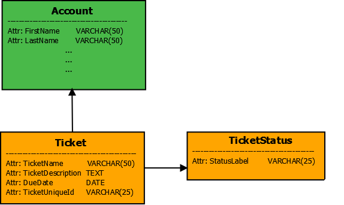
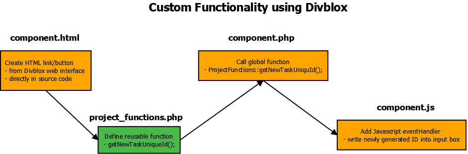
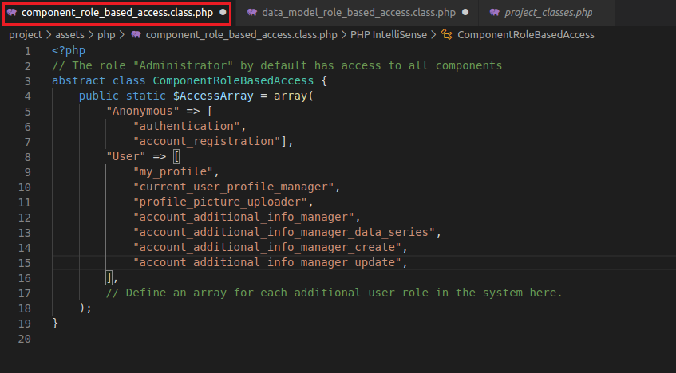

# Basic Training Exercise

This exercise assumes that you have managed to configure your Divblox project and that you understand the basic concepts.
If you are not sure that you do understand the basics, you can look at the [common examples](common-examples.md) and perhaps first try the 'Hello World' exercise.

> In this exercise we will go into a bit more detail about the main Divblox concepts that are used in every project.
> These concepts include:

-   Data modeling
-   The Divblox ORM (Object Relational Mapping)
-   Interaction between a component's front-end and back-end
-   Component and object security
-   Exposing an API

### Introduction

In this training exercise, we will be creating a basic ticketing system that will allow users to create and manage "tickets". To allow users to interact with our tickets, we will generate CRUD (Create, Read, Update, Delete) components.

Additionally, we will create the following components:

-   A page where full CRUD of tickets and statuses is done
-   A page where we reuse the CREATE component for a ticket to allow the user to create tickets in a simple way

We will also be building some custom functionality to demonstrate how to communicate between the front-end and back-end of a Divblox application.

Finally, we will also learn how to secure our components and data model entities, as well as how to expose our functionality via the Divblox API layer.

### Step 1 - Data Model

We will be creating a data model with the following entities and attributes:

-   **Ticket**: TicketName, TicketDescription, DueDate, TicketUniqueId
-   **TicketStatus**: StatusLabel

This can be represented as follows:



If you need a refresh on Divblox data modelling, click [here](data-modeler.md). Below is a walk-through of how to add the necessary entities using Divblox's Data Modeller.

<video id="TrainingExerciseStep1" muted="" playsinline="" preload="auto" autoplay>
  <source src="_basic-training-media/basic-training-exercise1.mp4" type="video/mp4">
  Video is not supported
</video>
<button onclick="replayVideo('TrainingExerciseStep1')" type="button" class="video-control-button">
<i class="fa fa-repeat"></i>
</button>
<button onclick="fullScreenVideo('TrainingExerciseStep1')" type="button" class="video-control-button">
<i class="fa fa-expand"></i>
</button>

### Step 2 - CRUD Components

Now that our data model is created and synchronized with our database,
let's generate some CRUD components (using the component builder) for Ticket and TicketStatus. Below is a walk-through of how to create full CRUD functionality for the ticket status entity.

<video id="TrainingExerciseStep2.1" muted="" playsinline="" preload="auto" autoplay>
  <source src="_basic-training-media/basic-training-exercise2.1.mp4" type="video/mp4">
  Video is not supported
</video>
<button onclick="replayVideo('TrainingExerciseStep2.1')" type="button" class="video-control-button">
<i class="fa fa-repeat"></i>
</button>
<button onclick="fullScreenVideo('TrainingExerciseStep2.1')" type="button" class="video-control-button">
<i class="fa fa-expand"></i>
</button>

> And now we will create the CRUD functionality for the ticket entity, which although more complex, is just as easy with Divblox.

<video id="TrainingExerciseStep2.3" muted="" playsinline="" preload="auto" autoplay>
  <source src="_basic-training-media/basic-training-exercise2.2.mp4" type="video/mp4">
  Video is not supported
</video>
<button onclick="replayVideo('TrainingExerciseStep2.3')" type="button" class="video-control-button">
<i class="fa fa-repeat"></i>
</button>
<button onclick="fullScreenVideo('TrainingExerciseStep2.3')" type="button" class="video-control-button">
<i class="fa fa-expand"></i>
</button>

> When checking the `Validate` checkbox, Divblox automatically notifies the user that input is required. Further validations can be added at a later stage.

Notice that in both examples we did not tick the `Constrain To` checkbox. If you constrain by a certain attribute, you are filtering to see only results that satisfy that criteria. An example would be to constrain Tickets by the current user account. This will display only tickets created by the current user. These constraints can only be done with entities that have a singular relationship. Singular relationships mean that an entity instance is linked to only one instance of another entity. E.g. Each ticket can oonly be made by one account holder.


This logic also applies when using 'create' and 'update' functionality and using the `Constrain By` checkbox. An example here would be to automatically link a ticket to the current user upon creation.

### Step 3 - Page Components

In order for us to be able to use our newly generated CRUD components, or any other component for that matter, we need to put them inside pages. Pages are also just components, but they can be navigated to by the user in the browser. The only distinction between other components and page components is that pages can be navigated to via the url or a navigation bar, while individual components can not.

The pages we will build for this exercise are:

-   An admin page where our full CRUD components can live
-   A "New Ticket" page where users can create new tickets

To do this we will use a pre-made page template with a side navbar. As you will see, the navigation bar is pre-populated with links we will later override or delete to suite our needs.

<video id="TrainingExerciseStep3.1" muted="" playsinline="" preload="auto" autoplay>
  <source src="_basic-training-media/basic-training-exercise3.1.mp4" type="video/mp4">
  Video is not supported
</video>
<button onclick="replayVideo('TrainingExerciseStep3.1')" type="button" class="video-control-button">
<i class="fa fa-repeat"></i>
</button>
<button onclick="fullScreenVideo('TrainingExerciseStep3.1')" type="button" class="video-control-button">
<i class="fa fa-expand"></i>
</button>

Now we can create the 'Tickets' page where users can create tickets. Note that we are not creating any new functionality, just reusing the 'create' component previously generated and placing it on its own page.

<video id="TrainingExerciseStep3.2" muted="" playsinline="" preload="auto" autoplay>
  <source src="_basic-training-media/basic-training-exercise3.2.mp4" type="video/mp4">
  Video is not supported
</video>
<button onclick="replayVideo('TrainingExerciseStep3.2')" type="button" class="video-control-button">
<i class="fa fa-repeat"></i>
</button>
<button onclick="fullScreenVideo('TrainingExerciseStep3.2')" type="button" class="video-control-button">
<i class="fa fa-expand"></i>
</button>

### Step 4 - Navigation bar

Ok, we now have components that allow us to create our data, as well as pages to view them on. We will now update the side navigation bar to function as we want it to. Notice how, in this video, we edit the component code in our IDE (any IDE/text editor of your choice). The preferred way is to use an IDE, but for quick fixes like changing the HTML layout of our page we can use Divblox's built-in code editor. The process followed here is as follows:

1.  Name your page components
2.  Change the navbar links to what you need them to be
3.  Add JavaScript to link it to the page in question

<video id="TrainingExerciseStep4" muted="" playsinline="" preload="auto" autoplay>
  <source src="_basic-training-media/basic-training-exercise4.mp4" type="video/mp4">
  Video is not supported
</video>
<button onclick="replayVideo('TrainingExerciseStep4')" type="button" class="video-control-button">
<i class="fa fa-repeat"></i>
</button>
<button onclick="fullScreenVideo('TrainingExerciseStep4')" type="button" class="video-control-button">
<i class="fa fa-expand"></i>
</button>

### Step 5 - Global Functions

For the purposes of this exercise, we want to assign a unique ID to every ticket. This will allow us later on to retrieve
information about our ticket via an API. To generate this unique ID, we will make use of a global function call.

!> Global functions are defined for functionality that will be used multiple times, reducing code duplication

> We will create the unique ID in the backend, as we need to verify whether or not it is indeed unique by checking our database.



Before we even start, lets point out a flaw in our CRUD component design. The unique ticket ID was omitted from the 'create' component, which must change as we are trying to randomly generate it on a button press.

This is a good time to discuss and show how easy it is to change or recreate CRUD functionality with Divblox. If you ever need to change what is displayed or what input is required, you can simply create new CRUD components with desired functionality, or delete and remake the component. If you name the new version the same as the old one, any pages where they were displayed previously will be smoothly updated with the new functionality.

We demonstrate below how this is done via Divblox's web interface. The changes can also be done directly in the source code, which is quicker, and will be covered in more advanced examples.

<video id="TrainingExerciseStep5.1" muted="" playsinline="" preload="auto" autoplay>

  <source src="_basic-training-media/basic-training-exercise5.1.mp4" type="video/mp4">
  Video is not supported
</video>
<button onclick="replayVideo('TrainingExerciseStep5.1')" type="button" class="video-control-button">
<i class="fa fa-repeat"></i>
</button>
<button onclick="fullScreenVideo('TrainingExerciseStep5.1')" type="button" class="video-control-button">
<i class="fa fa-expand"></i>
</button>

#### Step 1

Add the button in our `ticket_crud_create` component that will generate a unique ID and populate the input box. We can do this through the Divblox web interface or in the source code.

Below is a video running through step 1:

<video id="TrainingExerciseStep5.2" muted="" playsinline="" preload="auto" autoplay>

  <source src="_basic-training-media/basic-training-exercise5.2.mp4" type="video/mp4">
  Video is not supported
</video>
<button onclick="replayVideo('TrainingExerciseStep5.2')" type="button" class="video-control-button">
<i class="fa fa-repeat"></i>
</button>
<button onclick="fullScreenVideo('TrainingExerciseStep5.2')" type="button" class="video-control-button">
<i class="fa fa-expand"></i>
</button>

#### Step 2

Create the global php function that will generate the unique ID in `project_functions.php`.

#### Step 3

Call the global function from `component.php`, sending information to the front end.

Below is a video running through step 2 and 3:

<video id="TrainingExerciseStep5.3" muted="" playsinline="" preload="auto" autoplay>

  <source src="_basic-training-media/basic-training-exercise5.3.mp4" type="video/mp4">
  Video is not supported
</video>
<button onclick="replayVideo('TrainingExerciseStep5.3')" type="button" class="video-control-button">
<i class="fa fa-repeat"></i>
</button>
<button onclick="fullScreenVideo('TrainingExerciseStep5.3')" type="button" class="video-control-button">
<i class="fa fa-expand"></i>
</button>

Here is the code added into the class ProjectFunctions, in `project/assets/php/project_functions.php`.

```php
public static function getNewTaskUniqueId() {
        $CandidateStr = self::generateRandomString(24);
        $DoneBool = false;
        while(!$DoneBool) {
            // Divblox query language to load a ticket from the database,
            // based on the UniqueId field
            $ExistingTicketCount = Ticket::LoadByTicketUniqueId($CandidateStr);
            if ($ExistingTicketCount == 0) {
                $DoneBool = true;
            } else {
                $CandidateStr = self::generateRandomString(24);
            }
        }
        return $CandidateStr;
    }

```

And the code added into the `ticket_crud_create` component.php file:

```php
// The function on our component controller that will return a new unique task ID for us.
// This function is executed when we pass "getNewTaskUniqueId" as
// the value for "f" from our component JavaScript
public function getNewTaskUniqueId() {
        // setReturnValue() sets the values in an array that will be returned as JSON
        //when the script completes. We always need to set the value for "Result" to either
        // "Success" or "Failed" in order for the component JavaScript to know
        // how to treat the response
        $this->setReturnValue("Result","Success");
        // It is always a good idea to populate a "Message" for the front-end
        $this->setReturnValue("Message", "New unique ID created");
        // Here we set the value of any additional parameters to return
        $this->setReturnValue("TaskId", ProjectFunctions::getNewTaskUniqueId());
        // "presentOutput()" returns our array as JSON and stops any
        // further execution of the current php script
        $this->presentOutput();
    }
```

#### Step 4

Add the JavaScript functionality that autopopulates the input box with the newly generated unique ID in `component.js`.

Below is a video of step 4:

<video id="TrainingExerciseStep5.4" muted="" playsinline="" preload="auto" autoplay>

  <source src="_basic-training-media/basic-training-exercise5.4.mp4" type="video/mp4">
  Video is not supported
</video>
<button onclick="replayVideo('TrainingExerciseStep5.4')" type="button" class="video-control-button">
<i class="fa fa-repeat"></i>
</button>
<button onclick="fullScreenVideo('TrainingExerciseStep5.4')" type="button" class="video-control-button">
<i class="fa fa-expand"></i>
</button>

The code added into the `initCustomFunctions` function was:

```js
// dxRequestInternal() is the global function used to communicate
// from the component's JavaScript to its back-end php component
dxRequestInternal(
    // The first parameter tells the function where to send the request
    // getComponentControllerPath(this) returns the path to current component's php script
    getComponentControllerPath(this),
    // Tell component.php which function to execute
    { f: "getNewTaskUniqueId" },
    function(data_obj) {
        // Success function
        getComponentElementById(this, "TicketUniqueId").val(data_obj.TaskId);
    }.bind(this),
    function(data_obj) {
        // Fail function
    }.bind(this)
);
```

### Step 6 - Security

It is important to understand how Divblox user roles are used to control access to the application. Divblox has two forms of access.

-   _Component access_ allows the user to view the components
-   _Data Model_ access gives the user permissions to perform CRUD operations on specific entities defined in the data model.

By default, there are two user roles.

1. Administrator - Has access to all components and full CRUD functionality.
2. User - This is the user role allocated to anyone who registers on your app. The default access is only to your profile and account.

Any user that is not authenticated is treated as "Anonymous" - No access, gets redirected to the anonymous landing page.

!> Additional user roles can be defined in the data modeller.

The Component default settings are as follows:



And the Data Model settings seen below. It is also important to note that by default users are able to `create` and `read` data, even if not explicitly stated in the `$AccessArray`.


For our exercise we created 2 pages (The 'admin' and 'new ticket' pages). Let's assume that we only want administrators to access the admin page.

You can access the register page by navigating to `[your_project_root]/?view=register`. New users are registered with the user role "User" by default.

!> It is also good practice to test user role access in incognito/private mode, as you are typically logged in as a Divblox admin (dxAdmin) most of the time in your application and this may cause confusion.

<video id="TrainingExerciseStep6.1" muted="" playsinline="" preload="auto" autoplay>
  <source src="_basic-training-media/basic-training-exercise6.1.mp4" type="video/mp4">
  Video is not supported
</video>
<button onclick="replayVideo('TrainingExerciseStep6.1')" type="button" class="video-control-button">
<i class="fa fa-repeat"></i>
</button>
<button onclick="fullScreenVideo('TrainingExerciseStep6.1')" type="button" class="video-control-button">
<i class="fa fa-expand"></i>
</button>

As you can see, our new user is unable to view any of the pages we built. This is because he does not have component access to the components on those pages. We will change that in the `ComponentRoleBasedAccessArray::$AccessArray`.

In the below video we will firstly give our user full access to any `Ticket` and `TicketStatus` components. This will allow us to see how the _Data Model_ access works (we will observe this on our admin page). Once the _Data Model_ access is configured, we will then give our user access only to the `create` components of both `Ticket` and `TicketStatus`, allowing the user to view the _New Ticket_ page, but not the admin page.

<video id="TrainingExerciseStep6.2" muted="" playsinline="" preload="auto" autoplay>
  <source src="_basic-training-media/basic-training-exercise6.2.mp4" type="video/mp4">
  Video is not supported
</video>
<button onclick="replayVideo('TrainingExerciseStep6.2')" type="button" class="video-control-button">
<i class="fa fa-repeat"></i>
</button>
<button onclick="fullScreenVideo('TrainingExerciseStep6.2')" type="button" class="video-control-button">
<i class="fa fa-expand"></i>
</button>

It is worth noting that this is a basic example to demonstrate how Divblox handles user access. As you may have seen above, there is no need to change the _Data Model_ access of our user to be able to `update` and `delete` as he will never be able to get to the admin page to do this.

### Step 7 - Exposing an API

Now that we have all the groundwork completed, let's provide the world with an API endpoint that will allow us to do some custom functionality on our tickets. To do this, we will copy the provided `api_example` endpoint and modify it for our use case. The API functionality we want to achieve is as follows:

-   Allow a user to provide us with an array of unique task IDs as input
-   Select only the ticket descriptions from the tickets
-   Merge all of the ticket descriptions into the first ticket (initial unique ID)
-   Delete the remaining tickets
-   Return the new merged ticket as output

We will be using a program called 'PostMan' to test our API functionality. It comes pre-installed on the Divblox VM image.

!>Divblox automatically handles the routing for your API endpoint. API endpoints are available at [your_project_root]/api/[endpoint_name]

Below we will briefly explore the `api_example` functionality, how to navigate the URL and what the expected output looks like.

<video id="TrainingExerciseStep7.1" muted="" playsinline="" preload="auto" autoplay>
  <source src="_basic-training-media/basic-training-exercise7.1.mp4" type="video/mp4">
  Video is not supported
</video>
<button onclick="replayVideo('TrainingExerciseStep7.1')" type="button" class="video-control-button">
<i class="fa fa-repeat"></i>
</button>
<button onclick="fullScreenVideo('TrainingExerciseStep7.1')" type="button" class="video-control-button">
<i class="fa fa-expand"></i>
</button>

Now we will copy the `api_example.php` file as a template and write our own custom logic. Firstly, we add an API operation with function name `mergeTickets();`.

In the `mergeTickets();` function we code the following logic:

-   check if the input is valid JSON
-   check if the master unique ID exists
-   check if the master unique ID is valid
-   check if there are more than two IDs
-   if there is more than two IDs:
    -   loop through the valid IDs
    -   perform a merging of the ticket descriptions
    -   delete each ticket after its description is merged
-   save the results into the database
-   present output to front end

<video id="TrainingExerciseStep7.2" muted="" playsinline="" preload="auto" autoplay>
  <source src="_basic-training-media/basic-training-exercise7.2.mp4" type="video/mp4">
  Video is not supported
</video>
<button onclick="replayVideo('TrainingExerciseStep7.2')" type="button" class="video-control-button">
<i class="fa fa-repeat"></i>
</button>
<button onclick="fullScreenVideo('TrainingExerciseStep7.2')" type="button" class="video-control-button">
<i class="fa fa-expand"></i>
</button>

The code added into our 'basic_training_exercise.php' endpoint (`/project/api/basic_training_exercise.php`) is the following:

```php
<?php
require("../../divblox/divblox.php");
// Start by declaring your operations and then calling the initApi function.
// This is important for your API documentation to be automatically generated at run-time
PublicApi::addApiOperation("mergeTickets",
    // Specify the various input parameters as an array
    ["input_ids"],
    // Specify the various expected output parameters as an associative array
    ["merged_ticket" => "[JSON object representing new merged ticket]"],
    // Give your operation a name
    "Merge Tickets",
    // Give your operation a description
    "This operation will merge an array of tickets into a combined ticket with the unique
    ID of the first ticket. input_ids should be a JSON encoded array of unique ticket IDs");

// Describes the "entire" API endpoint
PublicApi::initApi("API endpoint to demonstrate our basic training exercise functionality",
                  "Basic Training Exercise");
// Operation
function mergeTickets() {
    // More information on functions available in the public API class
    // is provided in the API documentation section
    $InputIdArrayStr = PublicApi::getInputParameter("input_ids");
    if (!ProjectFunctions::isJson($InputIdArrayStr)) {
        PublicApi::setApiResult(false);
        PublicApi::addApiOutput("Message","Invalid value for input_ids provided.");
        PublicApi::printApiResult();
    }
    $InputIdArray = json_decode($InputIdArrayStr);
    if (!isset($InputIdArray[0])) {
        PublicApi::setApiResult(false);
        PublicApi::addApiOutput("Message","Invalid value for input_ids provided.");
        PublicApi::printApiResult();
    }
    $MasterTicketObj = Ticket::LoadByTicketUniqueId($InputIdArray[0]);
    if (is_null($MasterTicketObj)) {
        PublicApi::setApiResult(false);
        PublicApi::addApiOutput("Message","Invalid input ID for master ticket");
        PublicApi::printApiResult();
    }
    $InputIdArraySizeInt = ProjectFunctions::getDataSetSize($InputIdArray);
    if ($InputIdArraySizeInt < 2) {
        PublicApi::setApiResult(true);
        PublicApi::addApiOutput("merged_ticket", json_decode($MasterTicketObj->getJson()));
        PublicApi::printApiResult();
    }
    for ($i = 1; $i < $InputIdArraySizeInt; $i++) {
        $TicketObj = Ticket::LoadByTicketUniqueId($InputIdArray[$i]);
        if (is_null($TicketObj)) {
            continue;
        }
        $MasterTicketObj->TicketDescription .= $TicketObj->TicketDescription;
        $TicketObj->Delete();
    }
    $MasterTicketObj->Save();
    PublicApi::setApiResult(true);
    PublicApi::addApiOutput("merged_ticket", json_decode($MasterTicketObj->getJson()));
    PublicApi::printApiResult();
}
?>
```

Once we have defined our endpoint, we can test to see if everything works. Note that this specific API operation updates and deletes data in our database, we need to update the `Data Model` permissions so that 'any' users can 'update' and 'delete' (Recall that default permissions are only to 'create' and 'read'). Once this is done, our API operation should be set up and permissions for operations granted. We use Postman this time, as it makes it easier to input parameters and has a great user interface.

<video id="TrainingExerciseStep7.3" muted="" playsinline="" preload="auto" autoplay>
  <source src="_basic-training-media/basic-training-exercise7.3.mp4" type="video/mp4">
  Video is not supported
</video>
<button onclick="replayVideo('TrainingExerciseStep7.3')" type="button" class="video-control-button">
<i class="fa fa-repeat"></i>
</button>
<button onclick="fullScreenVideo('TrainingExerciseStep7.3')" type="button" class="video-control-button">
<i class="fa fa-expand"></i>
</button>

### Summary

In this exercise you learned about all the basic elements of a Divblox project. If you understand step 1 - 7 completely, you should have a fundamental understanding of the basics of any Divblox application.

If you would like to receive further hands-on training from the Divblox team, please reach out to us at support@divblox.com and we will arrange a consultation.
