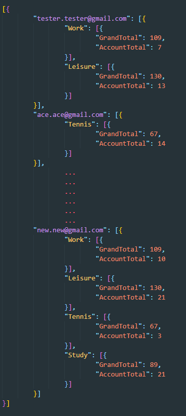

# Basic Training Exercise

This exercise assumes that you have managed to configure your Divblox project and that you understand the basic concepts.
If you are not sure that you do understand the basics, you can look at the [common examples](common-examples.md) and perhaps first try the 'Hello World' exercise.

> In this exercise we will go into a bit more detail about the main Divblox concepts that are used in every project.
> These concepts include:

-   Data modeling
-   The Divblox ORM (Object Relational Mapping)
-   Interaction between a component's front-end and back-end
-   Component and object security
-   Exposing an API

### Introduction

In this training exercise, we will be creating a basic ticketing system that will allow users to create and manage "tickets". To allow users to interact with our tickets, we will generate CRUD (Create, Read, Update, Delete) components.

Additionally, we will create the following components:

-   A page where full CRUD of tickets and categories is done
-   A page where we reuse the CREATE component for a ticket to allow the user to create tickets in a simple way

We will also be building some custom functionality to demonstrate how to communicate between the front-end and back-end of a Divblox application.

Finally, we will also learn how to secure our components and data model entities, as well as how to expose our functionality via the Divblox API layer.

### Step 1 - Data Model

We will be creating a data model with the following entities and attributes:

-   **Ticket**: TicketName, TicketDescription, TicketDueDate, TicketUniqueId, TicketStatus
-   **Category**: CategoryLabel

This can be represented as follows:


If you need a refresh on Divblox data modelling, click [here](data-modeler.md). Below is a walk-through of how to add the necessary entities using Divblox's Data Modeller.

<video id="TrainingExerciseStep1" muted="" playsinline="" preload="auto" autoplay>
  <source src="_basic-training-media/bte-1-1.mp4" type="video/mp4">
  Video is not supported
</video>
<button onclick="replayVideo('TrainingExerciseStep1')" type="button" class="video-control-button">
<i class="fa fa-repeat"></i>
</button>
<button onclick="fullScreenVideo('TrainingExerciseStep1')" type="button" class="video-control-button">
<i class="fa fa-expand"></i>
</button>

### Step 2 - CRUD Components

Now that our data model is created and synchronized with our database,
let's generate some CRUD components (using the component builder) for `Ticket` and `Category`. Below is a walk-through of how to create full CRUD functionality for the `Category` entity.

<video id="TrainingExerciseStep2.1" muted="" playsinline="" preload="auto" autoplay>
  <source src="_basic-training-media/bte-2-1.mp4" type="video/mp4">
  Video is not supported
</video>
<button onclick="replayVideo('TrainingExerciseStep2.1')" type="button" class="video-control-button">
<i class="fa fa-repeat"></i>
</button>
<button onclick="fullScreenVideo('TrainingExerciseStep2.1')" type="button" class="video-control-button">
<i class="fa fa-expand"></i>
</button>

> And now we will create the CRUD functionality for the `Ticket` entity, which although more complex, is just as easy with Divblox.

<video id="TrainingExerciseStep2.2" muted="" playsinline="" preload="auto" autoplay>
  <source src="_basic-training-media/bte-2-2.mp4" type="video/mp4">
  Video is not supported
</video>
<button onclick="replayVideo('TrainingExerciseStep2.2')" type="button" class="video-control-button">
<i class="fa fa-repeat"></i>
</button>
<button onclick="fullScreenVideo('TrainingExerciseStep2.2')" type="button" class="video-control-button">
<i class="fa fa-expand"></i>
</button>

> When checking the `Validate` checkbox, Divblox automatically notifies the user that input is required. Further validations can be added at a later stage.

Notice that in both examples we did not tick the `Constrain To` checkbox. If you constrain by a certain attribute, you are filtering to see only results that satisfy that criteria. An example would be to constrain Tickets by the current user account. This will display only tickets created by the current user. These constraints can only be done with entities that have a singular relationship. Singular relationships mean that an entity instance is linked to one, and only one, instance of another entity. E.g. Each ticket can only be linked to one account at any given time.


This logic also applies when using 'create' and 'update' functionality and using the `Constrain By` checkbox. An example here would be to automatically link a ticket to the current user upon creation.

You may want to change the display of certain attributes, in all of the components they feature. In our example, let's say we have a set predetermined list of ticket statuses the user should be able to chose from. This can be manually done in the `data_lists.json` and `entity_definitions.json` files. A walk-through of this is shown in the below video.

<video id="TrainingExerciseStep2.3" muted="" playsinline="" preload="auto" autoplay>
  <source src="_basic-training-media/bte-2-3.mp4" type="video/mp4">
  Video is not supported
</video>
<button onclick="replayVideo('TrainingExerciseStep2.3')" type="button" class="video-control-button">
<i class="fa fa-repeat"></i>
</button>
<button onclick="fullScreenVideo('TrainingExerciseStep2.3')" type="button" class="video-control-button">
<i class="fa fa-expand"></i>
</button>

### Step 3 - Page Components

In order for us to be able to use our newly generated CRUD components, or any other component for that matter, we need to put them inside pages.
Pages are also just components, but they can be navigated to by the user in the browser, while individual components can not.

!>A component is considered a page component when it is located in the "pages" grouping (the folder /project/components/pages/[component_name])

The pages we will build for this exercise are:

-   An admin page where our full CRUD components can live
-   A "New Ticket" page where users can create new tickets

To do this we will use a pre-made page template with a side navbar. As you will see, the navigation bar is pre-populated with links we will later override or delete to suite our needs.

<video id="TrainingExerciseStep3.1" muted="" playsinline="" preload="auto" autoplay>
  <source src="_basic-training-media/bte-3-1.mp4" type="video/mp4">
  Video is not supported
</video>
<button onclick="replayVideo('TrainingExerciseStep3.1')" type="button" class="video-control-button">
<i class="fa fa-repeat"></i>
</button>
<button onclick="fullScreenVideo('TrainingExerciseStep3.1')" type="button" class="video-control-button">
<i class="fa fa-expand"></i>
</button>

Now we can create the 'Tickets' page where users can create tickets. Note that we are not creating any new functionality, just reusing the 'create' component previously generated and placing it on its own page.

<video id="TrainingExerciseStep3.2" muted="" playsinline="" preload="auto" autoplay>
  <source src="_basic-training-media/bte-3-2.mp4" type="video/mp4">
  Video is not supported
</video>
<button onclick="replayVideo('TrainingExerciseStep3.2')" type="button" class="video-control-button">
<i class="fa fa-repeat"></i>
</button>
<button onclick="fullScreenVideo('TrainingExerciseStep3.2')" type="button" class="video-control-button">
<i class="fa fa-expand"></i>
</button>

### Step 4 - Navigation bar

Ok, we now have components that allow us to create our data, as well as pages to view them on. We will now update the side navigation bar to function as we want it to. Notice how, in this video, we edit the component code in our IDE (any IDE/text editor of your choice). The preferred way is to use an IDE, but for quick fixes like changing the HTML layout of our page we can use Divblox's built-in code editor. The process followed here is as follows:

1.  Name your page components
2.  Change the navbar links to what you need them to be
3.  Add JavaScript to link it to the page in question

<video id="TrainingExerciseStep4" muted="" playsinline="" preload="auto" autoplay>
  <source src="_basic-training-media/bte-4-1.mp4" type="video/mp4">
  Video is not supported
</video>
<button onclick="replayVideo('TrainingExerciseStep4')" type="button" class="video-control-button">
<i class="fa fa-repeat"></i>
</button>
<button onclick="fullScreenVideo('TrainingExerciseStep4')" type="button" class="video-control-button">
<i class="fa fa-expand"></i>
</button>

### Step 5 - Global Functions

For the purposes of this exercise, we want to assign a unique ID to every ticket. This will allow us later on to retrieve
information about our ticket via an API. To generate this unique ID, we will make use of a global function call.

!> Global functions are defined for functionality that will be used multiple times, reducing code duplication

> We will create the unique ID in the backend, as we need to verify whether or not it is indeed unique by checking our database.


#### Step 5.1 - Adding button

Add the button in our `ticket_crud_create` component that will generate a unique ID and populate the input box. We can do this through the Divblox web interface or in the source code.

Below is a video running through step 1:

<video id="TrainingExerciseStep5.2" muted="" playsinline="" preload="auto" autoplay>

  <source src="_basic-training-media/bte-5-1.mp4" type="video/mp4">
  Video is not supported
</video>
<button onclick="replayVideo('TrainingExerciseStep5.2')" type="button" class="video-control-button">
<i class="fa fa-repeat"></i>
</button>
<button onclick="fullScreenVideo('TrainingExerciseStep5.2')" type="button" class="video-control-button">
<i class="fa fa-expand"></i>
</button>

#### Step 5.2 - Create global function

Create the global php function that will generate the unique ID in `project_functions.php`.

#### Step 5.3 - Call global function

Call the global function from `component.php`, sending information to the front end.

Below is a video running through step 2 and 3:

<video id="TrainingExerciseStep5.3" muted="" playsinline="" preload="auto" autoplay>

  <source src="_basic-training-media/bte-5-2.mp4" type="video/mp4">
  Video is not supported
</video>
<button onclick="replayVideo('TrainingExerciseStep5.3')" type="button" class="video-control-button">
<i class="fa fa-repeat"></i>
</button>
<button onclick="fullScreenVideo('TrainingExerciseStep5.3')" type="button" class="video-control-button">
<i class="fa fa-expand"></i>
</button>

Here is the code added into the class ProjectFunctions, in `project/assets/php/project_functions.php`.

```php
public static function getNewTicketUniqueId() {
        $CandidateStr = self::generateRandomString(24);
        $DoneBool = false;
        while(!$DoneBool) {
            // Divblox query language to load a ticket from the database,
            // based on the UniqueId field
            $ExistingTicketCount = Ticket::LoadByTicketUniqueId($CandidateStr);
            if ($ExistingTicketCount == 0) {
                $DoneBool = true;
            } else {
                $CandidateStr = self::generateRandomString(24);
            }
        }
        return $CandidateStr;
    }
```

And the code added into the `ticket_crud_create` component.php file:

```php
// The function on our component controller that will return a new unique ticket ID for us.
// This function is executed when we pass "getNewTaskUniqueId" as
// the value for "f" from our component JavaScript
public function getNewTicketUniqueId() {
        // setReturnValue() sets the values in an array that will be returned as JSON
        //when the script completes. We always need to set the value for "Result" to either
        // "Success" or "Failed" in order for the component JavaScript to know
        // how to treat the response
        $this->setReturnValue("Result","Success");
        // It is always a good idea to populate a "Message" for the front-end
        $this->setReturnValue("Message", "New unique ID created");
        // Here we set the value of any additional parameters to return
        $this->setReturnValue("TicketId", ProjectFunctions::getNewTicketUniqueId());
        // "presentOutput()" returns our array as JSON and stops any
        // further execution of the current php script
        $this->presentOutput();
    }
```

#### Step 5.4 - Add JavaScript

Add the JavaScript functionality that auto-populates the input box with the newly generated unique ID in `component.js`.

Below is a video of step 4:

<video id="TrainingExerciseStep5.4" muted="" playsinline="" preload="auto" autoplay>

  <source src="_basic-training-media/bte-5-3.mp4" type="video/mp4">
  Video is not supported
</video>
<button onclick="replayVideo('TrainingExerciseStep5.4')" type="button" class="video-control-button">
<i class="fa fa-repeat"></i>
</button>
<button onclick="fullScreenVideo('TrainingExerciseStep5.4')" type="button" class="video-control-button">
<i class="fa fa-expand"></i>
</button>

The code added into the `initCustomFunctions` function was:

```js
// dxRequestInternal() is the global function used to communicate
// from the component's JavaScript to its back-end php component
dxRequestInternal(
    // The first parameter tells the function where to send the request
    // getComponentControllerPath(this) returns the path to current component's php script
    getComponentControllerPath(this),
    // Tell component.php which function to execute
    { f: "getNewTaskUniqueId" },
    function(data_obj) {
        // Success function
        getComponentElementById(this, "TicketUniqueId").val(data_obj.TaskId);
    }.bind(this),
    function(data_obj) {
        // Fail function
    }.bind(this)
);
```

### Step 6 - Security

It is important to understand how Divblox user roles are used to control access to the application. Divblox has two forms of access.

-   _Component access_ allows the user to view the components
-   _Data Model_ access gives the user permissions to perform CRUD operations on specific entities defined in the data model.

By default, there are two user roles.

1. Administrator - Has access to all components and full CRUD functionality.
2. User - This is the user role allocated to anyone who registers on your app. The default access is only to your profile and account.

Any user that is not authenticated is treated as "Anonymous" - No access, gets redirected to the anonymous landing page.

!> Additional user roles can be defined in the data modeller.

The Component default settings are as follows:


And the Data Model settings seen below. It is also important to note that by default users are able to `create` and `read` data, even if not explicitly stated in the `$AccessArray`.


For our exercise we created 2 pages (The 'admin' and 'new ticket' pages). Let's assume that we only want administrators to access the admin page.

You can access the register page by navigating to `[your_project_root]/?view=register`. New users are registered with the user role "User" by default.

!> It is also good practice to test user role access in incognito/private mode, as you are typically logged in as a Divblox admin (dxAdmin) most of the time in your application and this may cause confusion.

<video id="TrainingExerciseStep6.1" muted="" playsinline="" preload="auto" autoplay>
  <source src="_basic-training-media/bte-6-1.mp4" type="video/mp4">
  Video is not supported
</video>
<button onclick="replayVideo('TrainingExerciseStep6.1')" type="button" class="video-control-button">
<i class="fa fa-repeat"></i>
</button>
<button onclick="fullScreenVideo('TrainingExerciseStep6.1')" type="button" class="video-control-button">
<i class="fa fa-expand"></i>
</button>

As you can see, our new user is unable to view any of the pages we built. This is because he does not have component access to the components on those pages. We will change that in the `ComponentRoleBasedAccessArray::$AccessArray`.

In the below video we will firstly give our user full access to any `Ticket` and `Category` components. This will allow us to see how the _Data Model_ access works (we will observe this on our admin page). Once the _Data Model_ access is configured, we will then give our user access only to the `create` components of both `Ticket` and `Category`, allowing the user to view the _New Ticket_ page, but not the admin page.

<video id="TrainingExerciseStep6.2" muted="" playsinline="" preload="auto" autoplay>
  <source src="_basic-training-media/bte-6-2.mp4" type="video/mp4">
  Video is not supported
</video>
<button onclick="replayVideo('TrainingExerciseStep6.2')" type="button" class="video-control-button">
<i class="fa fa-repeat"></i>
</button>
<button onclick="fullScreenVideo('TrainingExerciseStep6.2')" type="button" class="video-control-button">
<i class="fa fa-expand"></i>
</button>

It is worth noting that this is a basic example to demonstrate how Divblox handles user access. As you may have seen above, there is no need to change the _Data Model_ access of our user to be able to `update` and `delete` as he will never be able to get to the admin page to do this.

### Step 7 - Exposing an API

Now that we have all the groundwork completed, let's provide the world with an API endpoint that will allow us to do some custom functionality on our tickets. To do this, we will copy the provided `api_example` endpoint and modify it for our use case. The API functionality we want to achieve is as follows:

-   Allow a user to provide us with an array of unique ticket IDs as input
-   Select only the ticket descriptions from the tickets
-   Merge all of the ticket descriptions into the first ticket (initial unique ID)
-   Delete the remaining tickets
-   Return the new merged ticket as output

We will be using a program called 'PostMan' to test our API functionality. It comes pre-installed on the Divblox VM image.

!>Divblox automatically handles the routing for your API endpoint. API endpoints are available at [your_project_root]/api/[endpoint_name]

Below we will briefly explore the `api_example` functionality, how to navigate the URL and what the expected output looks like.

<video id="TrainingExerciseStep7.1" muted="" playsinline="" preload="auto" autoplay>
  <source src="_basic-training-media/basic-training-exercise7.1.mp4" type="video/mp4">
  Video is not supported
</video>
<button onclick="replayVideo('TrainingExerciseStep7.1')" type="button" class="video-control-button">
<i class="fa fa-repeat"></i>
</button>
<button onclick="fullScreenVideo('TrainingExerciseStep7.1')" type="button" class="video-control-button">
<i class="fa fa-expand"></i>
</button>

To proceed, we will create a file `basic_training_exercise.php` in `project/api` and mimic the basic structure of an API endpoint like in `api_example.php`. Firstly, we add an API operation with function name`mergeTickets();`.

In the `mergeTickets();` function we code the following logic:

-   check if the input is valid JSON
-   check if the master unique ID exists
-   check if the master unique ID is valid
-   check if there are more than two IDs
-   if there is more than two IDs:
    -   loop through the valid IDs
    -   perform a merging of the ticket descriptions
    -   delete each ticket after its description is merged
-   save the results into the database
-   present output to front end

The code added into our 'basic_training_exercise.php' endpoint (`/project/api/basic_training_exercise.php`) is the following:

```php
<?php
require("../../divblox/divblox.php");
// Start by declaring your operations and then calling the initApi function.
// This is important for your API documentation to be automatically generated at run-time
PublicApi::addApiOperation("mergeTickets",
    // Specify the various input parameters as an array
    ["input_ids"],
    // Specify the various expected output parameters as an associative array
    ["merged_ticket" => "[JSON object representing new merged ticket]"],
    // Give your operation a name
    "Merge Tickets",
    // Give your operation a description
    "This operation will merge an array of tickets into a combined ticket with the unique
    ID of the first ticket. input_ids should be a JSON encoded array of unique ticket IDs");

// Describes the "entire" API endpoint
PublicApi::initApi("API endpoint to demonstrate our basic training exercise functionality",
                  "Basic Training Exercise");
// Operation
function mergeTickets() {
    // More information on functions available in the public API class
    // is provided in the API documentation section
    $InputIdArrayStr = PublicApi::getInputParameter("input_ids");
    if (!ProjectFunctions::isJson($InputIdArrayStr)) {
        PublicApi::setApiResult(false);
        PublicApi::addApiOutput("Message","Invalid value for input_ids provided.");
        PublicApi::printApiResult();
    }
    $InputIdArray = json_decode($InputIdArrayStr);
    if (!isset($InputIdArray[0])) {
        PublicApi::setApiResult(false);
        PublicApi::addApiOutput("Message","Invalid value for input_ids provided.");
        PublicApi::printApiResult();
    }
    $MasterTicketObj = Ticket::LoadByTicketUniqueId($InputIdArray[0]);
    if (is_null($MasterTicketObj)) {
        PublicApi::setApiResult(false);
        PublicApi::addApiOutput("Message","Invalid input ID for master ticket");
        PublicApi::printApiResult();
    }
    $InputIdArraySizeInt = ProjectFunctions::getDataSetSize($InputIdArray);
    if ($InputIdArraySizeInt < 2) {
        PublicApi::setApiResult(true);
        PublicApi::addApiOutput("merged_ticket", json_decode($MasterTicketObj->getJson()));
        PublicApi::printApiResult();
    }
    for ($i = 1; $i < $InputIdArraySizeInt; $i++) {
        $TicketObj = Ticket::LoadByTicketUniqueId($InputIdArray[$i]);
        if (is_null($TicketObj)) {
            continue;
        }
        $MasterTicketObj->TicketDescription .= $TicketObj->TicketDescription;
        $TicketObj->Delete();
    }
    $MasterTicketObj->Save();
    PublicApi::setApiResult(true);
    PublicApi::addApiOutput("merged_ticket", json_decode($MasterTicketObj->getJson()));
    PublicApi::printApiResult();
}
?>
```

Once we have defined our endpoint, we can test to see if everything works. Note that this specific API operation updates and deletes data in our database, we need to update the `Data Model` permissions so that 'any' users can 'update' and 'delete' (Recall that default permissions are only to 'create' and 'read'). Once this is done, our API operation should be set up and permissions for operations granted. We use Postman this time, as it makes it easier to input parameters and has a great user interface.

<video id="TrainingExerciseStep7.3" muted="" playsinline="" preload="auto" autoplay>
  <source src="_basic-training-media/bte-7-3.mp4" type="video/mp4">
  Video is not supported
</video>
<button onclick="replayVideo('TrainingExerciseStep7.3')" type="button" class="video-control-button">
<i class="fa fa-repeat"></i>
</button>
<button onclick="fullScreenVideo('TrainingExerciseStep7.3')" type="button" class="video-control-button">
<i class="fa fa-expand"></i>
</button>

### Step 8 - Further Examples

In the following examples, you will gain a deeper understanding of the Divblox PHP query language that is used to communicate with the database. We will also be building on your existing knowledge on how to communicate between the frontend and backend of your Divblox application.

!> In this section we will focus on the dxQuery language explained [here](the-basics.md?id=divbox-ORM-Queries).

You will build the following:

-   A custom component that will serve as a container for some example functions. This component will manage the communication between frontend and backend
-   Function 1: An example of how to generate dummy data
-   Function 2: Basic dxQuery example using `QueryArray()`
-   Function 3: A slightly more advanced dxQuery example using query conditions like `dxQ::AndCondition()` and `dxQ::Equal()`
-   Function 4: Even more advanced example that makes use of Divblox's wrappers for PHP's DateTime class
-   Function 5: Example of building up a query result in a loop
-   Function 6: More advanced example of building a query result in a loop
-   Function 7: Optimization of function 6
-   Lastly, we will optimize our code for extremely large datasets

#### Custom Component Setup

Create a custom component with two equally sized columns. In the left column we will house three elements, namely a drop down list of functions to select, an additional input box and a button to execute the chosen functionality. In the right column we will just create and empty div with ID = "ResultWrapper" so we can instruct `dxRequestInternal()` where to display any output. Below is a video walk through of the process:

<video id="TrainingExerciseStep8.1" muted="" playsinline="" preload="auto" autoplay>
  <source src="_basic-training-media/bte-8-1.mp4" type="video/mp4">
  Video is not supported
</video>
<button onclick="replayVideo('TrainingExerciseStep8.1')" type="button" class="video-control-button">
<i class="fa fa-repeat"></i>
</button>
<button onclick="fullScreenVideo('TrainingExerciseStep8.1')" type="button" class="video-control-button">
<i class="fa fa-expand"></i>
</button>

It is important to create a div in the right column so you can tell `dxInternalRequest()` where to return any output.

Next, we will set up our component JavaScript to send the selected function (and include the additional output if required) to the backend, and return whatever output the function provided to the front end.

We will again be using the `dxRequestInternal` function for backend/frontend communication.

The code that replaces the default 3 second loading function for our button is:

```javascript
dxRequestInternal(
    getComponentControllerPath(this),
    {
        // We specifically named the values of the drop down the same as
        // the functions to execute, so we can just use the value of input box
        f: getComponentElementById(this, "8LSBQ_FormControlSelect").val(),
        additional_input: getComponentElementById(
            this,
            "H7u7b_FormControlInput"
        ).val()
    },
    function(data_obj) {
        // Success Function
        // Returns (in JSON format) backend function output
        // in div with id="ResultWrapper"
        getComponentElementById(this, "ResultWrapper").html(
            JSON.stringify(data_obj.ReturnData)
        );
    }.bind(this),
    function(data_obj) {
        // Failure Function
        // Nothing set here right now
    }.bind(this),
    false,
    // Set loading text of button while function executes
    getComponentElementById(this, "dfVzo_btn"),
    "Executing " +
        getComponentElementById(this, "8LSBQ_FormControlSelect").val()
);
```

We should now be set! Our custom component is ready, our input selection is set up and we have a div to display our output. What remains now is to define our 7 functions.

#### Function 1

<strong>Generate data: This function will generate a bunch of categories & accounts, then it will generate a bunch of tickets, linked to a random category with a random status, account & due date </strong>

Here we use the built in PHP function `rand()`, as well as a bit of Divblox functionality, including the `dxDateTime()` class as well as the `generateRandomString()` and `generateTimeBasedString()` functions. If you are not comfortable with these, you can refer to the class/function definitions.

```php
public function Function1() {
    // Set how many of each we want to generate
    $AccountDataSize = 50;
    $CategoryDataSize = 8;
    $TicketDataSize = 500;
    $TicketStatusArray = ["New", "In Progress", "Backlog", "Urgent", "Completed"];

    // Note that you need an initial account and category for this to work
    for ($i = 0; $i < $TicketDataSize; $i++) {
        // Fill the Ticket object with necessary values and save into database
        $TicketObj = new Ticket();
        $TicketObj->TicketName = ProjectFunctions::generateRandomString(8);
        $TicketObj->TicketDescription = ProjectFunctions::generateRandomString(100);
        $TicketObj->TicketStatus = $TicketStatusArray[rand(0,4)];
        // dxDateTime has prebuilt functionality for working with dates,
        // all we are doing is making the DueDate a random date between
        // tomorrow and 20 days from now.
        $TicketObj->TicketDueDate = dxDateTime::Now()->AddDays(rand(1,20));
        // Load a random value from existing Account and Category Entities
        $TicketObj->AccountObject = Account::Load(rand(0,Account::CountAll()-1));
        $TicketObj->CategoryObject = Category::Load(rand(0,Category::CountAll()-1));
        $TicketObj->Save();
        if ($i >= $AccountDataSize) {
            continue;
        }
        // Fill the Account object with necessary values and save into database
        $AccountObj = new Account();
        $AccountObj->FirstName = ProjectFunctions::generateRandomString(8);
        $AccountObj->LastName = ProjectFunctions::generateRandomString(8);
        $AccountObj->FullName = $AccountObj->FirstName." ".$AccountObj->LastName;
        $AccountObj->EmailAddress = ProjectFunctions::generateTimeBasedRandomString();
        $AccountObj->Username = $AccountObj->EmailAddress;
        $AccountObj->Save();
        if ($i >= $CategoryDataSize) {
            continue;
        }
        //Fill the Category object with necessary values and save into database
        $CategoryObj = new Category();
        $CategoryObj->CategoryLabel = ProjectFunctions::generateTimeBasedRandomString();
        $CategoryObj->Save();
    }
    // Prepare the result we will send to the front end
    $this->setReturnValue("Result", "Success");
    $this->setReturnValue("ReturnData", "$TicketDataSize Tickets created");
    $this->presentOutput();
}
```

Every time we run this function, we are generating 500 new tickets, 8 new categories and 50 new accounts. Note that the way we executed our loop, the tickets will not be generated with uniform distribution of categories or accounts, as the oldest generated accounts and categories will be sampled more often. But since we are just doing this to get some data, we are not worried about that.

#### Function 2

<strong>Return all tickets in the category defined by the user in the additional input box. The default category should be 'Personal' if no input provided. </strong>

```php
// Return all tickets in the category specified in the input box
public function Function2() {
    // User input for which category to sort by.
    $CategoryInputStr = $this->getInputValue("additional_input");
    // Set default to "Personal"
    if (is_null($CategoryInputStr) || !strlen($CategoryInputStr)) {
        $CategoryInputStr = "Personal";
    }
    // dxQuery to return all tickets whose category matches the input category.
    // Note: $TicketArray is an array of individual ticket objects.
    $TicketArray = Ticket::QueryArray(
        dxQ::Equal(
            dxQN::Ticket()->CategoryObject->CategoryLabel,
            $CategoryInputStr
        )
    );
    // Create an array of the ticket objects with wanted category.
    // Note: we convert each ticket object into a JSON object
    // getJSON() returns the values in question in JSON (removing all methods).
    // We then decode the JSON object and append it to our $ResultArray. This is
    // because dxRequestInternal() already handles the JSON type conversions.
    $ReturnArray = [];
    foreach($TicketArray as $TicketObj) {
        $ReturnArray[] = json_decode($TicketObj->getJson());
    }
    // Set what we are returning to the front end
    $this->setReturnValue("Result", "Success");
    $this->setReturnValue("ReturnData", $ReturnArray);
    $this->presentOutput();
}
```

#### Function 3

<strong>Return all tickets where the Account's first name is specified in the additional input box (Default value is 'John') and the ticket status is "In Progress" </strong>

```php
// Return all tickets where the account's first name is specified in the input box and
// the ticket's status is <em>In Progress</em>
public function Function3() {
  // User input for which Name to sort by.
    $FirstNameStr = $this->getInputValue("additional_input");
    // Set default name to 'John'
    if (is_null($FirstNameStr) || !strlen($FirstNameStr)) {
        $FirstNameStr = "John";
    }
    // dxQuery to return all tickets whose name matches the input name AND
    // whose ticket status is 'In Progress'
    $TicketArray = Ticket::QueryArray(
        dxQ::AndCondition(
            dxq::Equal(
                dxqN::Ticket()->AccountObject->FirstName,
                $FirstNameStr
            ),
            dxq::Equal(
                dxqN::Ticket()->TicketStatus,
                "In Progress"
            )
        )
    );
    $ReturnArray = [];
    foreach($TicketArray as $TicketObj) {
        $ReturnArray[] = json_decode($TicketObj->getJson());
    }
    $this->setReturnValue("Result", "Success");
    $this->setReturnValue("ReturnData", $ReturnArray);
    $this->presentOutput();
}
```

#### Function 4

<strong>Return all tickets that have a status of "Completed" for the current month </strong>

This function is slightly trickier as we are now trying to sort by date. There are many ways to try do this, but we will use built-in Divblox functions to make this easier. The 'trick' here would be to be familiar and comfortable with what `dxDateTime` can offer you. All we do below is:

1. Set the StartDate to today's year and month but manually change the day to 1 and time to `00:00:00`.
2. Set the EndDate to StartDate, + 1 month, - 1 second (which is then just the last day of the current month)

```php
// Return all tickets that have a status Completed where the due
// date is in the current month, ordered by TicketDueDate ascending
public function Function4() {
    // Define start and end of current month
    $StartDateObj = dxDateTime::Now()->setDate(dxDateTime::Now()->format("Y"), dxDateTime::Now()->format("m"), 1)->setTime(0,0,0);
    $EndDateObj = dxDateTime::Now()->setDate(dxDateTime::Now()->format("Y"), dxDateTime::Now()->format("m"), 1)->setTime(0,0,0);
    $EndDateObj->addMonths(1);
    $EndDateObj->addSeconds(-1);
    // Slightly more complex dxQuery with 3 parts to the AND clause, as well as
    // and OrderBy Clause to sort by TicketDueDate ascending
    $TicketArray = Ticket::QueryArray(
        dxQ::AndCondition(
            dxq::Equal(
                dxqN::Ticket()->TicketStatus,
                "Completed"
            ),
            dxQ::GreaterOrEqual(
                dxqN::Ticket()->TicketDueDate,
                $StartDateObj
            ),
            dxQ::LessOrEqual(
                dxqN::Ticket()->TicketDueDate,
                $EndDateObj
            )
        ),
        dxQ::Clause(
            dxQ::OrderBy(
                dxqN::Ticket()->TicketDueDate,
                true
            )
        )
    );
    $ReturnArray = [];
    foreach($TicketArray as $TicketObj) {
        $ReturnArray[] = json_decode($TicketObj->getJson());
    }
    $this->setReturnValue("Result", "Success");
    $this->setReturnValue("ReturnData", $ReturnArray);
    $this->presentOutput();
}
```

#### Function 5

<strong>Return a list of "Account" full names with a count of tickets that they each currently have "In Progress" </strong>

In this function we first request an array of all Account objects. We then loop through each of those objects, and fill a key-value pair array as [FullName => NrTicketsInProgress] which is our expected result.

```php
// Return a list of account full names with a count of tickets that
// they each currently have <em>In Progress</em>.
public function Function5() {
    // Returns an array of all Account objects
    $AccountArray = Account::QueryArray(
        dxQ::All()
    );
    //Same results as: $AccountArray = Account::LoadAll();
    $ReturnArray = [];
    foreach ($AccountArray as $AccountObj) {
        $ReturnArray[$AccountObj->FullName] = Ticket::QueryCount(
            dxQ::Equal(
                dxQN::Ticket()->AccountObject->Id,
                $AccountObj->Id
            )
        );
    }
    $this->setReturnValue("Result", "Success");
    $this->setReturnValue("ReturnData", $ReturnArray);
    $this->presentOutput();
}
```

#### Function 6

<strong>Return a list of "Account" email addresses. For each account, show an array of categories. For each "Category" in the array, show the total count of all tickets for that category as well as the count for the specific account </strong>

You will end up with a nested array of objects, structured something like this:



For each account (defined by it's email address) we want to see an array of all the categories used in their tickets. For each of those account-used categories, we want to see both the category's total tickets, as well as the account's category total ticket count.

```php
public function Function6() {
    // Get Array of Account objects and array of Category objects
    $AccountArray = Account::QueryArray(
        dxQ::All()
    );
    $CategoryArray = Category::QueryArray(
        dxQ::All()
    );
    $ReturnArray = [];
    //Note Array indexing, refer to above diagram for visual aid of data structure
    foreach ($AccountArray as $AccountObj) {
        $ReturnArray[$AccountObj->EmailAddress] = [];
        foreach ($CategoryArray as $CategoryObj) {
            // For each account and each category, we find the two totals
            $TotalCountInt = Ticket::QueryCount(
                dxQ::Equal(
                    dxQN::Ticket()->CategoryObject->CategoryLabel,
                    $CategoryObj->CategoryLabel
                )
            );
            $AccountCountInt = Ticket::QueryCount(
                dxQ::AndCondition(
                    dxQ::Equal(
                        dxQN::Ticket()->CategoryObject->CategoryLabel,
                        $CategoryObj->CategoryLabel
                    ),
                    dxQ::Equal(
                        dxQN::Ticket()->AccountObject->Id,
                        $AccountObj->Id
                    )
                )
            );
            // For each account->category pair, we add the two total values
            $ReturnArray[$AccountObj->EmailAddress][$CategoryObj->CategoryLabel] =
              ["GrandTotal"=> $TotalCountInt, "AccountTotal"=> $AccountCountInt];
        }
    }
    $this->setReturnValue("Result", "Success");
    $this->setReturnValue("ReturnData", $ReturnArray);
    $this->presentOutput();
}
```

#### Function 7

<strong>Optimize the query in Function 6 using the Select Clause and by reducing the number of iterations in the loop. You can use your browser's dev tools to monitor the time taken to execute the query. </strong>

1. Select only the necessary attribute from Account entity, i.e. EmailAddress. This means that we are only returning a single column from the database. NOTE: Even though you only select one column, the Account primary key is still included for indexed searching.
2. We only calculate the GrandTotal once for every Category, instead of re-checking and re-saving it every time we loop over an account, which has a ticket with said category.

The new code can be seen below:

```php
// Optimizes function 6 to return its query result quicker
    public function Function7() {
        // Optimization 1 : Select only the necessary attribute from
        // Account entity, i.e. EmailAddress.
        $AccountArray = Account::QueryArray(
            dxQ::All(),
            dxQ::Clause(
                dxQ::Select(
                    dxQN::Account()->EmailAddress
                )
            )
        );
        $CategoryArray = Category::QueryArray(
            dxQ::All()
        );
        $ReturnArray = [];
        $TotalCountArray = [];
        foreach ($AccountArray as $AccountObj) {
            $ReturnArray[$AccountObj->EmailAddress] = [];
            foreach ($CategoryArray as $CategoryObj) {
                // Optimization 2: Only check TotalCount once for each category
                if (!isset($TotalCountArray[$CategoryObj->Id])) {
                    $TotalCountArray[$CategoryObj->Id] = Ticket::QueryCount(
                        dxQ::Equal(
                            dxQN::Ticket()->CategoryObject->Id,
                            $CategoryObj->Id
                        )
                    );
                }
                $AccountCountInt = Ticket::QueryCount(
                    dxQ::AndCondition(
                        dxQ::Equal(
                            dxQN::Ticket()->CategoryObject->Id,
                            $CategoryObj->Id
                        ),
                        dxQ::Equal(
                            dxQN::Ticket()->AccountObject->Id,
                            $AccountObj->Id
                        )
                    ),
                    dxQ::Clause(
                        dxQ::Select(
                            dxqN::Ticket()->Id
                        )
                    )
                );
                $ReturnArray[$AccountObj->EmailAddress][$CategoryObj->CategoryLabel] =
                 ["GrandTotal"=> $TotalCountArray[$CategoryObj->Id], "AccountTotal"=> $AccountCountInt];
            }
        }
        $this->setReturnValue("Result", "Success");
        $this->setReturnValue("ReturnData", $ReturnArray);
        $this->presentOutput();
    }
```

Using the browser's network monitoring tool, the difference with just these minor changes can already be seen. Below is a screenshot of the times taken with the two methods. 5 observations were taken for a better average. There are much better and more in-depth ways to test your code efficiency, but for this example a rough visual difference is all we need. The time taken is dependent on the hardware of your machine, as well as how big your database is. So if your times are different, don't worry, as long as you can see a visible decrease in time taken.


#### Final Optimizations

In this last step, we will have to change our data model slightly. Let us include the `TicketCount` attribute into the `Category` entity, which will represent the total number of tickets in the category in question, and will be updated as tickets are saved and deleted. Using Divblox's data modeller, this process is simple and all the user needs to do is add the attribute and sync to the database, which updates the database and regenerates all the classes and necessary functionality code.

This optimization is intended for when our dataset becomes extremely large, and the cost of making even an optimized query in a loop becomes too high. In this optimization we are focusing on preparing our data for reporting purposes rather than aggregating after the fact.

We will need to write the functionality that calculates the `TicketCount` into the `Save()` and `Delete()` functions of the Ticket ORM class, meaning that any time a ticket is saved or deleted, the `TicketCount` will be updated. We can do this by overriding their default behaviour defined in `TicketGen.class.php` (`divblox/config/database/data_model_orm/generated/TicketGen.class.php`) in `Ticket.class.php` (`divblox/config/database/data_model_orm/Ticket.class.php`). We do this in accordance with the Divblox code-generation philosophy: never touch auto-generated files, but rather add functionality in classes that extend base Divblox functionality to prevent loss of work.

The code added to the class `Ticket` which extends the class `TicketGen` was:

```php
public function Save($blnForceInsert = false, $blnForceUpdate = false) {
    // This step ensures that all of the original Save functionality is still carried out.
    $mixToReturn = parent::Save($blnForceInsert,$blnForceUpdate);

    $CategoryObj = Category::Load($this->intCategory);
    //If the category exists, calculate the total
    if (!is_null($CategoryObj)) {
        $TicketCount = Ticket::QueryCount(
            dxQ::Equal(
                dxQN::Ticket()->CategoryObject->Id,
                $CategoryObj->Id
            )
        );
        // Write it into local storage, and save into database
        $CategoryObj->TicketCount = $TicketCount;
        $CategoryObj->Save();
    }
    // Return
    return $mixToReturn;
}
```

```php
public function Delete() {
    // For delete, we first load the category since after it is deleted
    // we won't be able to know which category the ticket was in.
    $CategoryObj = Category::Load($this->intCategory);
    parent::Delete();
    // If category exists, calculate the total
    if (!is_null($CategoryObj)) {
        $TicketCount = Ticket::QueryCount(
            dxQ::Equal(
                dxQN::Ticket()->CategoryObject->Id,
                $CategoryObj->Id
            )
        );
        // Write it into local storage, and save into database
        $CategoryObj->TicketCount = $TicketCount;
        $CategoryObj->Save();
    }
}
```

This is great. Now every time we create or delete a ticket, our counter will automatically update. But what do we do about the tickets that already exist in our database? We will have to create a throwaway script to run once to account for all the already existing tickets in our database.

```php
<?php
require("divblox/divblox.php");
// Select All Categories
$CategoryArray = Category::QueryArray(
    dxQ::All()
);
// For each unique category, calculate the total number of tickets
// which have that category
foreach ($CategoryArray as $CategoryObj) {
    $TicketCount = Ticket::QueryCount(
        dxQ::Equal(
            dxQN::Ticket()->CategoryObject->Id,
            $CategoryObj->Id
        )
    );
    // save $TicketCount into localstorage and into database.
    $CategoryObj->TicketCount = $TicketCount;
    $CategoryObj->Save();
}
?>
```

This script can be saved anywhere and run by going to `localhost/[your_project]/[path_to_script]/throwaway.php` in your browser. You can confirm that it performed what it was supposed to by checking the category table in phpMyAdmin.

Now, the final step is to go back to our code and just reference the TicketCount attribute instead of calculating the TicketCount total every time. This shouldn't really affect our speed significantly until we have a _very_ large data set, but was included for good practice.

```php
public function Function7() {
        $AccountArray = Account::QueryArray(
            dxQ::All(),
            dxQ::Clause(
                dxQ::Select(
                    dxQN::Account()->EmailAddress
                )
            )
        );
        $CategoryArray = Category::QueryArray(
            dxQ::All()
        );
        $ReturnArray = [];
        foreach ($AccountArray as $AccountObj) {
            $ReturnArray[$AccountObj->EmailAddress] = [];
            foreach ($CategoryArray as $CategoryObj) {
                $AccountCountInt = Ticket::QueryCount(
                    dxQ::AndCondition(
                        dxQ::Equal(
                            dxQN::Ticket()->CategoryObject->Id,
                            $CategoryObj->Id
                        ),
                        dxQ::Equal(
                            dxQN::Ticket()->AccountObject->Id,
                            $AccountObj->Id
                        )
                    ),
                    dxQ::Clause(
                        dxQ::Select(
                            dxqN::Ticket()->Id
                        )
                    )
                );
                $ReturnArray[$AccountObj->EmailAddress][$CategoryObj->CategoryLabel] =
                    ["GrandTotal"=> $CategoryObj->TicketCount, "AccountTotal"=> $AccountCountInt];
            }
        }
        $this->setReturnValue("Result", "Success");
        $this->setReturnValue("ReturnData", $ReturnArray);
        $this->presentOutput();
    }
```

### Summary

In this exercise you learned about all the basic elements of a Divblox project. If you understand step 1 - 8 completely, you should have a fundamental understanding of the basics of any Divblox application.

If you would like to receive further hands-on training from the Divblox team, please reach out to us at support@divblox.com and we will arrange a consultation.
