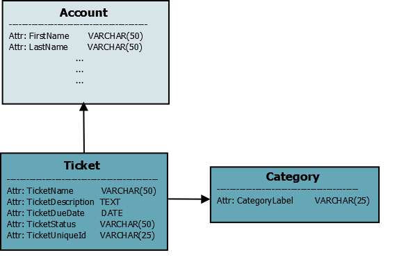

# Basic Training Exercise

This exercise assumes that you have managed to configure your Divblox project and that you understand the basic concepts.
If you are not sure that you do understand the basics, first try the [Hello World](hello-world.md) exercise.

> In this exercise we will go into a bit more detail about the main Divblox concepts that are used in every project.
> These concepts include:

-   Data modeling
-   The Divblox ORM (Object Relational Mapping)
-   Interaction between a component's front-end and back-end
-   Component and object security
-   Exposing an API

### Introduction

In this training exercise, we will be creating a basic ticketing system that will allow users to create and manage "tickets". To allow users to interact with our tickets, we will generate CRUD (Create, Read, Update, Delete) components.

Additionally, we will create the following components:

-   A page where full CRUD of tickets and statuses is done
-   A page where we reuse the CREATE component for a ticket to allow the user to create tickets in a simple way

We will also be building some custom functionality to demonstrate how to communicate between the front-end and back-end of a Divblox application.

Finally, we will also learn how to secure our components and data model entities, as well as how to expose our functionality via the Divblox API layer.

### Step 1 - Data Model

We will be creating a data model with the following entities and attributes:

-   **Ticket**: TicketName, TicketDescription, DueDate, TicketUniqueId
-   **TicketStatus**: StatusLabel

This can be represented as follows:



If you need a refresh on Divblox data modelling, click [here](data-modeler.md). Below is a walk-through of how to add the necessary entities using Divblox's Data Modeller.

<video id="TrainingExerciseStep1" muted="" playsinline="" preload="auto" autoplay>
  <source src="_basic-training-media/basic-training-exercise1Final.mp4" type="video/mp4">
  Video is not supported
</video>
<button onclick="replayVideo('TrainingExerciseStep1')" type="button" class="video-control-button">
<i class="fa fa-repeat"></i>
</button>
<button onclick="fullScreenVideo('TrainingExerciseStep1')" type="button" class="video-control-button">
<i class="fa fa-expand"></i>
</button>

### Step 2 - CRUD Components

Now that our data model is created and synchronized with our database,
let's generate some CRUD components (using the component builder) for Ticket and TicketStatus. Below is a walk-through of how to create full CRUD functionality for the ticket status entity.

<video id="TrainingExerciseStep2.1" muted="" playsinline="" preload="auto" autoplay>
  <source src="_basic-training-media/basic-training-exercise2.mp4" type="video/mp4">
  Video is not supported
</video>
<button onclick="replayVideo('TrainingExerciseStep2.1')" type="button" class="video-control-button">
<i class="fa fa-repeat"></i>
</button>
<button onclick="fullScreenVideo('TrainingExerciseStep2.1')" type="button" class="video-control-button">
<i class="fa fa-expand"></i>
</button>

> And now we will create the CRUD functionality for the ticket entity, which although more complex, is just as easy with Divblox.

<video id="TrainingExerciseStep2.3" muted="" playsinline="" preload="auto" autoplay>
  <source src="_basic-training-media/basic-training-exercise3.mp4" type="video/mp4">
  Video is not supported
</video>
<button onclick="replayVideo('TrainingExerciseStep2.3')" type="button" class="video-control-button">
<i class="fa fa-repeat"></i>
</button>
<button onclick="fullScreenVideo('TrainingExerciseStep2.3')" type="button" class="video-control-button">
<i class="fa fa-expand"></i>
</button>

> When checking the `Validate` checkbox, Divblox automatically notifies the user that input is required. Further validations can be added at a later stage.

Notice that in both examples we did not tick the `Constrain To` checkbox. If you constrain by a certain attribute, you are filtering to see only results that satisfy that criteria. An example would be to constrain Tickets by the current user account. This will display only tickets created by the current user. These constraints can only be done with entities that have a singular relationship.

This logic also applies when using 'create' and 'update' functionality and using the `Constrain By` checkbox. An example here would be linking a ticket to the current user's ID.

### Step 3 - Page Components

In order for us to be able to use our newly generated CRUD components, or any other component for that matter, we need to put them inside pages. Pages are also just components, but they can be navigated to by the user in the browser. The only distinction betweeen other components and page components is that pages can be navigated to via the url or a navigation bar, while individual components can not.

The pages we will build for this exercise are:

-   An admin page where our full CRUD components can live
-   A "New Ticket" page where users can create new tickets

To do this we will use a pre-made page template with a side navbar. As you will see, the navigation bar is pre-populated with links we will later override or delete to suite our needs.

<video id="TrainingExerciseStep3.1" muted="" playsinline="" preload="auto" autoplay>
  <source src="_basic-training-media/basic-training-exercise-step3-1.mp4" type="video/mp4">
  Video is not supported
</video>
<button onclick="replayVideo('TrainingExerciseStep3.1')" type="button" class="video-control-button">
<i class="fa fa-repeat"></i>
</button>
<button onclick="fullScreenVideo('TrainingExerciseStep3.1')" type="button" class="video-control-button">
<i class="fa fa-expand"></i>
</button>

Now we can create the 'Tickets' page where users can create tickets.

<video id="TrainingExerciseStep3.2" muted="" playsinline="" preload="auto" autoplay>
  <source src="_basic-training-media/basic-training-exercise-step3-2.mp4" type="video/mp4">
  Video is not supported
</video>
<button onclick="replayVideo('TrainingExerciseStep3.2')" type="button" class="video-control-button">
<i class="fa fa-repeat"></i>
</button>
<button onclick="fullScreenVideo('TrainingExerciseStep3.2')" type="button" class="video-control-button">
<i class="fa fa-expand"></i>
</button>

### Step 4 - Navigation bar

Ok, we now have components that allow us to create our data, as well as pages to view them on. We will now update the side navigation bar to function as we want it to. Notice how in this video we edit the component code in VS Code (or whatever code editor you prefer). The preferred way is to use a code editor, but for quick fixes like changing the HTML layout of our page we can ue Divblox's built-in code editor. The process followed here is as follows:

-   Name your page components
-   Change the navbar links to what you need them to be
-   Add JS to link it to the page in question

<video id="TrainingExerciseStep4" muted="" playsinline="" preload="auto" autoplay>
  <source src="_basic-training-media/basic-training-exercise-step4.mp4" type="video/mp4">
  Video is not supported
</video>
<button onclick="replayVideo('TrainingExerciseStep4')" type="button" class="video-control-button">
<i class="fa fa-repeat"></i>
</button>
<button onclick="fullScreenVideo('TrainingExerciseStep4')" type="button" class="video-control-button">
<i class="fa fa-expand"></i>
</button>

### Step 5 - Global Functions

For the purposes of this exercise, we want to assign a unique ID to every ticket. This will allow us later on to retrieve
information about our ticket via an API. To generate this unique ID, we will make use of a global function call.

!> Global functions are defined for functionality that will be used multiple times, reducing code duplication

-   Step 1: Let's add a new function to project.js (project/assets/js/project.js) that we can call from anywhere to generate a new unique ticket ID
-   Step 2: Because we need to ensure uniqueness of this ID, we should generate it on the server-side where we can check uniqueness before
    returning the ID. This means we need to add a new function to global_request_handler.php (project/assets/php/global_request_handler.php) to deal with this.

<video id="TrainingExerciseStep5" muted="" playsinline="" preload="auto" autoplay>
  <source src="_videos/divblox_exercise-global_functions_1.mp4" type="video/mp4">
  Video is not supported
</video>
<button onclick="replayVideo('TrainingExerciseStep5')" type="button" class="video-control-button">
<i class="fa fa-repeat"></i>
</button>
<button onclick="fullScreenVideo('TrainingExerciseStep5')" type="button" class="video-control-button">
<i class="fa fa-expand"></i>
</button>

> Below are the functions for both the project.js and global_request_handler.php scripts as shown in the video above

-   Add the following to project.js:

```javascript
function getNewTaskUniqueId(success_callback, failed_callback) {
    if (typeof success_callback !== "function") {
        success_callback = function(ticket_id) {};
    }
    if (typeof failed_callback !== "function") {
        failed_callback = function(message) {};
    }
    dxRequestInternal(
        getServerRootPath() + "project/assets/php/global_request_handler.php",
        { f: "getNewTaskUniqueId" },
        function(data_obj) {
            // Success function
            success_callback(data_obj.TicketUniqueId);
        },
        function(data_obj) {
            // Fail function
            failed_callback("Unknown error");
        }
    );
}
```

-   Add the following function to global_request_handler.php:

```php
function getNewTaskUniqueId() {
    $CandidateStr = ProjectFunctions::generateRandomString(24);
    $DoneBool = false;
    while(!$DoneBool) {
        $ExistingTicketCount = Ticket::LoadByTicketUniqueId($CandidateStr); // Divblox query language to load a ticket from the database, based on the UniqueId field
        if ($ExistingTicketCount == 0) {
            $DoneBool = true;
        } else {
            $CandidateStr = ProjectFunctions::generateRandomString(24);
        }
    }
    return $CandidateStr;
}

// Update the switch statement that deals with which function to call to look like this:
switch($_POST["f"]) {
    case 'getUserRole': die(json_encode(array("Result" => "Success","CurrentRole" => ProjectFunctions::getCurrentUserRole())));
        break;
    case 'getCurrentAccountId': die(json_encode(array("Result" => "Success","CurrentAccountId" => ProjectFunctions::getCurrentAccountAttribute())));
        break;
    case 'getCurrentAccountAttribute': die(json_encode(array("Result" => "Success","Attribute" => getCurrentAccountAttribute())));
        break;
    case 'logoutCurrentAccount': die(json_encode(array("Result" => "Success","LogoutResult" => ProjectFunctions::logoutCurrentAccount())));
        break;
    case 'updatePushRegistration': updatePushRegistration();
        break;
    case 'getNewTaskUniqueId': die(json_encode(array("Result" => "Success","TicketUniqueId" => getNewTaskUniqueId())));
        break;
    // TODO: Define custom function handlers here...
    default:  die(json_encode(array("Result" => "Failed","Message" => "Invalid function")));
}
```

Now we have our global functions ready. Let's add a button to our ticket CREATE component that will populate the ticket unique ID field with
the value returned from our global function.

<video id="TrainingExerciseStep5a" muted="" playsinline="" preload="auto" autoplay>
  <source src="_videos/divblox_exercise-global_functions_2.mp4" type="video/mp4">
  Video is not supported
</video>
<button onclick="replayVideo('TrainingExerciseStep5a')" type="button" class="video-control-button">
<i class="fa fa-repeat"></i>
</button>
<button onclick="fullScreenVideo('TrainingExerciseStep5a')" type="button" class="video-control-button">
<i class="fa fa-expand"></i>
</button>

### Step 6 - Security

For our exercise we created 2 pages (The admin and new ticket pages). Let's assume that we only want administrators to access the admin page.
We can achieve this by updating the component access in the project_classes.php script (project/assets/php/project_classes.php). To test this, we
need to register a new user that can log in.

!>You can access the register page by navigating to [your_project_root]/?view=register. New users are registered with the user role "User" by default

<video id="TrainingExerciseStep6" muted="" playsinline="" preload="auto" autoplay>
  <source src="_videos/divblox_exercise-security_1.mp4" type="video/mp4">
  Video is not supported
</video>
<button onclick="replayVideo('TrainingExerciseStep6')" type="button" class="video-control-button">
<i class="fa fa-repeat"></i>
</button>
<button onclick="fullScreenVideo('TrainingExerciseStep6')" type="button" class="video-control-button">
<i class="fa fa-expand"></i>
</button>

!>By default, Divblox allows access to all components for all users. This can be turned off easily by commenting out the following in project_classes.php

```php
$InitialReturn = parent::getComponentAccess($AccountId,$ComponentName);
// Find this line and comment it out
return true; // TODO: This is a temporary measure to allow you to get started quickly without restrictions.
// Remove this and implement correctly for your solution. NB! THIS GIVES ACCESS TO ALL COMPONENTS TO ANY USER!!!
```

> To apply the security rule, modify the \$UserRoleSpecificComponentArray in project_classes.php to the following:

```php
$UserRoleSpecificComponentArray = array(
            "User" => ["account_additional_info_manager","account_additional_info_manager_data_series","account_additional_info_manager_create","account_additional_info_manager_update",
                "new_ticket","ticket_crud_create"],
            "Administrator" => ["ticket_crud","ticket_crud_create","ticket_crud_update","ticket_crud_data_series",
                "ticket_status_crud","ticket_status_crud_create","ticket_status_crud_update","ticket_status_crud_data_series"]
            //TODO: Add more as required here
        );
```

This tells the system explicitly which user roles have access to which components. Once this rule is applied, try to open the admin page with your newly created user.

<video id="TrainingExerciseStep6a" muted="" playsinline="" preload="auto" autoplay>
  <source src="_videos/divblox_exercise-security_2.mp4" type="video/mp4">
  Video is not supported
</video>
<button onclick="replayVideo('TrainingExerciseStep6a')" type="button" class="video-control-button">
<i class="fa fa-repeat"></i>
</button>
<button onclick="fullScreenVideo('TrainingExerciseStep6a')" type="button" class="video-control-button">
<i class="fa fa-expand"></i>
</button>

### Step 7 - Exposing an API

Now that we have all the groundwork completed, let's provide the world with an API endpoint that will provide information about our ticket if its unique ID is provided.
To do this, we will copy the provided api_example endpoint and modify it for our use case.

!>Divblox automatically handles the routing for your API endpoint. API endpoints are available at [your_project_root]/api/endpoint

<video id="TrainingExerciseStep7" muted="" playsinline="" preload="auto" autoplay>
  <source src="_videos/divblox_exercise-apis_1.mp4" type="video/mp4">
  Video is not supported
</video>
<button onclick="replayVideo('TrainingExerciseStep7')" type="button" class="video-control-button">
<i class="fa fa-repeat"></i>
</button>
<button onclick="fullScreenVideo('TrainingExerciseStep7')" type="button" class="video-control-button">
<i class="fa fa-expand"></i>
</button>

> Let's see our API in action

<video id="TrainingExerciseStep7a" muted="" playsinline="" preload="auto" autoplay>
  <source src="_videos/divblox_exercise-apis_2.mp4" type="video/mp4">
  Video is not supported
</video>
<button onclick="replayVideo('TrainingExerciseStep7a')" type="button" class="video-control-button">
<i class="fa fa-repeat"></i>
</button>
<button onclick="fullScreenVideo('TrainingExerciseStep7a')" type="button" class="video-control-button">
<i class="fa fa-expand"></i>
</button>

### Summary

In this exercise you learned about all the basic elements of a Divblox project. If you understand step 1 - 7 completely, you should be able to build
virtually any Divblox project.

If you would like to receive further hands-on training from the Divblox team, please reach out to us at support@Divblox.com and we will arrange a consultation.
