# Divblox Components

Virtually everything in Divblox is a component. Components are used as the building blocks for your project. You can create any type of component for your specific requirement, from a basic image viewer to a full blown page that is made up of multiple individual components. There are templates for navigation bars, page setups, CRUD functionality and more. Each component can be modified and reused as required, dynamically across your whole project.

# How components work

Every Divblox component follows a certain recipe. The extremely high-level view of this is diagrammed below.

<p align="center">
    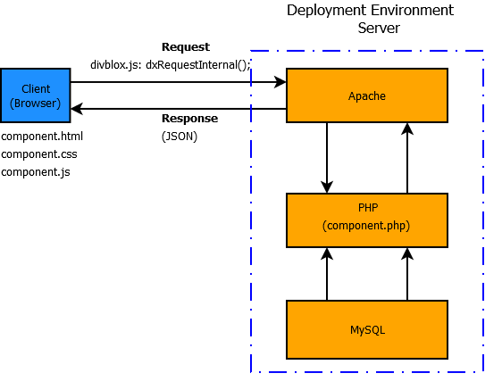
</p>

Each of Divblox's components communicates between client and server _independently_. A component is made up of 5 independent files, each responsible for their own unique functionality. More on this later in the [component DNA section](#component-dna).

# Component Types

> Divblox allows you to create any of the following types of components:

-   [Data model](data-modeler.md) related components
-   Custom components
-   Basic components

## Data model components

Data model components allow for the CRUD behaviour of any of your data model entities. Divblox can generate the following CRUD components from your data model:

-   **Create component:**
    -   Displays input boxes for the relevant attributes of your entity along with a save button.
    -   Processes the request to the server to create a new instance of your entity and store it in the database

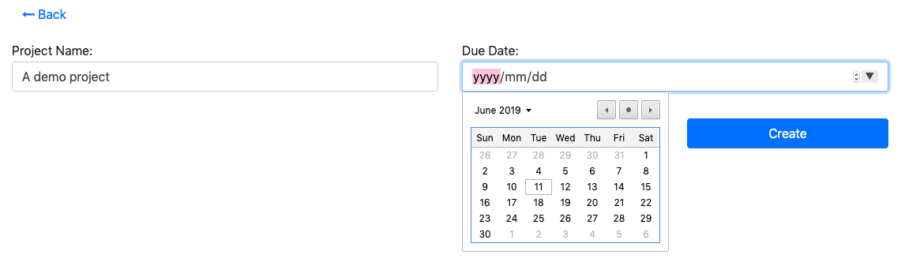

-   **Update component:**
    -   Displays pre-populated input boxes for the relevant attributes of your entity along with a save & a delete button.
    -   Processes the request to the server to update or delete the existing instance of your entity in the database

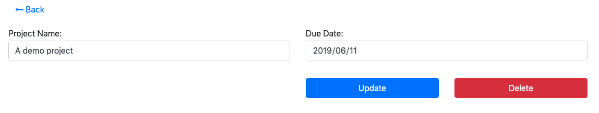

-   **Data Table component:**
    -   Displays a tabular view with data from the database for the selected entity. The data can be searched and/or constrained as required.
    -   Allows multiple functions to be executed on the data set, including Excel,csv or text export and bulk deletion.

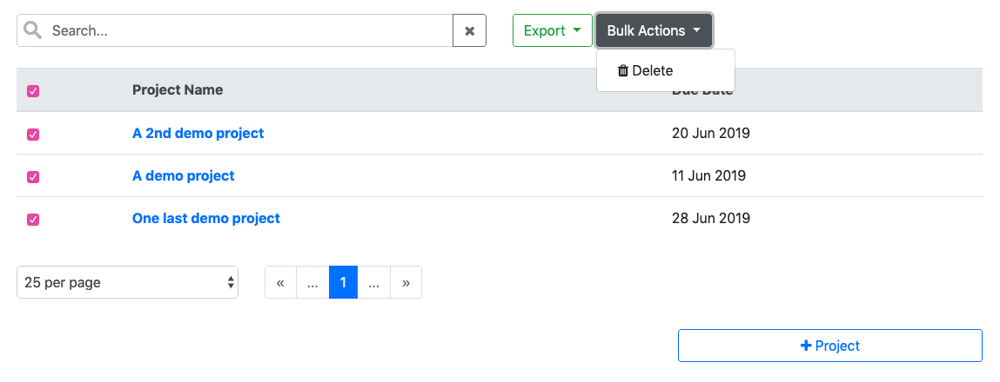

-   **Data List component:**
    -   Displays a list view with data from the database for the selected entity.
    -   The data can be searched and/or constrained as required. This is intended to be a more mobile friendly way of viewing data for a specific entity.

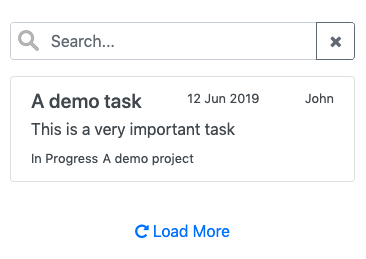

## Custom components

Custom components allow you to create any specific type of functionality for your app.
Create anything from an image viewer or an html editor, to file uploaders and charting tools. Divblox ships standard with the following custom components:

-   **Data Visualization:** Chartjs with examples
-   **Navigation:** Various types of navbars, including top, bottom and side navbars
-   **System:**
    -   Authentication: Allows for a user to authenticate or log in to your solution
    -   File upload: Provides a modern file uploader and processes the uploaded file on the server
    -   Image upload: Similar to the file upload component, but for images. Provides basic image manipulation such as crop and resize, etc.
    -   Rich text editor: A wysiwyg editor that processes your html input and sends it to the server
    -   Native versions of file and image upload, including native camera access
    -   A basic image viewer

## Basic components

Basic components are typically components that do not necessarily have a server-side requirement.
These can range from simple alerts and buttons, to modals and progress bars.

> Divblox ships standard with the majority of [bootstrap's](https://getbootstrap.com/docs/4.3/components/alerts/) UI components

# Component DNA

Components are typically made up of the following parts:

-   An HTML file
-   A CSS file
-   A Javascript file
-   A Php file
-   A JSON file

!> The exception here is **basic components**. These types of components usually reside within existing components to provide additional specialized functionality.

## Component HTML

The component's HTML file describes the component's layout.
The basic structure of any component's HTML follows the following pattern:

```html
<!-- The component wrapper is used to contain the content of the entire component-->
<div id="ComponentWrapper" class="component-wrapper">
    <!-- The component placeholder is shown first while the component is loading-->
    <div
        id="ComponentPlaceholder"
        class="component_placeholder component_placeholder_general"
    >
        <!-- Should an error occur, from which the component cannot recover, 
        the component feedback is used to display the error to the user-->
        <div id="ComponentFeedback"></div>
    </div>
    <!-- Once the component has successfully loaded, 
    the component content replaces the component placeholder. 
    Therefor it is hidden to start with-->
    <div
        id="ComponentContent"
        class="component-content"
        style="display:none"
    ></div>
</div>
```

## Component CSS

The component's CSS file provides any special styling that is required by the component. By default this is empty

## Component Javascript

The component's Javascript file controls the component's behaviour. The basic structure of any component's Javascript follows the following pattern:

```javascript
if (typeof component_classes["ungrouped_demo_component"] === "undefined") {
    class ungrouped_demo_component extends DivbloxDomBaseComponent {
        constructor(inputs, supports_native, requires_native) {
            super(inputs, supports_native, requires_native);
            // Sub component config start
            this.sub_component_definitions = [];
            // Sub component config end
        }
    }
    component_classes["ungrouped_demo_component"] = ungrouped_demo_component;
}
```

As seen above, this class `ungrouped_demo_component` extends the `DivbloxDomBaseComponent` class from which every Divblox component inherits. This class manages the following behaviour for each component:

-   Loading workflow, which includes checking of prerequisites and dependencies
-   Error handling
-   Component & Subcomponent resets
-   Event handling and propagation

## Component Php

The component's Php file handles server-side requests for the component.
The basic structure of any component's Php follows the following pattern:

```php
// We need to require the Divblox initialization in order to
// have access to Divblox's classes and functions
require("../../../../Divblox/Divblox.php");
/* Every component controller class will inherit from the ProjectComponentController class.
  The ProjectComponentController handles things like
  - POST variables,
  - authentication,
  - script output, etc
*/
class DemoComponentController extends ProjectComponentController {
    public function __construct($ComponentNameStr = 'Component') {
        parent::__construct($ComponentNameStr);
    }
    // An example function to show how we can deal with inputs and outputs.
    // This function is called by the constructor
    // when the $_POST variable "f" is set to "exampleFunction"
    public function exampleFunction() {
        $ExpectedInputValue = $this->getInputValue("InputValue");
        if (is_null($ExpectedInputValue)) {
            // We did not receive the input we were expecting.
            // Let's fail the request
            $this->setReturnValue("Result","Failed");
            $this->setReturnValue("Message","InputValue not provided");
            $this->presentOutput();
        }
        $this->setReturnValue("Result","Success");
        $this->setReturnValue("Message","InputValue is $ExpectedInputValue");
        $this->presentOutput();
    }
}
// Let's initialize the class to invoke the constructor.
// This will do the initial request processing for us
$ComponentObj = new DemoComponentController("demo_component");
```

## Component JSON

The component's JSON file is used for component configuration. By default this is empty

# Component Builder

The Divblox component builder allows you to create and manage your project’s components in a visual environment and to combine various different components to create specific components for your project’s needs
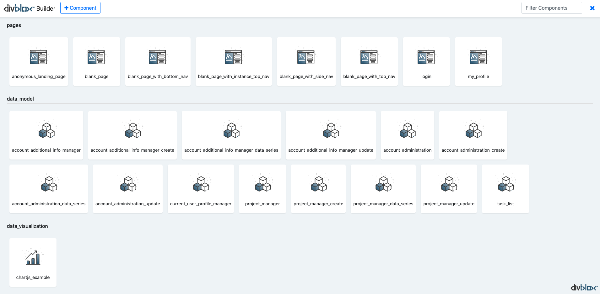

> From the default component builder page you can do the following:

-   Search for existing components using the search bar at the top right of the page
-   Open an existing component in order to work on it
-   Create a new component, either from an existing one or from scratch

## Creating a new component

Clicking the + Component button brings up the following modal:
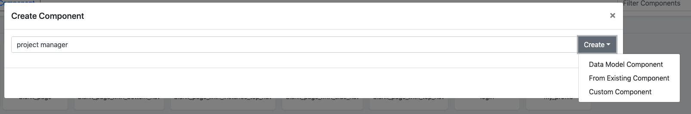
Here you can give your new component a name and select the type of component you want to create.

### Creating a data model component

Selecting a [Data Model Component](#data-model-components) will provide you with the options to select the entity for which you want to generate, as well as the type of data model component to create:
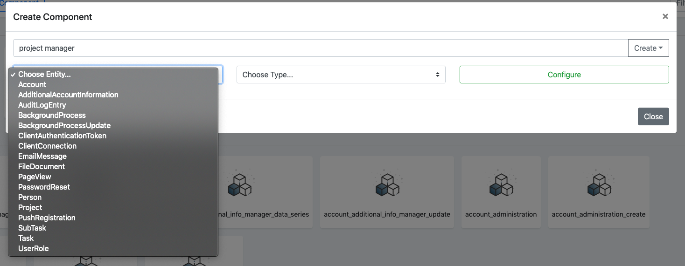
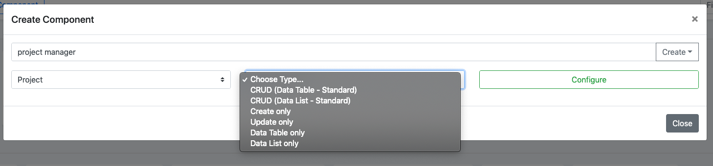

Once you selected your entity and component type, you can configure the attributes and/or validations that you would like Divblox to generate for the component.<br><br>
The example below shows a typical configuration modal for a "CREATE" type of component, which allows you to configure which attributes to display and to select the specific validations you require for them:
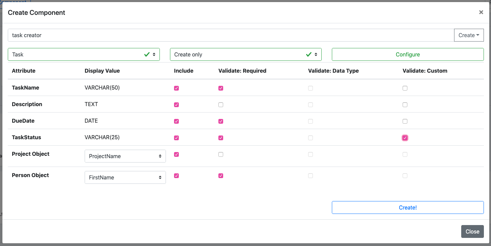

The example below shows a typical configuration modal for a "DATA TABLE" type of component, which allows you to configure which attributes to display in the table:
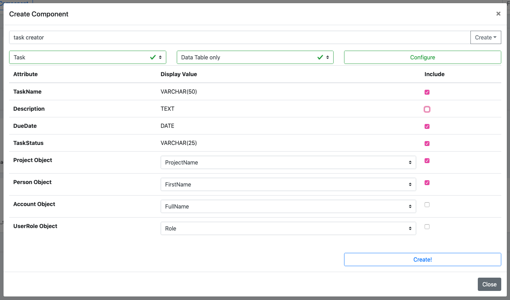

### Creating from an existing component

You can easily copy the functionality from an existing component be selecting the "**From Existing Component**" option. This will allow you to specialize the functionality of that component for your needs.
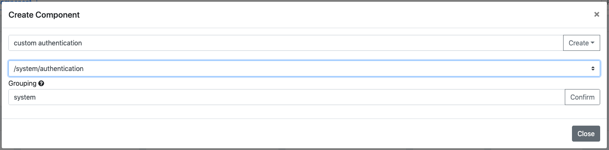

!>Notice the "Grouping" field above. This field allows you to group certain components together in folders for a better organized project.

### Creating a custom component

You can also create a custom component by selecting the "**Custom Component**" option. This simply allows you to provide a name and grouping for your component.
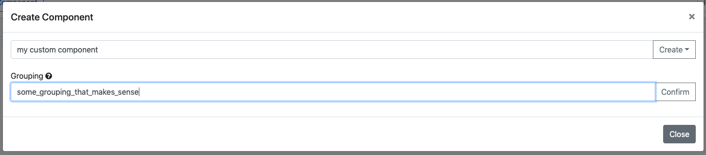

!>Custom components **ALWAYS** start out as blank components

## Visual Builder Interface

The component builder visual interface allows you to create any type of layout that you might require.
Using Bootstrap's grid system, it allows you to place the following containing elements on the screen to begin with:

-   **Containers**:<br>
    Containers are the most basic layout element in Bootstrap and are required when using the grid system. Choose from a responsive, fixed-width container (meaning its max-width changes at each breakpoint) or fluid-width (meaning it’s 100% wide all the time).
-   **Rows**:<br>
    Multiple rows can be placed inside each container and they serve the purpose of being wrappers for columns
-   **Columns**:<br>
    A column is the final containing element within which you can place your components
-   Learn more about Bootstrap's grid system [here](https://getbootstrap.com/docs/4.3/layout/grid/#how-it-works)

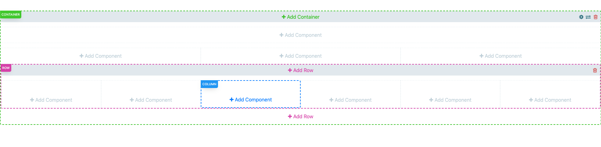

### Adding a sub component

You can add a component as a sub component to the current page (which in itself is a component). See below:

<!---->

<video id="AddingComponentsVideo" muted="" playsinline="" preload="auto" autoplay>
  <source src="_videos/Adding-Components.mp4" type="video/mp4">
  Video is not supported
</video>
<button onclick="replayVideo('AddingComponentsVideo')" type="button" class="video-control-button">
<i class="fa fa-repeat"></i>
</button>
<button onclick="fullScreenVideo('AddingComponentsVideo')" type="button" class="video-control-button">
<i class="fa fa-expand"></i>
</button>

### Adding a basic component

You can add a basic component to the current component. See below:

<!---->

<video id="AddingBasicComponentsVideo" muted="" playsinline="" preload="auto" autoplay>
  <source src="_videos/Adding-Basic-Components.mp4" type="video/mp4">
  Video is not supported
</video>
<button onclick="replayVideo('AddingBasicComponentsVideo')" type="button" class="video-control-button">
<i class="fa fa-repeat"></i>
</button>
<button onclick="fullScreenVideo('AddingBasicComponentsVideo')" type="button" class="video-control-button">
<i class="fa fa-expand"></i>
</button>

### Adding custom html

You can add custom html to the current component. See below:

<!--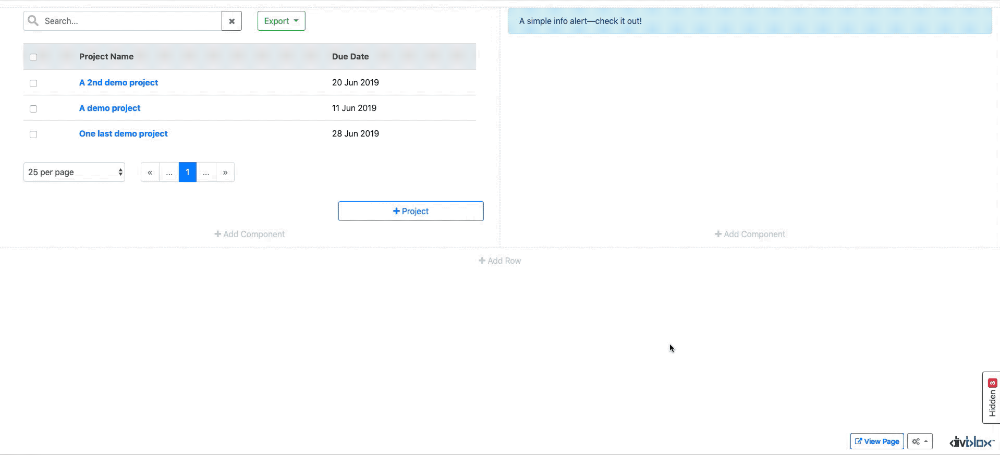-->

<video id="AddingCustomHtmlVideo" muted="" playsinline="" preload="auto" autoplay>
  <source src="_videos/Adding-Custom-Html.mp4" type="video/mp4">
  Video is not supported
</video>
<button onclick="replayVideo('AddingCustomHtmlVideo')" type="button" class="video-control-button">
<i class="fa fa-repeat"></i>
</button>
<button onclick="fullScreenVideo('AddingCustomHtmlVideo')" type="button" class="video-control-button">
<i class="fa fa-expand"></i>
</button>

### Modify a component

The builder interface allows you to modify your component in the browser at any time. See below:

<!---->

<video id="ModifyComponentVideo" muted="" playsinline="" preload="auto" autoplay>
  <source src="_videos/Modify-Component.mp4" type="video/mp4">
  Video is not supported
</video>
<button onclick="replayVideo('ModifyComponentVideo')" type="button" class="video-control-button">
<i class="fa fa-repeat"></i>
</button>
<button onclick="fullScreenVideo('ModifyComponentVideo')" type="button" class="video-control-button">
<i class="fa fa-expand"></i>
</button>
