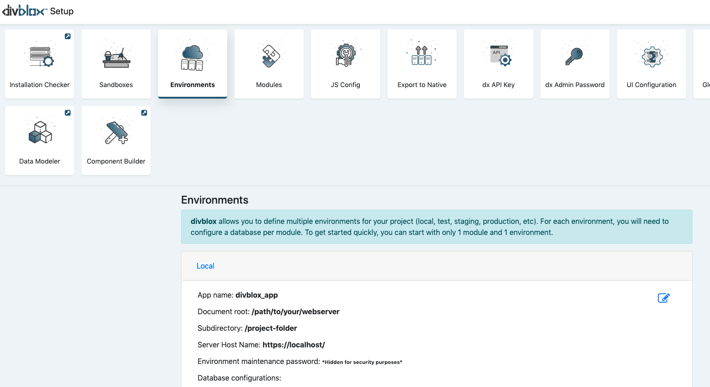

# Configuration

We need to talk about installation cleaner, export to native, UI config, global functions , media library.

Next we will take you through interface of Divblox's setup and what each part entails. Below is a screenshot of what you should expect upon loading into the Divblox environment. We will first discuss the sections which have more to do with configuration of your Divblox application.


## Modules

Divblox allows you to define multiple modules for your project. Modules are useful for grouping related data objects. At least one module (The _Main_ module) is required.
Modules are essentially separate databases that ring-fence certain data objects.

## Environments

Divblox allows you to define multiple environments for your project (local, staging, testing, production, etc).
When you start up Divblox for the first time, it will automatically generate the default (local) environment for your current project.



> For an environment to function correctly, the following needs to be configured:

-   **Environment Name** - Can be anything. This is just used to identify the environment
-   **App Name** - The name of your app. This will be displayed as the document title
-   **Maintenance Password** - This is a password used internally by Divblox for sensitive operations, for example to drop a database
-   **The server's host name or IP address** - The url or IP address where this environment is deployed
-   **The document root** - The path to your web server's www folder
-   **Subdirectory** - The sub directory in which your Divblox project resides (can be empty)
-   **The Database configuration for each module** - The connection information for every module's database


## Divblox Api key

-   When making use of the Divblox build functions, Divblox always checks that you have a valid license. The Divblox Api key is used to enable this license check.
-   Your _FREE_ Divblox Api key can be obtained in the following way:

    1. Go to [Divblox basecamp](https://basecamp.Divblox.com), and register for an account.
    2. Then log in and, on the dashboard, click "+ Project" to create a new project. This will automatically generate your Api key.
    3. Save your project and copy your Api key into your project configuration.

-   If you have any trouble creating your project and getting a key, please [contact us](https://Divblox.com/#contact) (support@Divblox.com) to request your _FREE_ Api key


## dx Admin Password

This password is used to manage your Divblox project and allows access to the setup page and various other system features. This password gives direct access to your project files and indirect access to your data via the component builder.

!>It is important to select a secure password as your admin password for public and/or production solutions


## UI Config

The UI configuration panel gives quick access to your project logo, project icon and theme.css file. Note that Divblox stores your project logo and icon as app_logo.png and favicon.ico. Submitting either in the UI config tab will rename your file and save it accordingly. You are also able to edit the `theme.css` file in-browser. This is great due to the order of dependencies executed in Divblox's start up. Divblox first loads Bootstrap 4, then Font-Awesome, followed by `project.css` and finally `theme.css` meaning that any changes you make in `theme.css` will over-ride any default project settings.


## JS Config

The main configurable items for the Divblox javascript engine can be configured from the JS Config setup block.


### SPA Mode

**Single Page Application mode** is ideal for apps that will function in multiple forms, from web, to progressive, to native.
Divblox allows you to configure your web app to run as a single page application or as a normal web application.
When in SPA mode, Divblox does not open a new web page when loading a new page, but rather updates the DOM with the new page content. Divblox also handles the rooting challenges in the background.

!>If you are building for web only, it is recommended to turn SPA mode off.

### Service Worker

Divblox allows you to configure a service worker to handle and cache requests. You can decide to toggle it on or off. It is also sometimes useful to force the service worker to reload when assets are modified. The service worker is the premise on which the idea of progressive applications are built. It acts as a form of advanced cache manager allowing offline browsing, push notifications and other 'native app' functionality.

!>When the service worker is on during development (debug), ensure that you have the option to "Update on reload" enabled in your browser.

!>It is recommended to disable the service worker during development, since this can cause assets to be loaded from cache.

### Debug Mode

Debug mode enables robust logging of your web application. This is useful when in development mode, but can slow down your app in production environments. Disabling this mode disables the Divblox function `dxLog();`, removing all development logs with a switch of a button when your app is ready. Debug mode also changes the way the `loadComponent()` function works: when enabled, all caching is disabled.

!>It is recommended to turn debug mode off for production environments, but to keep it on in local/development environments.

### Allow Feedback

Divblox allows you to toggle the project-wide feedback functionality on/off. When this is on, the user will always see a feedback button on the right of the screen.
This will allow you to collect feature requests and bug reports for your pages. You can choose to have this enabled for use by end users, but it's strength lies in the fact that it can log the feedback to a specific component on a specific page, allowing developers, testers and the business side of the project to integrate more seamlessly.

!>Feedback is stored at basecamp.Divblox.com. This means that feedback is accessible project-wide, for any environment.

---

# Global Functions

This set of files represents all the functions (set up into classes) that need to be available globally in your project. It is split up into 5 main files, as seen in the screenshot below. This includes both front-end javascript files as well as back-end php files. As mentioned before, whatever is edited in the project folder will override default Divblox functionality. The bulk of your project code will be either in these files, or in component-specific files.


## Divblox.js

!>Divblox.js is located at /Divblox/assets/js/Divblox.js

Divblox.js is the main javascript function library that provides all of the core front-end Divblox functionality as globally available functions. It is required for Divblox to run and does the following:

-   Manages the core dependencies
-   Initializes and prepares the DOM
-   Manages the state of your app
-   Manages the routing of your app
-   Manages the loading of components and component events
-   Provides functions for components to communicate with their server side scripts
-   Provides various helper functions to simplify your app development

Some commonly used Divblox.js functions are:

```javascript
dxLog(Message, show_stack_trace);
// A wrapper for console.log that provides more advanced logging capability
// and can be turned off when in production mode
dxRequestInternal(
    url,
    parameters,
    on_success,
    on_fail,
    queue_on_offline,
    element,
    loading_text
);
// A wrapper for the jQuery $.post method with some additional Divblox functionality:
// - Ensures that the on_success and on_fail callbacks receive a structured object
// - Provides for queuing of request, either on- or offline
// - Provides for disabling the calling element and displaying an appropriate message while
//   the request is handled
// - Also manages authentication tokens between the front-end and back-end
showAlert(
    AlertStr,
    Icon,
    ButtonArray,
    AutoHide,
    TimeUntilAutoHide,
    ConfirmFunction,
    CancelFunction
);
// A wrapper for the sweetalert library that provides for nicer alerts
showToast(
    title,
    toast_message,
    position,
    icon_path,
    toast_time_stamp,
    auto_hide
);
// Allows for presenting a Bootstrap toast type message on the screen
```

!>Divblox.js should not be modified since the framework relies on its integrity. The developer should rather use [project.js](project-js.md) to override specific functions as required

## Project.js

!>project.js is located at /project/assets/js/project.js

project.js is where the developer can add variables and functions that should always be globally available. It is a core dependency for Divblox and is always loaded directly after Divblox.js.
This means that it can also be used to override specific Divblox.js functions as required.

## Divblox global request handler

!>The global request handler is located at /project/assets/php/global_request_handler.php

The main purpose of the global request handler is to handle any system-wide server requests. This is very useful when you
want to create a general server function that can be reused in multiple places, instead of individually implemented per
component.
The script should always return a json string with at least one parameter called "Result".

You can send a request to this script by using the following snippet:

```javascript
dxRequestInternal(
    // The path to the global request handler on the server
    getServerRootPath() + "project/assets/php/global_request_handler.php",
    // The function to execute, along with additional inputs
    { f: "aFunctionToExecute", additional_input_variable: "example" },
    function(data_obj) {
        // If the request was successful
    },
    function(data) {
        // If the request was not successful
    }
);
```

## Project Functions

!>ProjectFunctions is an abstract class that is located at /project/assets/php/project_functions.php

ProjectFunctions is intended to be used as a space where php functions that should be globally available can be housed.
It extends the core Divblox class "FrameworkFunctions" that provides many of the core Divblox server side features.
This means that you can call the following from any php script the requires Divblox.php:

```php
    ProjectFunctions::myFunction();
```

## Project Classes

!>project_classes.php is a collection of globally available php classes and is located at /project/assets/php/project_classes.php.
You can add any custom classes to the project_classes.php script to make them globally available.

The core project classes are:

-   **ProjectAccessManager**, which extends AccessManager and is responsible for managing access to components and objects,
    based on the currently logged in user

!>By default, component access is open to **ANY** user to allow the developer to get started quickly. This should be removed
as soon as possible to enforce proper security for your solution:

```php
public static function getComponentAccess($AccountId = -1, $ComponentName = '') {
        $InitialReturn = parent::getComponentAccess($AccountId,$ComponentName);
        if ($InitialReturn == true) {
            return true;
        }
        // THIS LINE SHOULD BE REMOVED
        return true; // TODO: This is a temporary measure to allow you to get started quickly without restrictions.
        // Remove this and implement correctly for your solution. NB! THIS GIVES ACCESS TO ALL COMPONENTS TO ANY USER!!!
...
```

-   **ProjectComponentController**, which extends ComponentController and allows for component php scripts to function correctly
-   **FileUploader**, which deals with storing files as data objects once they are uploaded to the server
-   **PublicApi**, which extends PublicApi_Base and provides the outline for how to expose a Divblox api via an endpoint

# Service worker

The file `dx.sw.js` is where all of the progressive application functionality is built. How and what the service worker caches as well as all further functionality is defined here.

# Media Library

[Kind find where that info was about where image is stored and as what name]
This is a visual tool to help with importing media for those who prefer a 'drag and drop' approach.

<!-- tabs:start -->

#### ** Uploading a file **


#### ** Editing an upload **

<p align="center">
<p align="left">
    <ul> 
        <li> You can do basic editing on the upload such as cropping and resizing</li>
    </ul>
    
</p>

#### ** Upload info **

<p align="center">
<p align="left">
Once the upload is complete you can view:
    <ul> 
        <li>The autogenerated file name of the image</li>
        <li>The absolute and relative path to the image</li>
    </ul>
    
</p>

<!-- tabs:end -->


# Updates

When Divblox updates become available, you will be notified in the bottom right corner of the setup page.


To prevent unexpected data loss, it is important to understand how the Divblox auto-updater works. When the auto-updater is run, core Divblox files will be replaced on your local machine with newer versions. This is why it is highly encouraged to leave Divblox-specific files untouched and use project-specific files to override any functionality. This is also a good time to stress the importance of using some sort of version control system like git to make sure that you have the ability to revert unintended changes.

For users who would like to review each file change, or if the updater seems to not be working, you can update Divblox using a patch. This is found in basecamp. All that is required is for you to enter your current Divblox version. A zipped patch file will then be downloaded containing only the files changed between your version and the current version.


<!-- # Summary

To wrap this section up, let's summarize. The parts of this section described how to configure a global Divblox environment. It may also be helpful to discuss the execution chain of a Divblox application. Below is a screenshot of the `index.html` file.


As discussed before, the order of the css dependencies can be seen here. JQuery is also only loaded in the body of the document.
The following sections will dive into more detail about the background data modelling process as well as other Divblox functionality. -->
