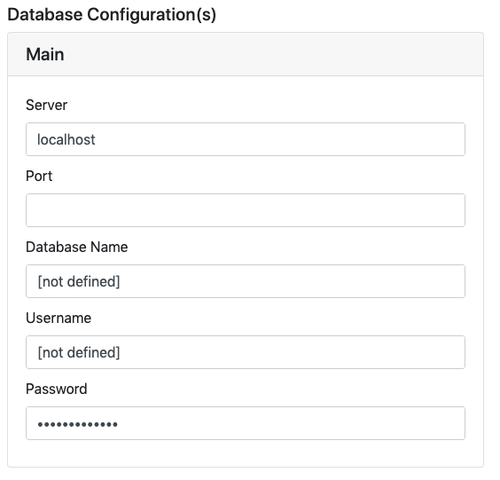

# Configuration

We need to talk about installation cleaner, export to native, UI config, global functions , media library.

Next we will take you through interface of Divblox's setup and what each part entails. Below is a screenshot of what you should expect upon loading into the Divblox environment. We will first discuss the sections which have more to do with configuration of your Divblox application.

## Modules

Divblox allows you to define multiple modules for your project. Modules are useful for grouping related data objects. At least one module (The _Main_ module) is required.
Modules are essentially separate databases that ring-fence certain data objects.

## Environments

Divblox allows you to define multiple environments for your project (local, staging, testing, production, etc).
When you start up Divblox for the first time, it will automatically generate the default (local) environment for your current project.

> For an environment to function correctly, the following needs to be configured:

-   **Environment Name** - Can be anything. This is just used to identify the environment
-   **App Name** - The name of your app. This will be displayed as the document title
-   **Maintenance Password** - This is a password used internally by Divblox for sensitive operations, for example to drop a database
-   **The server's host name or IP address** - The url or IP address where this environment is deployed
-   **The document root** - The path to your web server's www folder
-   **Subdirectory** - The sub directory in which your Divblox project resides (can be empty)
-   **The Database configuration for each module** - The connection information for every module's database

## Divblox Api key

-   When making use of the Divblox build functions, Divblox always checks that you have a valid license. The Divblox Api key is used to enable this license check.
-   Your _FREE_ Divblox Api key can be obtained in the following way:

    1. Go to [Divblox basecamp](https://basecamp.Divblox.com), and register for an account.
    2. Then log in and, on the dashboard, click "+ Project" to create a new project. This will automatically generate your Api key.
    3. Save your project and copy your Api key into your project configuration.

-   If you have any trouble creating your project and getting a key, please [contact us](https://Divblox.com/#contact) (support@Divblox.com) to request your _FREE_ Api key

## dx Admin Password

This password is used to manage your Divblox project and allows access to the setup page and various other system features.

!>It is important to select a secure password as your admin password for public and/or production solutions

## JS Config

The main configurable items for the Divblox javascript engine can be configured from the JS Config setup block.

### SPA Mode

**Single Page Application mode** is ideal for apps that will function in multiple forms, from web, to progressive, to native.
Divblox allows you to configure your web app to run as a single page application or as a normal web application.
When in SPA mode, Divblox does not open a new web page when loading a new page, but rather updates the DOM with the new page content. Divblox also handles the rooting challenges in the background.

!>If you are building for web only, it is recommended to turn SPA mode off.

### Service Worker

Divblox allows you to configure a service worker to handle and cache requests. You can decide to toggle it on or off. It is also sometimes useful to force the service worker to reload when assets are modified. The service worker is the premise on which the idea of progressive applications are built. It acts as a form of advanced cache manager allowing offline browsing, push notifications and other 'native app' functionality.

!>When the service worker is on during development (debug), ensure that you have the option to "Update on reload" enabled in your browser.

!>It is recommended to disable the service worker during development, since this can cause assets to be loaded from cache.

### Debug Mode

Debug mode enables robust logging of your web application. This is useful when in development mode, but can slow down your app in production environments. Disabling this mode disables the Divblox function `dxLog();`, removing all development logs with a switch of a button when your app is ready. Debug mode also changes the way the `loadComponent()` function works: when enabled, all caching is disabled.

!>It is recommended to turn debug mode off for production environments, but to keep it on in local/development environments.

### Allow Feedback

Divblox allows you to toggle the project-wide feedback functionality on/off. When this is on, the user will always see a feedback button on the right of the screen.
This will allow you to collect feature requests and bug reports for your pages. You can choose to have this enabled for use by end users, but it's strength lies in the fact that it can log the feedback to a specific component on a specific page, allowing developers, testers and the business side of the project to integrate more seamlessly.

!>Feedback is stored at basecamp.Divblox.com. This means that feedback is accessible project-wide, for any environment.

# Summary

To wrap this section up, let's summarize. The parts of this section described how to configure a global Divblox environment. The following sections will dive into more detail about the background data modelling process as well as other Divblox functionality.
