## Linux Deployment

This section will take you through how to get a linux (Ubuntu 18.04 LTS) system up and running to build with Divblox. We will configure a LAMP stack, necessary permissions and IonCube to run Divblox.

### Install Ubuntu 18.04 image

At time of writing, the latest stable version is Ubuntu 18.04, found [here](https://ubuntu.com/download/desktop). Download the .iso file (approx. 5 GB).

### Create a bootable flashdrive

You will need a USB stick or portable hard drive with at least 8 GB of memory. Note that your memory device will be formatted upon completion of this step.

!> NOTE: All previous data will be erased!

Download Rufus (recommended) [here](https://rufus.ie/), or another similar application which will enable you to turn your memory stick into a bootable device.

Continuing with Rufus: When you insert your USB stick, the device field should automatically update. You want to select the chosen memory stick, and _FreeDOS_ as your boot selection. Now you can select the image you want to use. The default search folder is Downloads, so if this is your first attempt you should only see the newly downloaded image file. Leave all the other settings as default. You may rename the device as you wish. Below are some snapshots of the process.

<!-- tabs:start -->

###### ** Without USB stick **

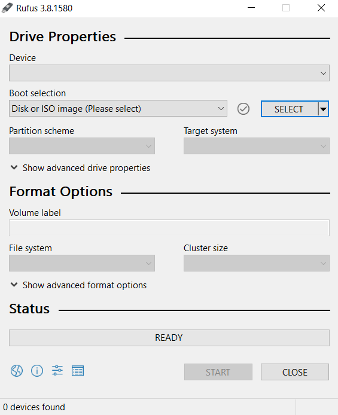

###### ** With USB stick and .iso selected **

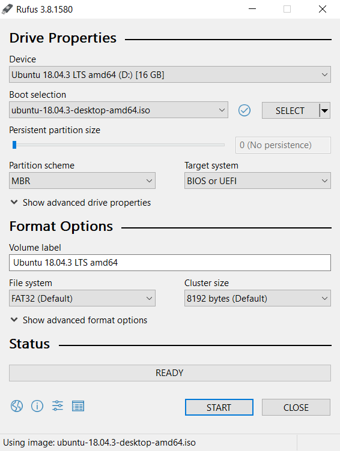

###### ** Complete installation **

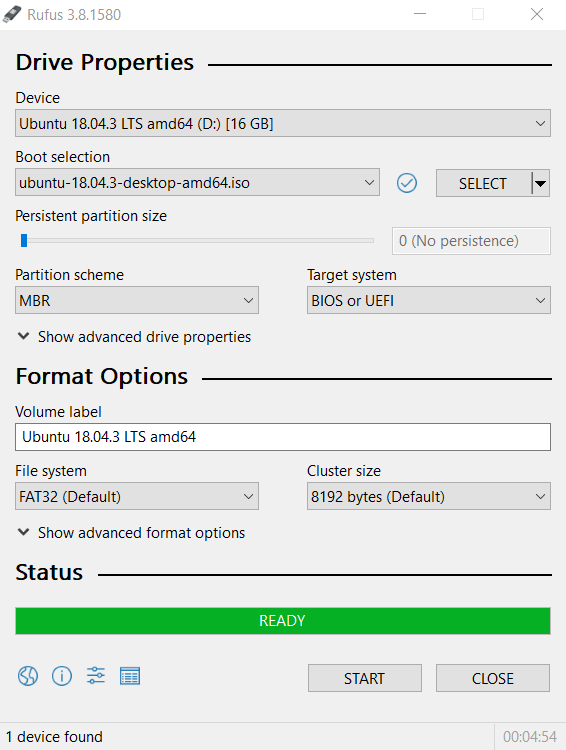

<!-- tabs:end -->

Once you are done, you can click _Close_ and eject your newly bootable flash disk.

### Restart machine with flashdrive inserted

To boot with Linux Ubuntu, you need to restart your chosen computer with the flash drive inserted. Your computer may automatically boot up from the drive, but if not, you need to press `F1`, `F2`, `ESC`, `F8` or `F10` as your PC is starting (depending on system). Below are screenshots of the Ubuntu installation process.

<!-- tabs:start -->

###### ** 1.) Install Ubuntu **

<p align="center">
<p align="left">
    <ul> 
        <li> Select Install Ubuntu. </li>
        <li>You are also able to try Ubuntu without installing it. </li>
    </ul>
    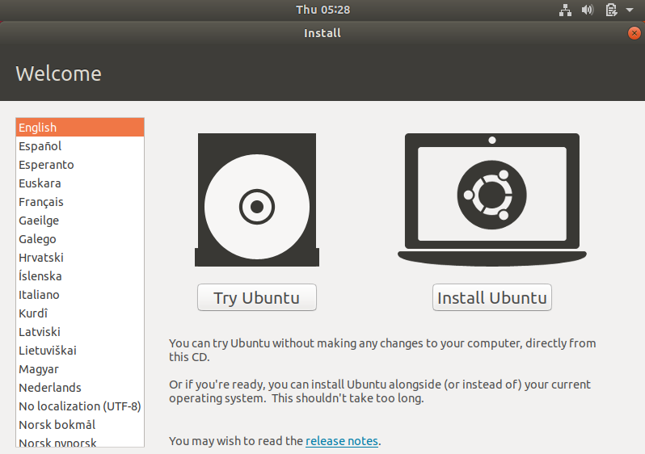
</p>

###### ** 2.) Select Language **

<p align="center">
<p align="left">
    <ul> 
        <li> Select your prefered language.</li>
        <li>Note that English UK and English US have a few special characters swapped around.</li>
    </ul>
    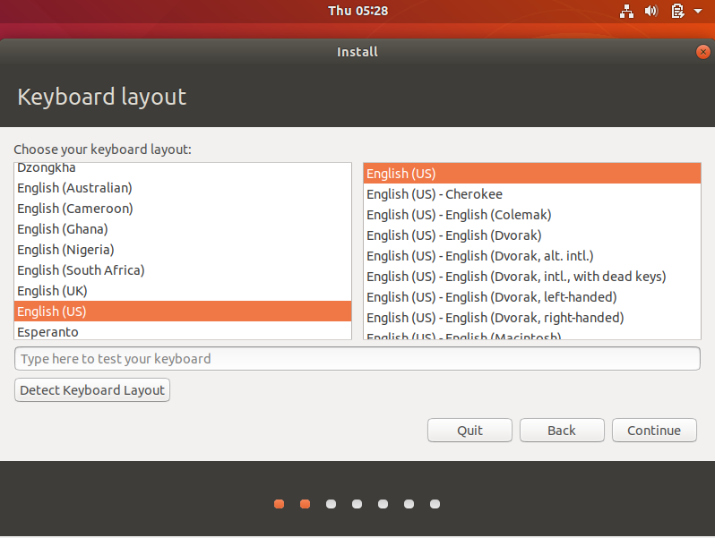
</p>

###### ** 3.) Installation options **

<p align="center">
<p align="left">
    <ul> 
        <li>Select 'Normal Installation'. This comes with the default bundle of apps and utilities including a music player, games and lauchpad for Linux apps.</li>
        <li>If however, you are comfortable with what you want and need, you can proceed to the custom installation which will be a much more lightweight installation.</li>
        <li>It is advised to have 'Download Updates' checked and to be connected to the internet so Ubuntu can update during the installation process</li>
    </ul>
    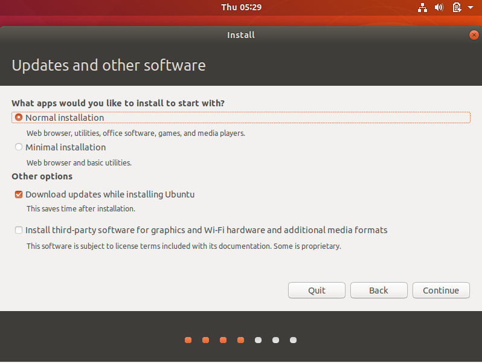
</p>

###### ** 4.) Installation Type **

<p align="center">
<p align="left">
    <ul> 
        <li>We want to erase our entire disk and install a clean Ubuntu OS</li>
        <li>The other options allow you to install Ubuntu alongside your current OS,</li>
        <li>and for advanced users, you can configure the installation by checking 'Something Else'</li>
    </ul>
    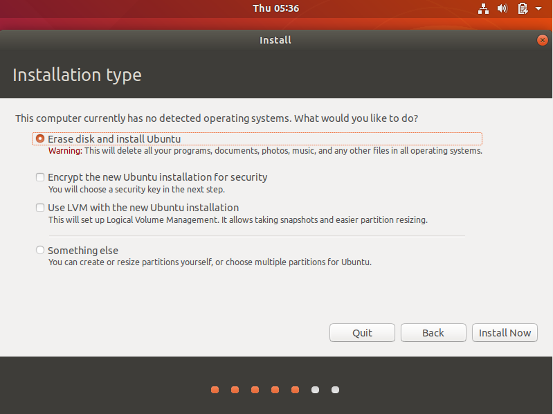
</p>

###### ** 5.) Location **

<p align="center">
<p align="left">
    <ul> 
        <li>Select your location</li>
        <li>If you have internet connection, this should be auto-populated</li>
    </ul>
    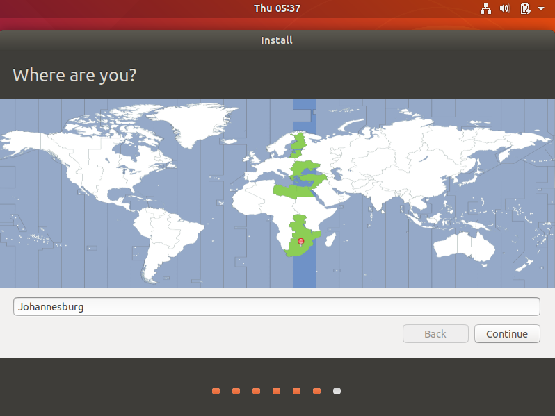
</p>

###### ** 6.) Personal **

<p align="center">
<p align="left">
    <ul> 
        <li>Fill in your personal details and password</li>
        <li>Remember that this will be your user password, so make it a secure</li>
        <li>You can also decide whether to be remembered or not</li>
    </ul>
    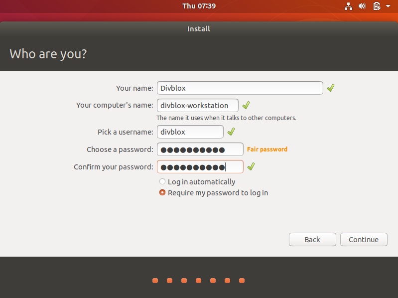
</p>

###### ** 7.) Install Process **

<p align="center">
<p align="left">
    <ul> 
        <li>Screenshot of the installation</li>
    </ul>
    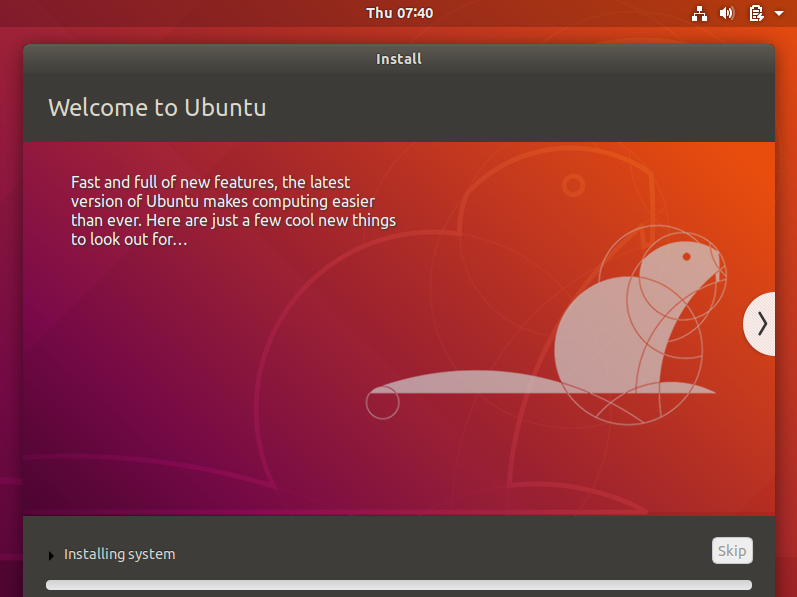
</p>

###### ** 8.) Install Complete **

<p align="center">
<p align="left">
    <ul> 
        <li>Screenshot of the completed installation</li>
    </ul>
    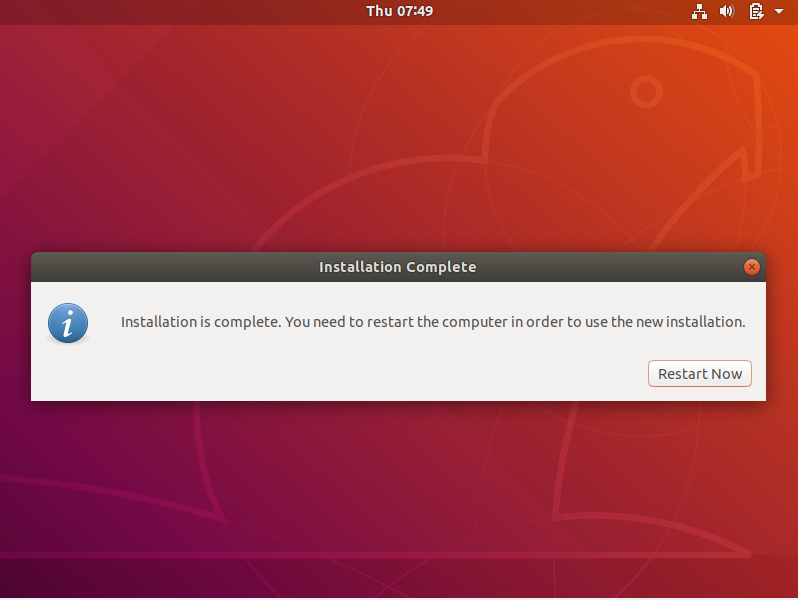
</p>

###### ** 9.) Sign In **

<p align="center">
<p align="left">
    <ul> 
        <li>Screenshot of the sign in screen, meaning you have successfully installed and booted Ubuntu 18.04!</li>
    </ul>
    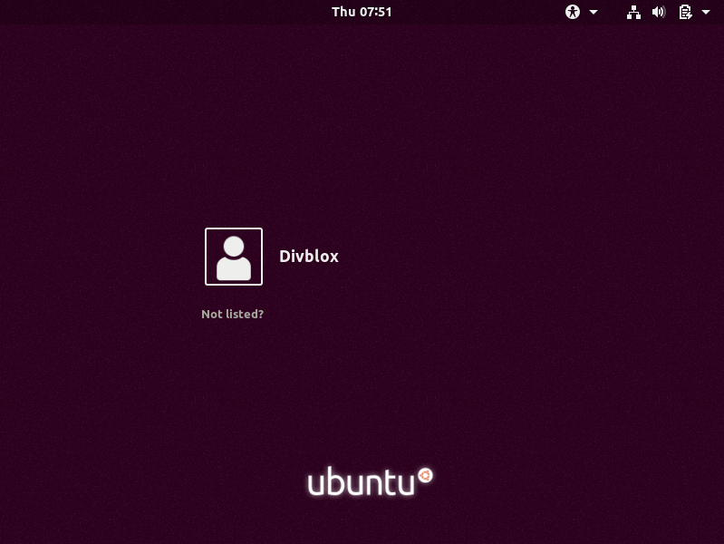
</p>

<!-- tabs:end -->

### Configure base Ubuntu OS

In this step we will make minor changes to suite our needs. As you log in you will be prompted to do a few things:

<!-- tabs:start -->

###### ** 1.) Welcome **

<p align="center">
<p align="left">
    <ul> 
        <li>Note the changes to UX in newer version of Ubuntu</li>
    </ul>
    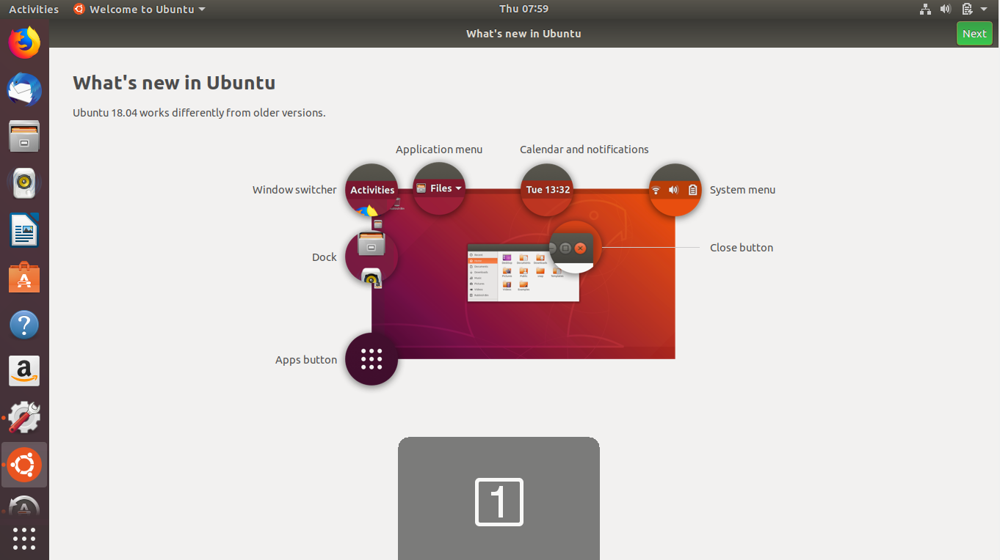
</p>

###### ** 2.) LivePatch **

<p align="center">
<p align="left">
    <ul> 
        <li>There is no need to set up LivePatch for now</li>
    </ul>
    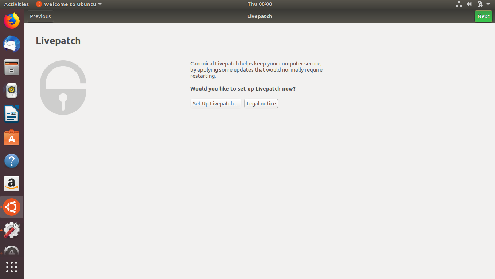
</p>

###### ** 3.) Ubuntu feedback **

<p align="center">
<p align="left">
    <ul> 
        <li>You can decide whether or not to provide information to improve Ubuntu</li>
    </ul>
    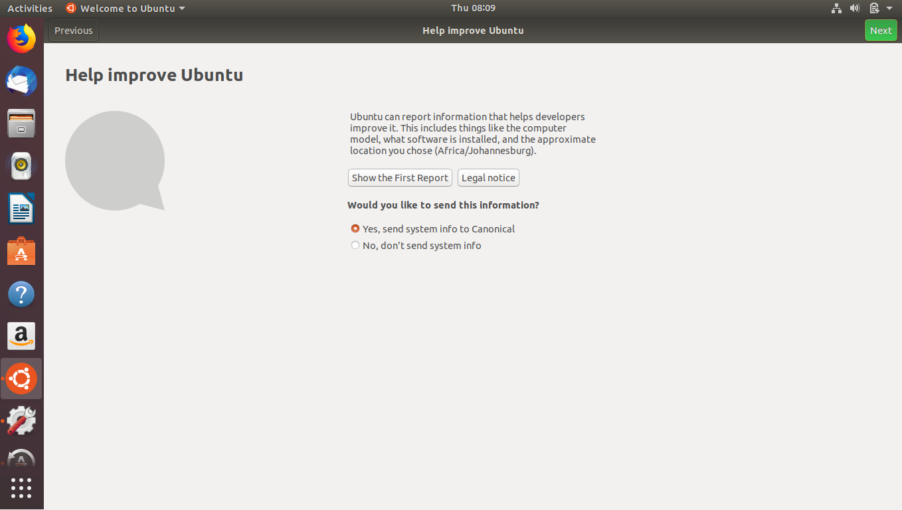
</p>

###### ** 4.) App Store **

<p align="center">
<p align="left">
    <ul> 
        <li>You can search and download Linux-ready applications from the Ubuntu software store</li>
    </ul>
    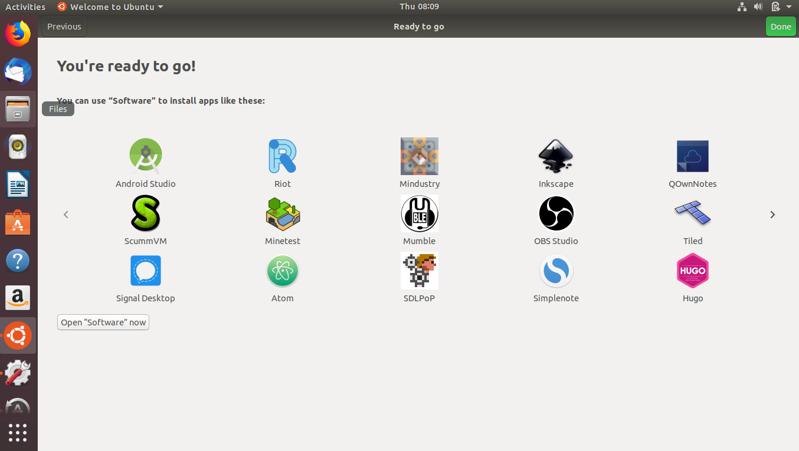
</p>

###### ** 5.) Ubuntu update **

<p align="center">
<p align="left">
    <ul> 
        <li>Allow Ubuntu to update (not compulsory)</li>
    </ul>
    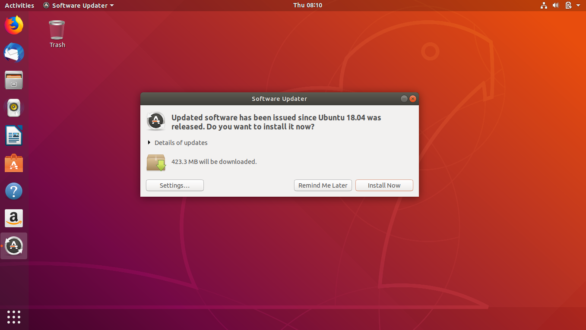
</p>

<!-- tabs:end -->

### Configuring a deployment environment

To do this, we need a webserver, backend support as well as database system.

#### Webserver: Apache2

There are two main web servers you can use, namely Apache and Nginx, and either would work as they are both fast, secure, reliable and most importantly well-supported. We will be using Apache as it is the most popular.

We will now be working in the Linux terminal, which can be found in your applications or opened by pressing `CTRL+ALT+T`. It is important to note that Linux works differently to Windows when it comes to permissions. When running any memory-changing commands like `install`, `update` or `delete` you will not be able to unless you do it as a superuser. Luckily this is very simple to do. All you have to do is type `sudo` before any of the commands. Another thing to note is that to cancel any given command while it is still running, all you need to do is press `CTRL+C`.

The following commands will:

1. Install Apache

```
sudo apt install apache2
```

You will be prompted to confirm whether you want to continue, and will be shown how much memory will be stored. You will also see all the files being unpacked.

<p align="center">
    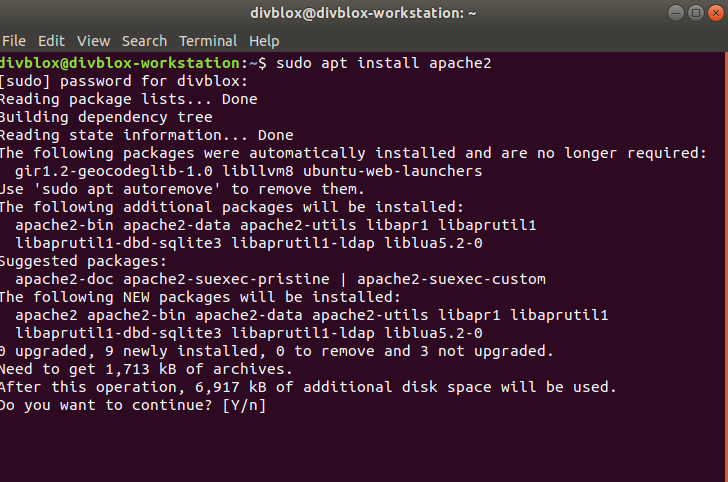
</p>

2. Start the Apache Server

```
sudo systemctl start apache2
```

3. Enable Apache to automatically start up when the server boots up

```
sudo systemctl enable apache2
```

4. Check the current status of the web service

```
sudo systemctl status apache2
```

<p align="center">
    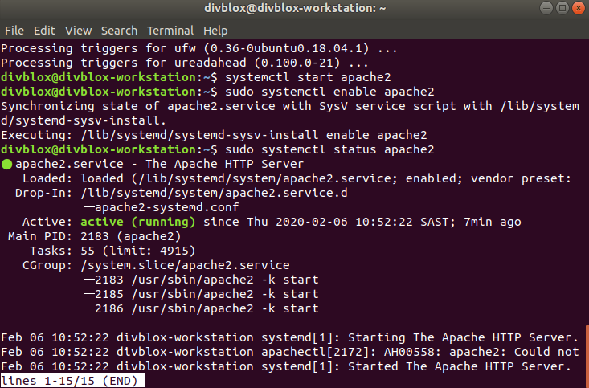
</p>

And now we can press `CTRL+C` to exit the status command. We can see that Apache is up and running.

#### Server Language: PHP 7.3

For this step we will use Ondřej Surý’s PPA (Personal Package Archive) as it has everything we will need. To do this we will firstly need to install software-properties-common and python-software-properties package.

```
sudo apt install software-properties-common python-software-properties
```

Once the installations are complete we can proceed to add the PPA:

```
LC_ALL=C.UTF-8 add-apt-repository ppa:ondrej/php
```

You can read about what is included in the PPA and click enter to start the download. We then update the sources to reflect any changes.

```
apt update
```

We now install PHP 7.3 by running and confirming the following command.

```
sudo apt install php7.3 php7.3-cli php7.3-common
```

We can also check if we already have PHP 7.3 by checking the current version:

```
php -v
```

This should give us:

<p align="center">
    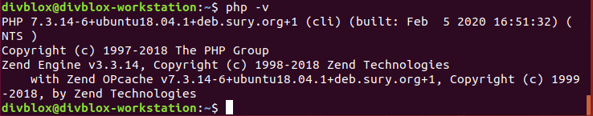
</p>

Now, we will install the most commonly used PHP modules with the following command:

```
sudo apt install php-pear php7.3-curl php7.3-dev php7.3-gd php7.3-mbstring php7.3-zip php7.3-mysql php7.3-xml php7.3-fpm libapache2-mod-php7.3 php7.3-imagick php7.3-recode php7.3-tidy php7.3-xmlrpc php7.3-intl
```

If you want to install any further modules you can search for them with this command:

```
sudo apt-cache search php7.3
```

Or if you want to see all PHP modules available in Ubuntu, you can do so with:

```
sudo apt-cache search --names-only ^php
```

To make PHP 7.3 the default (although it should already be it), run:

```
sudo update-alternatives --set php /usr/bin/php7.3
```

To reflect any changes, we must always resstart the apache server:

```
sudo systemctl restart apache2
```

Our PHP should now be working, but we can't yet test it as Linux permissions will not let us write into files so easily. Lets install a different File Explorer which can open up files as a superuser. The original file explorer is called Nautilus and we will be replacing it with Nemo. To download Nemo:

```
sudo apt install nemo
```

Once it is installed you can find it with your other applications. Both Nautilus and Nemo are called 'Files', but you can distiguish them by the icons. We want to use Nemo, which is the orange file icon. Once opened, navigate to File System and then /var/www/html . Right-click and open as root. You will be prompted to input your root password, after which you have writing access to that folder.

You can now create an empty document with extension `.php`. (Ours is called phpTest.php) Copy the following code into your test php file: `<?php phpinfo(); ?>`. This function just displays current php version and information when called. If the file states 'read-only' it means you did not enter the folder with root access.

<p align="center">
    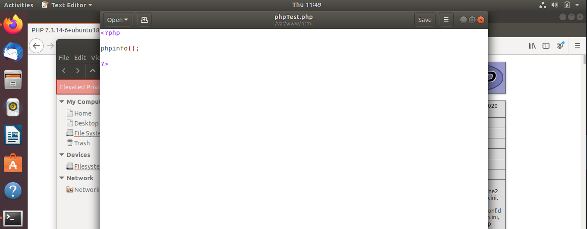
</p>

Once the code is saved, you can navigate to any browser, and search the URL `http://localhost/phpTest.php` and you should be able to see the following:

<p align="center">
    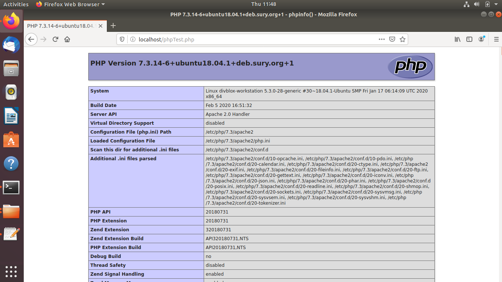
</p>

If this is not the page you see, you have done something wrong. Check each step and make sure you have saved the file in the correct folder. Once PHP is installed and configured, we can move on and setup our database management.

#### Database Server: MySQL

MySQL is a relational database management system based off of the language SQL. We create databases to structure collections of data. To install MySQL and all the relevant dependacies we run the following commands:

```
sudo apt-get update
sudo apt-get install mysql-server
```

To set up some configurations we run:

```
sudo mysql_secure_installation utility
```

The following options can be answered on the preference of the user, but here is what settings we used:

1. Validate Password Plugin: NO
2. Enter own password
3. Confirm new password
4. Remove Anonymous Users: YES
5. Disallow root login remotely: YES
6. Remove Test Database and access to it: YES
7. Reload Privilege Tables Now: YES

To ensure that the database server launches automatically even after a reboot:

```
sudo systemctl enable mysql
```

Now start the mysql shell (the most basic way of working with the mysql server):

```
sudo mysql -u root -p
```

You will be prompted for a password, this is the root password you set up on installation. Once you are in the mysql shell, you can execute mysql commands and queries. Note that using all caps for sql query commands is standard, but is not syntax-enforced. Lets start with how to reset the root password:

```
UPDATE mysql.user SET authentication_string = PASSWORD('new_password') WHERE User = 'root';
```

Whenever we need to change user information, we must run the following command to reflect the changes:

```
FLUSH PRIVILEGES;
```

To see what users are stored in the database, we run the following command:

```
SELECT User, Host, authentication_string FROM mysql.user;
```

We select the columns User, Host and authentication_string from the table user in the database mysql. This is the expected result:

<p align="center">
    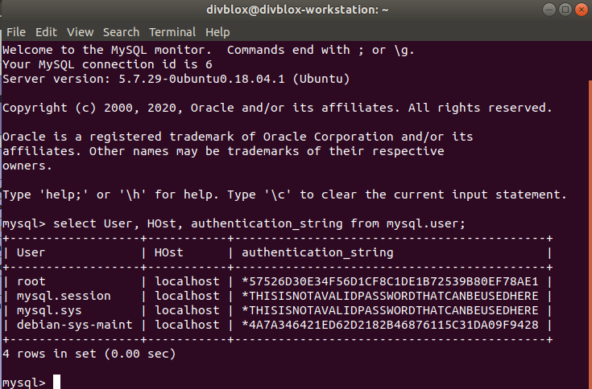
</p>

YOu can exit the MySQL shell at any time by entering 'exit' and hitting enter.

#### Database Manager: phpMyAdmin

phpMyAdmin is a web interface for database management. It is by far the most popular MySQL administration tool. To install it we run:

```
sudo apt update
sudo apt install phpmyadmin php-mbstring php-gettext
```

For server selection: Select Apache 2. Note that no option is selected by default. You need to press `SPACE`, `TAB` and then `ENTER` to confirm Apache as the option.

<!-- tabs:start -->

##### ** 1.) Select Server **

<p align="center">
<p align="left">
    <ul> 
        <li>Select Apache Server.</li>
        <li>Note that no option is selected by default. You need to press `SPACE`, `TAB` and then `ENTER` to confirm Apache as the option.</li>
    </ul>
    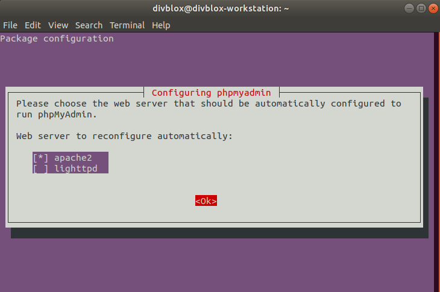
    <!--  -->
</p>

##### ** 2.) DB-Common **

<p align="center">
<p align="left">
    <ul> 
        <li>Select Yes</li>
    </ul>
    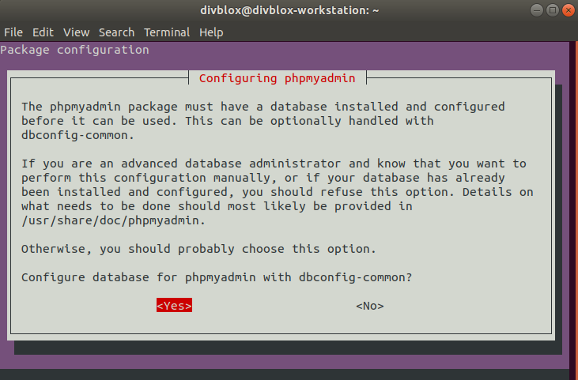
</p>

<!-- tabs:end -->

Once the installation is done, we need to explicitly enable the `mbstring` Php extension,

```
sudo phpenmod mbstring
```

And now restart the Apache2 server to reflect changes.

```
sudo systemctl restart apache2
```

Now that phpMyAdmin is installed and configured, the last step is to make sure that your MySQL users have the permissions to interact with the program. Ubuntu systems running newer MySQL versions (5.7 or later) authenticate the root user using an `auth-socket` instead of a password. This methos is more secure and allows for more usability in some cases, but is also troublesome when trying to give external programs like phpMyAdmin access to the user.

To circumvent this and be able to log into phpMyAdmin as your current user, we need to set the authentication method to `mysql_native_password`.

Enter the MySQL shell and enter your password

```
sudo mysql -u root -p
```

We can check the authentication type of each of your MySQL users running the following command:

```
SELECT user,authentication_string,plugin,host FROM mysql.user;
```

### Permissions

Now we have a basic LAMP stack set up, and can proceed to download the latest version of Divblox [here](https://github.com/Divblox/Divblox/). Once the zipped file is downloaded, copy it into /var/www/html and unzip it.

To allow Divblox and ourselves to edit and write to that destination, we will have to edit the linux user and group permissions to that directory. This is done by giving the web server access to local storage.

First we add our current user to the 'www-data' group

```
sudo usermod -a -G www-data divblox
```

Then we give recursive ownership of `/var/www/html` to 'www-data'.

```
sudo chown -R www-data /var/www/html
```

We then set the permissions of the `/var/www/html` folder recursively to give read, write and execute permissions to both the group and owner of `/var/www/html`. This is necessary as we need to have the permission to edit files from a local editor, as well as let Divblox autogenerate files from the web server.

```
sudo chmod -R 2770 /var/www/html
```

[Full commands that work now]

```
sudo chown -R www-data /var/www/html/divblox-master
sudo chgrp -R www-data /var/www/html/divblox-master
sudo chmod -R 2770 /var/www/html/divblox-master
sudo chmod -R g+rwxs /var/www/html/divblox-master
```

### Download and configure Divblox

You should now be ready to install Divblox. Go to Github and download the zip file. Extract it in the `/var/www/html` folder. Ensure that your web server is running and navigate to `http://localhost/` or `http://localhost/[your-project-folder]` (if you placed Divblox within a sub folder). You should create an account with a secure password. Creating a project is explained <a href="https://divblox.github.io/#/getting-started?id=Initializing-a-new-Sandbox" target="_blank">here</a>. Remember to copy the free Divblox license key to authenticate yourself in the setup page.

To open the Divblox setup page, browse to `http://localhost/Divblox` or `http://localhost/[your-project-folder]/Divblox`, depending on your installation. You should be able to log in as the user Divblox using the password "1".

Once in the Divblox setup page, we want to go to the Installation Checker. You will be prompted to log in as Divblox admin to proceed. The page provided is there to monitor and make sure all relevant dependencies are installed and configured to run Divblox, providing useful feedback on how to solve installation related problems.

Start with the right side of the page, downloading the IonCube zip and file requested. Place them in the required folders and restart the Apache2 server. If everything was installed correctly, you should have green boxes indicating that the Divblox config files are all there, correct versions of PHP, MySQL and Apache2 are installed and configured, as well as the fact that we have the necessary permissions needed for Divblox basecamp to operate.

<!-- tabs:start -->

##### ** 1.) Before **

<p align="center">
<p align="left">
    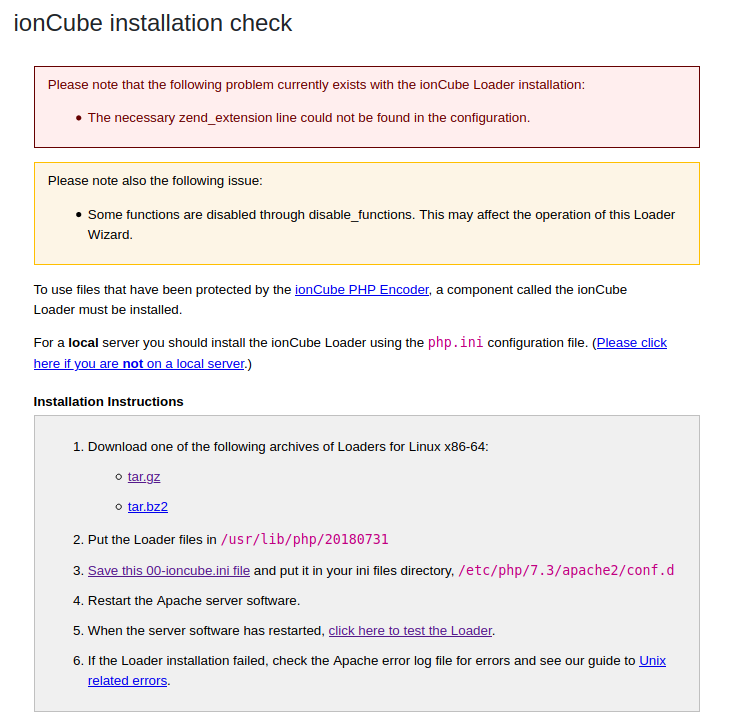
    <!--  -->
</p>

##### ** 2.) After **

<p align="center">
<p align="left">
    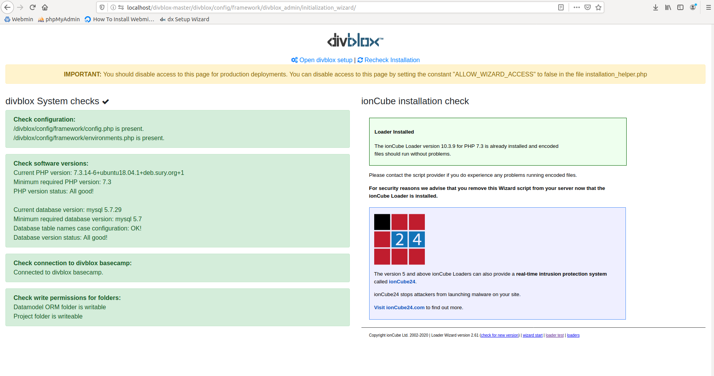
</p>

<!-- tabs:end -->

That's it! Everything is now configured and you are ready to start building apps with Divblox.
