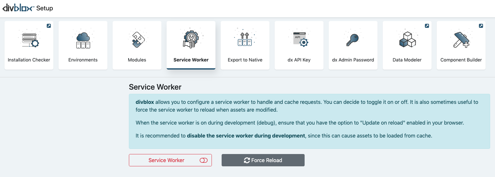

## Typical Project Development Approach
Below is a visualization of the typical development approach you will follow when builing a divblox project.

  1. Sign in to [basecamp.divblox.com](https://basecamp.divblox.com/?view=login)  
    

<i class="fa fa-arrow-down"></i>

  2. Create a new project and click "Open in Sandbox"  

<i class="fa fa-arrow-down"></i>

  3. Start by modeling your data structure using the divblox data modeler  

<i class="fa fa-arrow-down"></i>

  4. Use the divblox component builder to create various components that will provide your app's functionality   

<i class="fa fa-arrow-down"></i>

  5. Initialize a local deployment environment (also called a development environment) to pull in your sandbox changes and get your project ready to be published   

<i class="fa fa-arrow-down"></i>

  6. Deploy your app to another deployment environment (any server of your choice)  

>Everything in divblox is a component, from basic on screen elements, to full-blown pages. You can build sophisticated pages
using the divblox component builder by creating the layouts you need and combining various components to fulfil your needs.

>In a local deployment environment, more advanced features are available:
- You can configure your server variables and modules
- You can configure your database connections
- You can export to native
- You have full access to your entire code base
- You can deploy your app to another deployment environment

>A deployment environment is defined as an instance of a project, that is hosted on a web server, which is accessible by a user.
These can include, but are not limited to:
- A local web server on a development computer
- A cloud based web server

## Sandboxes
>A divblox sandbox is a special type of deployment environment that is created and owned by divblox. This environment runs on divblox's servers and is accessible to the public. This environment can only be managed by the user that initiated it.

### Initializing a new Sandbox
Creating a new sandbox is easy:
1. Start by creating your project at [basecamp.divblox.com](https://basecamp.divblox.com/?view=login)

2. Complete the required fields and click "Create"

2. You are now ready to launch your sandbox by clicking on "Open in Sandbox"

### Downloading a Sandbox
Sandboxes are great for prototyping and even to deploy small projects, but if you are serious about your project, 
at some point you will need to download your sandbox progress and continue on a local development environment.

To download your sandbox, all you need is a [local installation of divblox](#download-divblox) with your [project's API key](#divblox-api-key) configured. 
From here you can click on the "Sandboxes" setup block to download your sandbox or deploy your local changes to your sandbox.

>Sandboxes are controlled by your local deployment environments. 
This means that you can deploy to your sandboxes from any local deployment environment as well as download any changes that were made in your sandboxes to your local environments

### Sandbox best practices
divblox makes it super easy to transfer content between your local deployment environments and your sandboxes, but this can also be risky. 
When downloading your sandbox to a local environment, always make sure that you have backed up your local project files. The following is a 
shortlist of tips to help you get the most out of sandboxes:
1. Always make use of a code versioning service such as GitHub, GitLab or BitBucket
2. When downloading sandbox changes to a local environment, make sure to do this in a feature branch which can be reviewed before merging with your master project branch.
3. Re-initializing a sandbox every now and then can be a good idea to ensure data integrity.
4. Make regular backups of your sandbox data through the Data Modeler "Data Export" tool

## Prerequisites
!>The following sections are only relevant for local and/or self provisioned server setup. For sandboxes, you can skip ahead to the [Data Modeler](data-modeler.md) section

>The divblox server-side functionality is built in php and therefore requires a php environment to be setup in order to function correctly.

>You can [skip ahead](hello-world.md) and just see the "Hello World" example to get a sense for how to build with divblox

- Download your favourite Apache/Php/Mysql distribution and configure to use the following:
    - Latest version of Apache
    - Php 7.2 or later
    - MySQL 5.6 or later or MariaDB 10.3 or later
    - The easiest way to get started is to download and install MAMP for either windows or mac: https://www.mamp.info/en/
    - Ensure that you have created a database for use with your divblox project

Some of the core divblox code is encoded using IonCube. To ensure that your divblox installation functions correctly, download and install the IonCube loader for Php 7.2 or later for your operating system.
- Download here: https://www.ioncube.com/loaders.php
- Don't worry if you have some trouble installing this. The [Installation checker](#installation-checker) will guide you through this process a bit later on as well.

# Download divblox
- You can download or fork the divblox public repo on github here: https://github.com/divblox/divblox
- Add the downloaded content to your apache "public_html" or "www" folder
- Ensure that your web server is running and navigate to http://localhost/ or http://localhost/[your-project-folder] (if you placed divblox within a sub folder)
- divblox will check your installation and, if needed, provide further guidelines on how to finish the installation
- To open the divblox setup page, browse to http://localhost/divblox or http://localhost/[your-project-folder]/divblox, depending on your installation
- Open the installation checker to ensure that all systems indicate an OK status. Once the installation checker indicates all is OK, you are ready to build with divblox

# Installation checker
The divblox installation checker is designed to ensure that your divblox project meets all the [prerequisites](#prerequisites) described above. It will also provide useful guidelines on how to solve installation related problems.
The main checks performed are listed below:
- Checks for php >= 7.2
- Checks for mariadb >= 10.3 or mysql >= 5.6
- Checks your IonCube loader is installed. [Learn why IonCube is required](#prerequisites) in the prerequisites section

!> The installation checker might fail if your [environments](#environments) have not yet been configured properly

# Configuration
## Modules

divblox allows you to define multiple modules for your project. Modules are useful for grouping related data objects. At least one module (The *Main* module) is required. 
Modules are essentially separate databases that ring-fence certain data objects

## Environments

divblox allows you to define multiple environments for your project (local, test, staging, production, etc). 
When you start up divblox for the first time, it will automatically generate the default environment for your current project.

>For an environment to function correctly, the following needs to be configured:

- **Environment Name** - Can be anything. This is just used to identify the environment
- **App Name** - The name of your app. This will be displayed as the document title
- **Maintenance Password** - This is a password used internally by divblox for sensitive operations, for example to drop a database
- **The server's host name or IP address** - The url or IP address where this environment is deployed
- **The document root** - The path to your web server's www folder
- **Subdirectory** - The sub directory in which your divblox project resides (can be empty)
- **The Database configuration for each module** - The connection information for every module's database

## divblox Api key
- When making use of the divblox build functions, divblox always checks that you have a valid license. The divblox Api key is used to enable this license check.
- Your *FREE* divblox Api key can be obtained in the following way:

    1. Go to [divblox basecamp](https://basecamp.divblox.com), and register for an account.
    2. Then log in and, on the dashboard, click "+ Project" to create a new project. This will automatically generate your Api key.
    3. Save your project and copy your Api key into your project configuration.

- If you have any trouble creating your project and getting a key, please [contact us](https://divblox.com/#contact) (support@divblox.com) to request your *FREE* Api key

## dx Admin Password
This password is used to manage your divblox project and allows access to the setup page and various other system features.

!>It is important to select a secure password as your admin password for public and/or production solutions

## Service worker
divblox allows you to configure a service worker to handle and cache requests. You can decide to toggle it on or off. It is also sometimes useful to force the service worker to reload when assets are modified.

!>When the service worker is on during development (debug), ensure that you have the option to "Update on reload" enabled in your browser.

!>It is recommended to disable the service worker during development, since this can cause assets to be loaded from cache.

