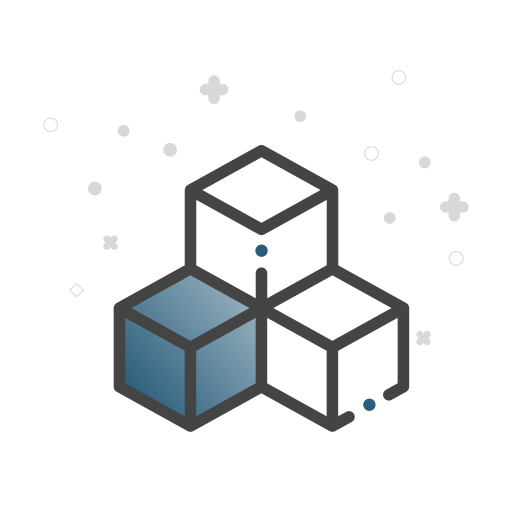
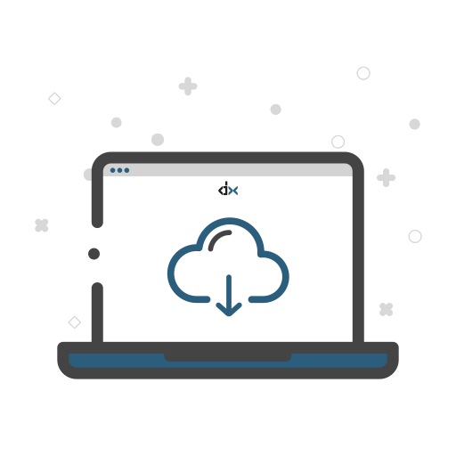
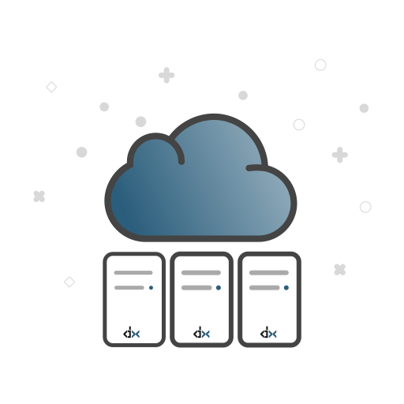
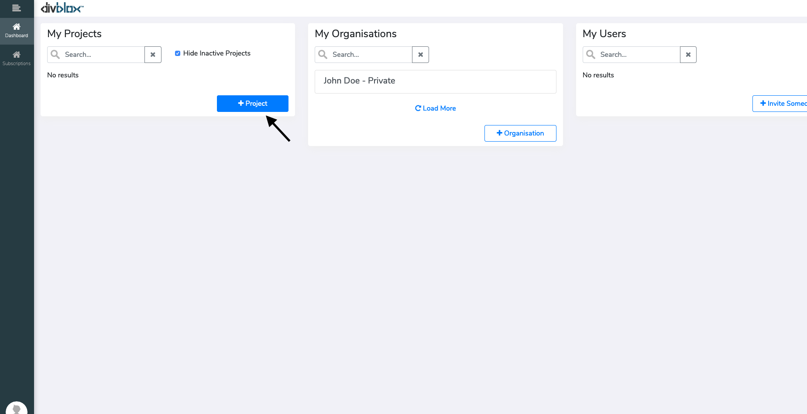
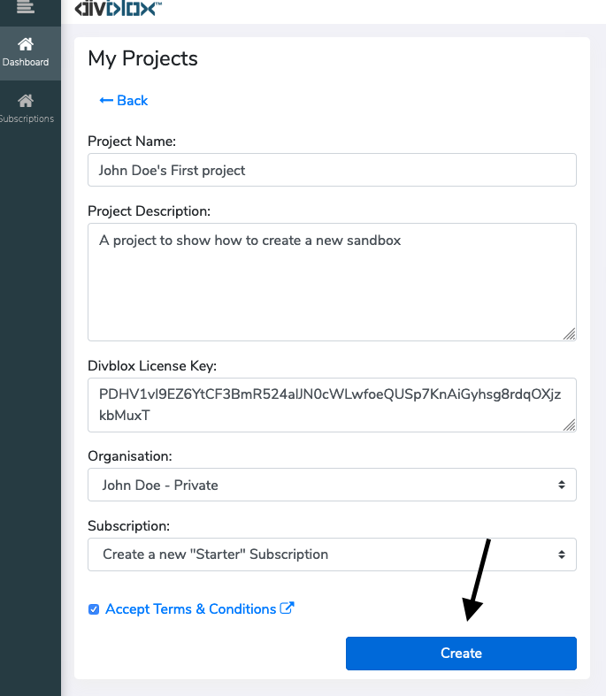
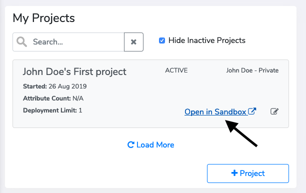
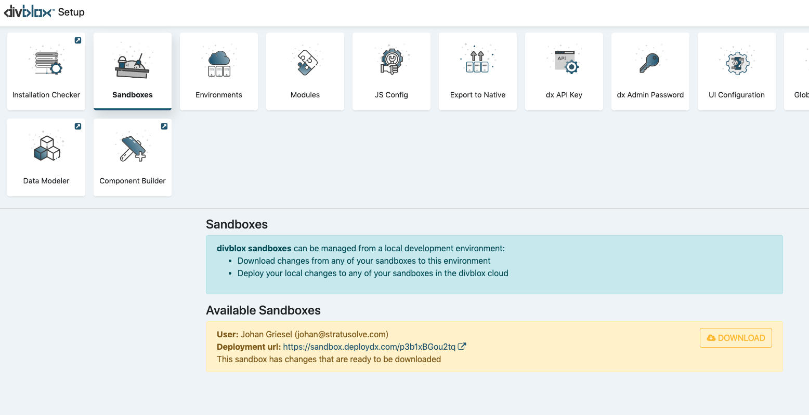

# Getting Started

## Ways to get started

To start creating an app with Divblox, you need to configure a development environment (also known as a deployment environment). To do this you have a number of options:

1. The first and easiest way is to spin up a **Divblox sandbox** where you can get a feel for the Divblox environment and play around with most of Divblox's features

2. A slightly more advanced option that allows for more complex features, is to download the **Divblox VirtualBox image** and import that as a virtual machine on a local machine of your choosing
3. The third, and most hands on option, is to configure a **Divblox deployment environment from scratch** on a machine of your choosing

### Sandbox vs local deployment

> In a local deployment environment, more advanced features are available:

-   You can configure your server variables and modules
-   You can configure your database connections
-   You can export to native
-   You have full access to your entire code base
-   You can deploy your app to another deployment environment

> A deployment environment is defined as an instance of a project, that is hosted on a web server, which is accessible by a user.
> These can include, but are not limited to:

-   A local web server on a development computer
-   A cloud based web server

## Option 1. Starting with sandbox

> A Divblox sandbox is a special type of deployment environment that is created and owned by Divblox. This environment runs on Divblox's servers and is accessible to the public. This environment can only be managed by the user that initiated it.

Below is a visualization of how to spin up a sandbox.

  1. Sign in to [basecamp.divblox.com](https://basecamp.Divblox.com/?view=login)  

<i class="fa fa-arrow-down"></i>

  2. Create a new project and click "Open in Sandbox"  

<i class="fa fa-arrow-down"></i>

  3. Start by modeling your data structure using the Divblox data modeler  

<i class="fa fa-arrow-down"></i>

  4. Use the Divblox component builder to create various components that will provide your app's functionality  

<i class="fa fa-arrow-down"></i>

  5.
[Initialize a local deployment environment](#option-2-starting-with-virtualbox) to pull down your sandbox changes and get your project ready to be published  

<i class="fa fa-arrow-down"></i>

  6. Deploy your app to another deployment environment (any server of your choice)  

### Initializing a new Sandbox

Creating a new sandbox is easy:

<!-- tabs:start -->

#### ** Step 1 **

    <ul> 
        <li> Start by creating your project at <a href="https://basecamp.Divblox.com/?view=login" target="_blank">basecamp.Divblox.com</a></li>
    </ul>
    

#### ** Step 2 **

    <ul> 
        <li> Complete the required fields and click "Create"</li>
    </ul>
    

#### ** Step 3 **

    <ul> 
        <li>You are now ready to launch your sandbox by clicking on "Open in Sandbox"</li>
    </ul>
    

<!-- tabs:end -->

### Downloading a Sandbox

Sandboxes are great for prototyping and even to deploy small projects, but if you are serious about your project,
at some point you will need to download your sandbox progress and continue on a local development environment.

To download your sandbox, all you need is a [local installation of Divblox](#download-Divblox) with your [project's API key](the-basics?id=divblox-api-key) configured.
From here you can click on the "Sandboxes" setup block to download your sandbox or deploy your local changes to your sandbox.

> Sandboxes are controlled by your local deployment environments.
> This means that you can deploy to your sandboxes from any local deployment environment as well as download any changes that were made in your sandboxes to your local environments

### Sandbox best practices

Divblox makes it super easy to transfer content between your local deployment environments and your sandboxes, but this can also be risky.
When downloading your sandbox to a local environment, always make sure that you have backed up your local project files. The following is a
shortlist of tips to help you get the most out of sandboxes:

1. Always make use of a code versioning service such as GitHub, GitLab or BitBucket
2. When downloading sandbox changes to a local environment, make sure to do this in a feature branch which can be reviewed before merging with your master project branch.
3. Re-initializing a sandbox every now and then can be a good idea to ensure data integrity.
4. Make regular backups of your sandbox data through the Data Modeler "Data Export" tool

## Option 2. Starting with VirtualBox

Divblox provides a fully configured [VirtualBox](https://www.virtualbox.org/wiki/VirtualBox) image that allows you to start building Divblox apps in no time. The purpose of having this Virtual Machine (VM) is to be able to setup Divblox in a single neat package that is already pre-configured to simplify the installation process. Divblox can also be installed on your local OS (see [Option 3. Starting from scratch](#option-3-starting-from-scratch)).

> Start developing with Divblox in 3 easy steps:

1. Download VirtualBox and the Image containing Divblox
2. Import the image into VirtualBox and boot the VM
3. Start a new project and configure the API

### VirtualBox Download

!> Note: the virtual machine image is a 6 GB download.

The latest version of Oracle's VirtualBox can be downloaded [here](https://www.virtualbox.org/wiki/Downloads) to ensure that the VirtualBox image runs properly.

The VM (.ova) file that contains Divblox and all the accompanying software can be downloaded [here](https://drive.google.com/open?id=1MSZa78rd95WCP59P17jkFklwbOGiDzvV).

### Loading the Virtual machine

After installing VirtualBox on your device and running the application, add the image by opening "File" -> "Import Appliance".

  

From here, find and add the Divblox VM image file (.ova). On the following window you will be prompted to "Import". Adding the image may take several minutes to install and configure.

  

Once your VM has been loaded, it can be started by "double-clicking" on the newly added machine in the VirtualBox application. This will open a separate window and begin booting up the Divblox image.

!> Note: The boot sequence is complete when you are greeted by the Welcome page.

### Initialize Divblox

  

The Welcome page is necessary to read through in order to operate the virtual machine.
It contains information such as:

-   Username and passwords for the VM
-   Relevant file locations and permissions
-   Quick start links
-   Information about the VM software

After you have familiarised yourself with the introduction page, the first thing you should do is to configure your project's _Free_ Divblox API key.

1. To generate your new API see [Divblox API key](the-basics?id=divblox-api-key).

2. Open the "local starter project" from the link located under "Quick Start links" on the welcome Page.

3. Click "dx API key" to open the dialog that allows you to copy in and update your API key.

  

## Option 3. Starting from scratch

### Prerequisites

!>The following sections are only relevant for local and/or self provisioned server setup.

> The Divblox server-side functionality is built in php and therefore requires a php environment to be setup in order to function correctly.

1. Download your favourite Apache/Php/Mysql distribution (MAMP, WAMP, XAMPP etc...) and configure to use the following:

    - Latest version of Apache
    - Php 7.3 or later
    - MySQL 5.7 or later or MariaDB 10.3 or later
    - The recommended server software is MAMP for either windows or mac: https://www.mamp.info/en/
    - Ensure that you have created a database for use with your Divblox project

2. Some of the core Divblox code is encoded using IonCube. To ensure that your Divblox installation functions correctly, download and install the IonCube loader for Php 7.3 or later for your operating system.

    - Download here: https://www.ioncube.com/loaders.php
    - Don't worry if you have some trouble installing this. The [Installation checker](#installation-checker) will guide you through this process a bit later on as well.

3. For an example of how to do this with Ubuntu 18.04, click [here](deployment?id=Install-Ubuntu-18.04-image)

### Download Divblox

-   You can download or fork the Divblox public repo on github here: https://github.com/divblox/divblox
-   Add the downloaded content to your apache "public_html" or "www" folder
-   Ensure that your web server is running and navigate to http://localhost/ or http://localhost/[your-project-folder] (if you placed Divblox within a sub folder)
-   Divblox will check your installation and, if needed, provide further guidelines on how to finish the installation
-   To open the Divblox setup page, browse to http://localhost/divblox or http://localhost/[your-project-folder]/divblox, depending on your installation
-   Open the installation checker to ensure that all systems indicate an OK status. Once the installation checker indicates all is OK, you are ready to build with Divblox

### Installation checker

The Divblox installation checker is designed to ensure that your Divblox project meets all the [prerequisites](#prerequisites) described above. It will also provide useful guidelines on how to solve installation related problems.
The main checks performed are listed below:

-   Checks for php >= 7.3
-   Checks for mariadb >= 10.3 or mysql >= 5.7
-   Checks your IonCube loader is installed. [Learn why IonCube is required](#prerequisites) in the prerequisites section

!> The installation checker might fail if your [environments](the-basics.md?id=environments) have not yet been configured properly
