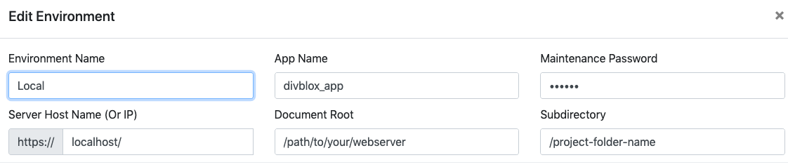
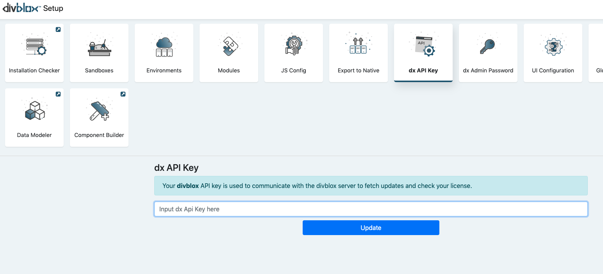

## Prerequisites
>The divblox server-side functionality is built in php and therefor requires a php environment to be setup in order to function correctly.

>You can [skip ahead](hello-world.md) and just see the "Hello World" example to get a sense for how to build with divblox

- Download your favourite Apache/Php/Mysql distribution and configure to use the following:
    - Latest version of Apache
    - Php 7.2 or later
    - MySQL 5.6 or later or MariaDB 10.3 or later
    - The easiest way to get started is to download and install MAMP for either windows or mac: https://www.mamp.info/en/
    - Ensure that you have created a database for use with your divblox project

Some of the core divblox code is encoded using IonCube. To ensure that your divblox installation functions correctly, download and install the IonCube loader for Php 7.2 or later for your operating system.
- Download here: https://www.ioncube.com/loaders.php
- Don't worry if you have some trouble installing this. The [Installation checker](#installation-checker) will guide you through this process a bit later on as well.

# Download divblox
- You can download divblox zipped from https://divblox.com/releases or fork the divblox public repo on github here: https://github.com/divblox/divblox
- Add the downloaded content to your apache "public_html" or "www" folder
- Ensure that your web server is running and navigate to http://localhost/ or http://localhost/[your-project-folder] (if you placed divblox within a sub folder)
- divblox will check your installation and, if needed, provide further guidelines on how to finish the installation
- To open the divblox setup page, browse to http://localhost/divblox or http://localhost/[your-project-folder]/divblox, depending on your installation
- Open the installation checker to ensure that all systems indicate an OK status. Once the installation checker indicates all is OK, you are ready to build with divblox

# Installation checker
The divblox installation checker is designed to ensure that your divblox project meets all the [prerequisites](#prerequisites) described above. It will also provide useful guidelines on how to solve installation related problems.
The main checks performed are listed below:
- Checks for php >= 7.2
- Checks for mariadb >= 10.3 or mysql >= 5.6
- Checks your IonCube loader is installed. [Learn why IonCube is required](#prerequisites) in the prerequisites section

!> The installation checker might fail if your [environments](#environments) have not yet been configured properly

# Configuration
## Modules
divblox allows you to define multiple modules for your project. Modules are useful for grouping related data objects. At least one module (The *Main* module) is required. 
Modules are essentially separate databases that ring-fence certain data objects

## Environments
divblox allows you to define multiple environments for your project (local, test, staging, production, etc). 
When you start up divblox for the first time, it will automatically generate the default environment for your current project.

>For an environment to function correctly, the following needs to be configured:

- **Environment Name** - Can be anything. This is just used to identify the environment
- **App Name** - The name of your app. This will be displayed as the document title
- **Maintenance Password** - This is a password used internally by divblox for sensitive operations, for example to drop a database
- **The server's host name or IP address** - The url or IP address where this environment is deployed
- **The document root** - The path to your web server's www folder
- **Subdirectory** - The sub directory in which your divblox project resides (can be empty)
- **The Database configuration for each module** - The connection information for every module's database

## divblox Api key
- When making use of the divblox build functions, divblox always checks that you have a valid license. The divblox Api key is used to enable this license check.
- Currently divblox Api keys are issued on request only. Please [contact us](https://divblox.com/#contact) to request your *FREE* Api key

## dx Admin Password
This password is used to manage your divblox project and allows access to the setup page and various other system features.

!>It is important to select a secure password as your admin password for public and/or production solutions

## Service worker
divblox allows you to configure a service worker to handle and cache requests. You can decide to toggle it on or off. It is also sometimes useful to force the service worker to reload when assets are modified.

!>When the service worker is on during development (debug), ensure that you have the option to "Update on reload" enabled in your browser.

!>It is recommended to disable the service worker during development, since this can cause assets to be loaded from cache.

