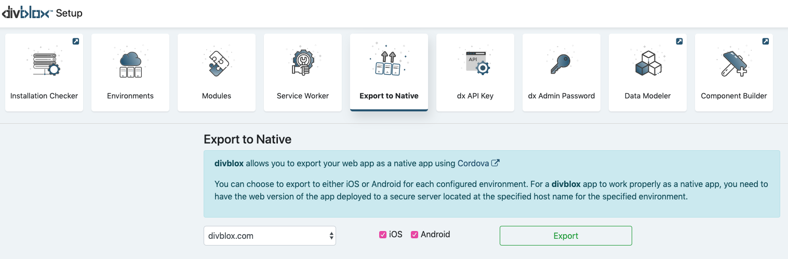

# Export to native
divblox allows you to export your progressive web app to a native project using [Cordova](https://cordova.apache.org/)
To export to a native project you need the following:
- Your web app needs to be deployed on a server with an ssl certificate
- You need to configure your environment for native export:

- You need to select your environment for native export:

- Exporting will do the following:
    - For iOS, it will package your web app as a cordova xcode project. You will require a Mac to proceed, since the rest will happen through xcode as per normal xcode development
    - For Android, it will package your web app as a cordova project and build the .apk file that can be deployed to an emulator