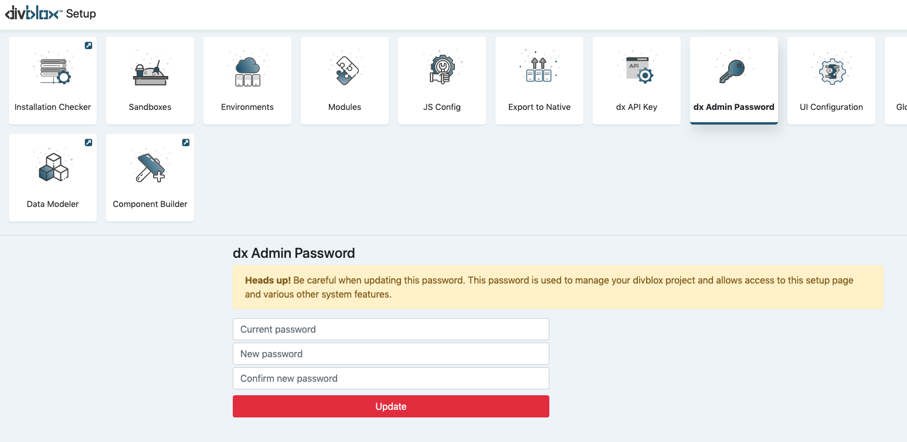
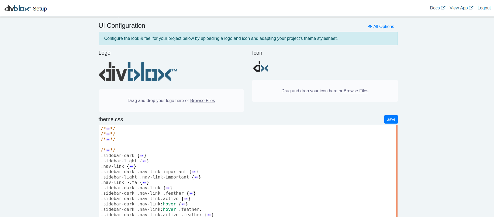
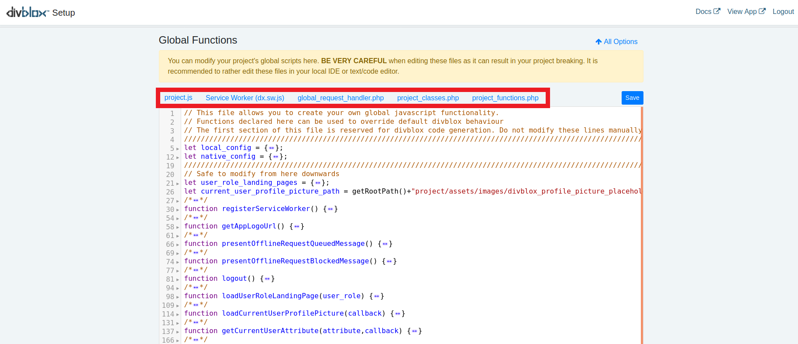
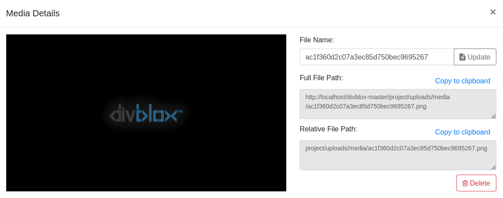
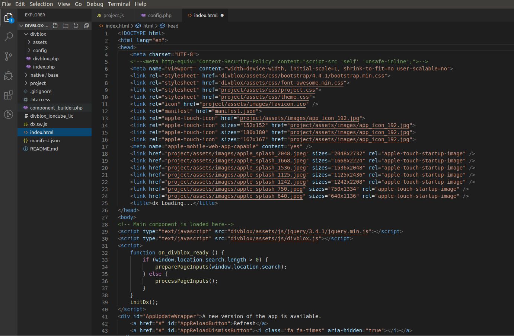
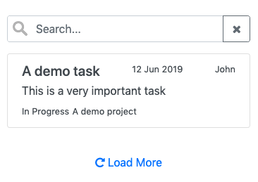
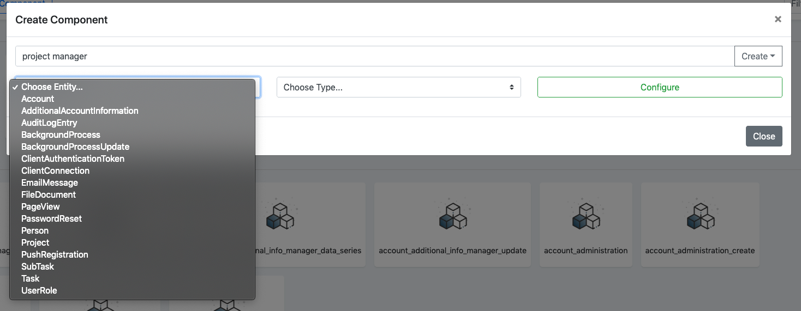
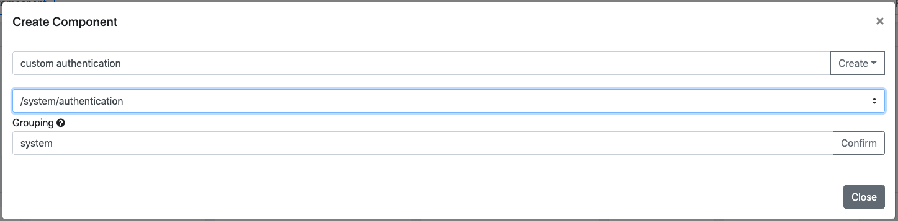
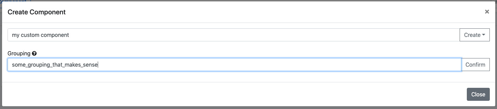
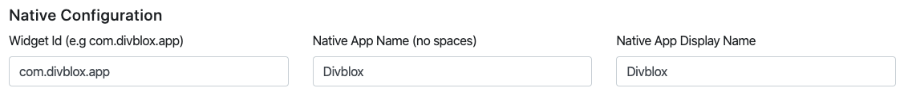

# The Basics

## Configuration

We need to talk about installation checker, export to native, UI config, global functions, media library.

Next we will take you through interface of Divblox's setup and what each part entails. Below is a screenshot of what you should expect upon loading into the Divblox environment. We will first discuss the sections which have more to do with configuration of your Divblox application.


### Modules

Divblox allows you to define multiple modules for your project. Modules are useful for grouping related data objects. At least one module (The _Main_ module) is required.
Modules are essentially separate databases that ring-fence certain data objects.

### Environments

Divblox allows you to define multiple environments for your project (local, staging, testing, production, etc).
When you start up Divblox for the first time, it will automatically generate the default (local) environment for your current project.


> For an environment to function correctly, the following needs to be configured:

-   **Environment Name** - Can be anything. This is just used to identify the environment
-   **App Name** - The name of your app. This will be displayed as the document title
-   **Maintenance Password** - This is a password used internally by Divblox for sensitive operations, for example to drop a database
-   **The server's host name or IP address** - The url or IP address where this environment is deployed
-   **The document root** - The path to your web server's www folder
-   **Subdirectory** - The sub directory in which your Divblox project resides (can be empty)
-   **The Database configuration for each module** - The connection information for every module's database


### Divblox Api key

-   When making use of the Divblox build functions, Divblox always checks that you have a valid license. The Divblox Api key is used to enable this license check.
-   Your _FREE_ Divblox Api key can be obtained in the following way:

    1. Go to [Divblox basecamp](https://basecamp.Divblox.com), and register for an account.
    2. Then log in and, on the dashboard, click "+ Project" to create a new project. This will automatically generate your Api key.
    3. Save your project and copy your Api key into your project configuration.

-   If you have any trouble creating your project and getting a key, please [contact us](https://Divblox.com/#contact) (support@divblox.com) to request your _FREE_ Api key


### dx Admin Password

This password is used to manage your Divblox project and allows access to the setup page and various other system features. This password gives direct access to your project files and indirect access to your data via the component builder.

!>It is important to select a secure password as your admin password for public and/or production solutions



### UI Config

The UI configuration panel gives quick access to your project logo, project icon and theme.css file. Note that Divblox stores your project logo and icon as app_logo.png and favicon.ico. Submitting either in the UI config tab will rename your file and save it accordingly. You are also able to edit the `theme.css` file in-browser. This is great due to the order of dependencies executed in Divblox's start up. Divblox first loads Bootstrap 4, then Font-Awesome, followed by `project.css` and finally `theme.css` meaning that any changes you make in `theme.css` will over-ride any default project settings.



### JS Config

The main configurable items for the Divblox javascript engine can be configured from the JS Config setup block.


#### SPA Mode

**Single Page Application mode** is ideal for apps that will function in multiple forms, from web, to progressive, to native.
Divblox allows you to configure your web app to run as a single page application or as a normal web application.
When in SPA mode, Divblox does not open a new web page when loading a new page, but rather updates the DOM with the new page content. Divblox also handles the rooting challenges in the background.

!>If you are building for web only, it is recommended to turn SPA mode off.

#### Service Worker

Divblox allows you to configure a service worker to handle and cache requests. You can decide to toggle it on or off. It is also sometimes useful to force the service worker to reload when assets are modified. The service worker is the premise on which the idea of progressive applications are built. It acts as a form of advanced cache manager allowing offline browsing, push notifications and other 'native app' functionality.

!>When the service worker is on during development (debug), ensure that you have the option to "Update on reload" enabled in your browser.

!>It is recommended to disable the service worker during development, since this can cause assets to be loaded from cache.

#### Debug Mode

Debug mode enables robust logging of your web application. This is useful when in development mode, but can slow down your app in production environments. Disabling this mode disables the Divblox function `dxLog();`, removing all development logs with a switch of a button when your app is ready. Debug mode also changes the way the `loadComponent()` function works: when enabled, all caching is disabled.

!>It is recommended to turn debug mode off for production environments, but to keep it on in local/development environments.

#### Allow Feedback

Divblox allows you to toggle the project-wide feedback functionality on/off. When this is on, the user will always see a feedback button on the right of the screen.
This will allow you to collect feature requests and bug reports for your pages. You can choose to have this enabled for use by end users, but it's strength lies in the fact that it can log the feedback to a specific component on a specific page, allowing developers, testers and the business side of the project to integrate more seamlessly.

!>Feedback is stored at basecamp.Divblox.com. This means that feedback is accessible project-wide, for any environment.

---

### Global Functions

This set of files represents all the functions (set up into classes) that need to be available globally in your project. It is split up into 5 main files, as seen in the screenshot below. This includes both front-end javascript files as well as back-end php files. As mentioned before, whatever is edited in the project folder will override default Divblox functionality. The bulk of your project code will be either in these files, or in component-specific files.



#### Divblox.js

!>Divblox.js is located at /Divblox/assets/js/Divblox.js

Divblox.js is the main javascript function library that provides all of the core front-end Divblox functionality as globally available functions. It is required for Divblox to run and does the following:

-   Manages the core dependencies
-   Initializes and prepares the DOM
-   Manages the state of your app
-   Manages the routing of your app
-   Manages the loading of components and component events
-   Provides functions for components to communicate with their server side scripts
-   Provides various helper functions to simplify your app development

Some commonly used Divblox.js functions are:

```javascript
dxLog(Message, show_stack_trace);
// A wrapper for console.log that provides more advanced logging capability
// and can be turned off when in production mode
dxRequestInternal(
    url,
    parameters,
    on_success,
    on_fail,
    queue_on_offline,
    element,
    loading_text
);
// A wrapper for the jQuery $.post method with some additional Divblox functionality:
// - Ensures that the on_success and on_fail callbacks receive a structured object
// - Provides for queuing of request, either on- or offline
// - Provides for disabling the calling element and displaying an appropriate message while
//   the request is handled
// - Also manages authentication tokens between the front-end and back-end
showAlert(
    AlertStr,
    Icon,
    ButtonArray,
    AutoHide,
    TimeUntilAutoHide,
    ConfirmFunction,
    CancelFunction
);
// A wrapper for the sweetalert library that provides for nicer alerts
showToast(
    title,
    toast_message,
    position,
    icon_path,
    toast_time_stamp,
    auto_hide
);
// Allows for presenting a Bootstrap toast type message on the screen
```

!>Divblox.js should not be modified since the framework relies on its integrity. The developer should rather use `project.js` to override specific functions as required

#### Project.js

!>project.js is located at /project/assets/js/project.js

project.js is where the developer can add variables and functions that should always be globally available. It is a core dependency for Divblox and is always loaded directly after Divblox.js.
This means that it can also be used to override specific Divblox.js functions as required.

#### Divblox Global Functions

!>The API endpoint for the global functions is located at `/project/api/global_functions.php`

The main purpose of the global functions is to handle any system-wide server requests. This is very useful when you want to create a general server function that can be reused in multiple places, instead of individually implemented per component. The script should always return a JSON string with at least one parameter called "Result".

You can send a request to this script by using the following snippet:

```javascript
dxRequestInternal(
    // The path to the global request handler on the server
    getServerRootPath() + "project/assets/php/global_request_handler.php",
    // The function to execute, along with additional inputs
    {
        f: "aFunctionToExecute",
        additional_input_variable: "example",
    },
    function (data_obj) {
        // If the request was successful
    },
    function (data) {
        // If the request was not successful
    }
);
```

#### Project Functions

!>ProjectFunctions is an abstract class that is located at /project/assets/php/project_functions.php

ProjectFunctions is intended to be used as a space where php functions that should be globally available can be housed.
It extends the core Divblox class "FrameworkFunctions" that provides many of the core Divblox server side features.
This means that you can call the following from any php script the requires Divblox.php:

```php
    ProjectFunctions::myFunction();
```

#### Project Classes

!>project_classes.php is a collection of globally available php classes and is located at /project/assets/php/project_classes.php.
You can add any custom classes to the project_classes.php script to make them globally available.

The core project classes are:

-   **ProjectAccessManager**, which extends AccessManager and is responsible for managing access to components and objects,
    based on the currently logged in user

!>By default, component access is open to **ANY** user to allow the developer to get started quickly. This should be removed
as soon as possible to enforce proper security for your solution:

```php
public static function getComponentAccess($AccountId = -1, $ComponentName = '') {
        $InitialReturn = parent::getComponentAccess($AccountId,$ComponentName);
        if ($InitialReturn == true) {
            return true;
        }
        // THIS LINE SHOULD BE REMOVED
        return true;
        // TODO: This is a temporary measure to allow you to get
        // started quickly without restrictions. Remove this and implement correctly
        // for your solution. NB! THIS GIVES ACCESS TO ALL COMPONENTS TO ANY USER!!!
...
```

-   **ProjectComponentController**, which extends ComponentController and allows for component php scripts to function correctly
-   **FileUploader**, which deals with storing files as data objects once they are uploaded to the server
-   **PublicApi**, which extends PublicApi_Base and provides the outline for how to expose a Divblox api via an endpoint

### Media Library

This is a visual tool to help with importing media for those who prefer a 'drag and drop' approach.

<!-- tabs:start -->

#### ** Uploading a file **


#### ** Editing an upload **

<p align="center">
<p align="left">
    <ul> 
        <li> You can do basic editing on the upload such as cropping and resizing</li>
    </ul>
    
</p>

#### ** Upload info **

<p align="center">
<p align="left">
Once the upload is complete you can view:
    <ul> 
        <li>The autogenerated file name of the image</li>
        <li>The absolute and relative path to the image</li>
    </ul>
    
</p>

<!-- tabs:end -->

### Updates

When Divblox updates become available, you will be notified in the bottom right corner of the setup page.


To prevent unexpected data loss, it is important to understand how the Divblox auto-updater works. When the auto-updater is run, core Divblox files will be replaced on your local machine with newer versions. This is why it is highly encouraged to leave Divblox-specific files untouched and use project-specific files to override any functionality. This is also a good time to stress the importance of using some sort of version control system like git to make sure that you have the ability to revert unintended changes.

For users who would like to review each file change, or if the updater seems to not be working, you can update Divblox using a patch. This is found in basecamp. All that is required is for you to enter your current Divblox version. A zipped patch file will then be downloaded containing only the files changed between your version and the current version.


<!-- # Summary

To wrap this section up, let's summarize. The parts of this section described how to configure a global Divblox environment. It may also be helpful to discuss the execution chain of a Divblox application. Below is a screenshot of the `index.html` file.



As discussed before, the order of the css dependencies can be seen here. JQuery is also only loaded in the body of the document.
The following sections will dive into more detail about the background data modelling process as well as other Divblox functionality. -->

# Data modeler

## Start at the beginning

Every Divblox project starts with the data model.
A well designed data model can be the difference between an app that works brilliantly and one that just doesn't cut it.
The Divblox data modeler allows you to create and manage your app's data model in a visual environment.<br><br>
Once a data model is defined, the Data Modeler ensures that the underlying databases are synchronized to its specification and then generates the object relational model classes.
This makes communication with your databases seemless and easy to manage in an object oriented way.

## Vocabulary

!> _Entity_: The definition of an object that will be presented by a class in code and by a table in the database

## Basic Data Modeling Concepts

> The data model allows you define the following:

-   All of your entities, their attributes, attribute types and their relationships to other entities
-   The user roles that your app will allow for


> The data model in the above example describes the following:

-   4 Entities: "Person","Project","Task","SubTask"
-   A Person is described by 3 attributes: "FirstName","LastName","EmailAddress" of type "VARCHAR(50)","VARCHAR(50)" and "VARCHAR(50)"
-   A Project is described by 2 attributes: "ProjectName","DueDate" of type "VARCHAR(50)" and "DATE"
-   A Task is described by 4 attributes: "TaskName","Description","DueDate","TaskStatus" of type "VARCHAR(50)","TEXT","DATE" and "VARCHAR(50)"
-   A SubTask is described by 3 attributes: "SubTaskName","Description","SubTaskStatus" of type "VARCHAR(50)","TEXT" and "VARCHAR(50)"
-   A Task has a single relationship to both Person and Project, meaning a person and/or project can have multiple tasks associated with it
-   A SubTask has a single relationship to a Task, meaning a Task can have multiple SubTasks linked to it

**The Divblox data model is broken up into 2 main parts:**

-   **The System Entities** - Defined by Divblox and used internally to perform certain core functions (Audit Logs, Authentication, File Management, etc)
-   **The Project Entities** - Defined by the developer to serve the purposes of their project

Below is a visual representation of the Divblox System Entities. These entities should not be edited, but rather reused where needed, since they might be affected by future Divblox updates. The developer is free to create relationships to these entities to leverage their existing functionality.


The final data model for your app will be the combination of the system entities and the project entities. Once this is defined, Divblox can generate the app's object relational model and CRUD (Create, Read, Update, Delete) components. <br>
<br>In essence, simply by defining a data model, you already have CRUD ability for every entity in your data model. More on this in later topics.<br>
Below is a visual representation of a complete Divblox data model for the example provided [above](#basic-data-modeling-concepts)


## The Divblox ORM (Server side)

### ORM Code Generation

> Based on the data model, the following is generated or can be generated as required:

-   **The project's ORM:** These are the ORM classes that describe the current underlying database. For each database table there will be corresponding ORM classes that will allow for the CRUD behaviour for that entity. In essence, the ORM caters for the communication with the database without the need for the developer to write sql queries.
-   **Data model related components:** These are the components that allow for exposing the entity's CRUD functionality to the front-end. More on this can be found in the [components](component-builder.md) section.

> Code is generated using the following approach:

Each entity will have its own base classes for the ORM. These base classes will always be regenerated when code is generated to ensure that the foundation of your solution is always inline with the database.
Each entity will then also have implemented classes that inherit from their base classes. These classes allow for the developer to change the way a certain class works from the default way, since the code in these classes will never be regenerated.
This base class/implemented class approach is true for every area where Divblox generates ORM code.

### divbox ORM Queries

The querying logic behind all the Load methods in Divblox ORM classes is powered by dxQuery, or dxQ for short. Put simply, dxQ is a completely object oriented API to perform any SELECT-based query on your database to return any result or hierarchy of your ORM objects.

While the ORM classes utilize basic, straightforward SELECT statements in their Load methods, dxQ is capable of infinitely more complex queries. In fact, any SELECT a developer would need to do against a database should be possible with dxQ.

At its core, any dxQ query will return a collection of objects of the same type (e.g. a collection of Task objects). But the power of dxQ is that we can branch beyond this core collection by bringing in any related objects, performing any SQL-based clause (including WHERE, ORDER BY, JOIN, aggregations, etc.) on both the core set of Task rows and any of these related objects rows.

> Every code generated class in your ORM will have the three following static dxQuery methods:

-   **QuerySingle**: to perform a dxQuery to return just a single object (typically for queries where you expect only one row)
-   **QueryArray**: to perform a dxQuery to return just an array of objects
-   **QueryCount**: to perform a dxQuery to return an integer of the count of rows (e.g. "COUNT (\*)")

> All three dxQuery methods expect two parameters, a dxQ Condition and an optional set of dxQ Clauses.

-   dxQ Conditions are typically conditions that you would expect to find in a SQL WHERE clause, including Equal, GreaterThan, IsNotNull, etc.
-   dxQ Clauses are additional clauses that you could add to alter your SQL statement, including methods to perform SQL equivalents of JOIN, DISTINCT, GROUP BY, ORDER BY and LIMIT.
-   And finally, both dxQ Condition and dxQ Clause objects will expect dxQ Node parameters. dxQ Nodes can either be tables, individual columns within the tables, or even association tables. dxQ Node classes for your entire ORM is code generated for you.

> The next few examples will examine all three major constructs (dxQ Node, dxQ Condition and dxQ Clause) in greater detail.

#### Basic Example

```php
// Retrieve a single Task from the database
$TaskObj = Task::QuerySingle(dxQ::All());

//Retrieve all Tasks from the database
$TaskArray = Task::QueryArray(dxQ::All());

//Count all Tasks in the database
$TaskCount = Task::QueryCount(dxQ::All());

//Retrieve all Tasks from the database where the TaskName is "A test task"
$TaskArray = Task::QueryArray(dxQ::Equal(dxQN::Task()->TaskName,"A test task"));
```

> Notice that dxQuery doesn't have any construct to describe what would normally be your SELECT clause.
> This is because we take advantage of the code generation process to allow dxQuery to automagically "know" which fields should be SELECT-ed based on the query, conditions and clauses you are performing.
> This will allow a lot greater flexibility in your data model. Because the framework is now taking care of column names, etc., instead of the developer needing to manually hard code it, you can make changes to columns in your tables without needing to rewrite your dxQuery calls.

#### dxQuery Nodes

dxQ Nodes are any object table or association table (type tables are excluded), as well as any column within those tables. dxQ Node classes for your entire data model is generated for you during the code generation process.

But in addition to this, dxQ Nodes are completely interlinked together, matching the relationships that you have defined as foreign keys (or virtual foreign keys using a relationships script) in your database.

To get at a specific dxQ Node, you will need to call `dxQN::ClassName()`, where "ClassName" is the name of the class for your table (e.g. "Task"). From there, you can use property getters to get at any column or relationship.

Naming standards for the columns are the same as the naming standards for the public getter/setter properties on the object, itself. So just as `$TaskObj->TaskName` will get you the "TaskName" property of a Task object, `dxQN::Task()->TaskName` will refer to the "Task.TaskName" column in the database.

Naming standards for relationships are the same way. The tokenization of the relationship reflected in a class's property and method names will also be reflected in the dxQ Nodes. So just as `$TaskObj->PersonObject` will get you a Person object which is the manager of a given Task, `dxQN::Task()->PersonObject` refers to the Task table's row where Task.id = Task.person_id.

And of course, because everything that is linked together in the database, is also linked together in your dxQ Nodes, `dxQN::Task()->PersonObject->FirstName` would of course refer to the Person's first name of the relevant Task.

#### dxQuery Conditions

All dxQuery method calls require a dxQ Condition. dxQ Conditions allow you to create a nested/hierarchical set of conditions to describe what essentially becomes your WHERE clause in a SQL query statement.

> The following lists the dxQ Condition classes and what parameters they take:

-   `dxQ::All()`
-   `dxQ::None()`
-   `dxQ::Equal(dxQNode, Value)`
-   `dxQ::NotEqual(dxQNode, Value)`
-   `dxQ::GreaterThan(dxQNode, Value)`
-   `dxQ::LessThan(dxQNode, Value)`
-   `dxQ::GreaterOrEqual(dxQNode, Value)`
-   `dxQ::LessOrEqual(dxQNode, Value)`
-   `dxQ::IsNull(dxQNode)`
-   `dxQ::IsNotNull(dxQNode)`
-   `dxQ::In(dxQNode, array of string/int/datetime)`
-   `dxQ::Like(dxQNode, string)`

For almost all of the above dxQ Conditions, you are comparing a column with some value. The dxQ Node parameter represents that column. However, value can be either a static value (like an integer, a string, a datetime, etc.) or it can be another dxQ Node.

> And finally, there are three special dxQ Condition classes which take in any number of additional dxQ Condition classes:

-   `dxQ::AndCondition()`
-   `dxQ::OrCondition()`
-   `dxQ::Not()` - "Not" can only take in one dxQ Condition class (conditions can be passed in as parameters and/or as arrays).
    Because And/Or/Not conditions can take in any other condition, including other And/Or/Not conditions, you can embed these conditions into other conditions to create what ends up being a logic tree for your entire SQL Where clause.

> Example

```php
//Select all Tasks where the TaskName is alphabetically "greater than" the Description
$TaskArray = Task::QueryArray(
    dxQ::GreaterThan(
        dxQN::Task()->TaskName, dxQN::Task()->Description)
    )
);

//Select all Tasks where the person's FirstName is alphabetically
// "greater than" their LastName, or who's name contains "Website"
$TaskArray = Task::QueryArray(
    dxQ::OrCondition(
        dxQ::GreaterThan(
            dxQN::Task()->PersonObject->FirstName,
            dxQN::Task()->PersonObject->LastName),
        dxQ::Like(dxQN::Task()->Name, '%Website%')
    )
);

//Select all Tasks where the Task ID <= 2 AND (the person's FirstName
// is alphabetically "greater than" the Description, or who's name contains "Website")
$TaskArray = Task::QueryArray(
    dxQ::AndCondition(
        dxQ::OrCondition(
            dxQ::GreaterThan(
                dxQN::Task()->PersonObject->FirstName,
                dxQN::Task()->PersonObject->LastName),
            dxQ::Like(dxQN::Task()->Name, '%Website%')
        ),
        dxQ::LessOrEqual(dxQN::Task()->Id, 2)
    )
);
```

#### dxQuery Clauses

All dxQuery method calls take in an optional set of dxQ Clauses. dxQ Clauses allow you alter the result set by performing the equivalents of most of your major SQL clauses, including JOIN, ORDER BY, GROUP BY and DISTINCT.

> The following lists the dxQ Clause classes and parameters they take:

-   `dxQ::OrderBy(array/list of dxQNodes or dxQConditions)`
-   `dxQ::GroupBy(array/list of dxQNodes)`
-   `dxQ::Having(dxQSubSqlNode)`
-   `dxQ::Count(dxQNode, string)`
-   `dxQ::Minimum(dxQNode, string)`
-   `dxQ::Maximum(dxQNode, string)`
-   `dxQ::Average(dxQNode, string)`
-   `dxQ::Sum(dxQNode, string)`
-   `dxQ::LimitInfo(integer[, integer = 0])`
-   `dxQ::Distinct()`
-   `dxQ::Select(array/list of dxQNodes)`

> Explanation

-   OrderBy and GroupBy follow the conventions of SQL ORDER BY and GROUP BY. It takes in a list of one or more dxQ Column Nodes. This list could be a parameterized list and/or an array.
    <br>Specifically for OrderBy, to specify a dxQ Node that you wish to order by in descending order, add a "false" after the dxQ Node. So for example, `dxQ::OrderBy(dxQN::Task()->Description, false,dxQN::Task()->TaskName)` will do the SQL equivalent of "ORDER BY Description DESC, TaskName ASC".

-   Count, Minimum, Maximum , Average and Sum are aggregation-related clauses, and only work when GroupBy is specified. These methods take in an attribute name, which can then be restored using GetVirtualAttribute() on the object.

-   Having adds a SQL Having clause, which allows you to filter the results of your query based on the results of the aggregation-related functions. Having requires a Subquery, which is a SQL code snippet you create to specify the criteria to filter on. (See the Subquery section later in this tutorial for more information on those).

-   LimitInfo will limit the result set. The first integer is the maximum number of rows you wish to limit the query to. The optional second integer is the offset (if any).

-   Distinct will cause the query to be called with SELECT DISTINCT.

-   The select clause will allow you to manually specify the specific columns you wish to return for the query.

!>All clauses must be wrapped around a single dxQ::Clause() call, which takes in any number of clause classes for your query.

> Example

```php
//Select all Tasks, Ordered by Description then TaskName
$TaskArray = Task::QueryArray(
    dxQ::All(),
    dxQ::Clause(
        dxQ::OrderBy(
            dxQN::Task()->Description,
            dxQN::Task()->TaskName
        )
    )
);
//Select all Tasks, Ordered by Description then TaskName, Limited to the first 4 results
$TaskArray = Task::QueryArray(
    dxQ::All(),
    dxQ::Clause(
        dxQ::OrderBy(
            dxQN::Task()->Description,
            dxQN::Task()->Name
        ),
        dxQ::LimitInfo(4)
    )
);
```

# Divblox Components

Virtually everything in Divblox is a component. Components are used as the building blocks for your project. You can create any type of component for your specific requirement, from a basic image viewer to a full blown page that is made up of multiple individual components. There are templates for navigation bars, page setups, CRUD functionality and more. Each component can be modified and reused as required, dynamically across your whole project.

## Component Types

> Divblox allows you to create any of the following types of components:

-   [Data model](data-modeler.md) related components
-   Page components
-   Custom components
-   Basic components

### Data model components

Data model components allow for the CRUD behaviour of any of your data model entities. Divblox can generate the following CRUD components from your data model:

-   **Create component:**
    -   Displays input boxes for the relevant attributes of your entity along with a save button.
    -   Processes the request to the server to create a new instance of your entity and store it in the database


-   **Update component:**
    -   Displays pre-populated input boxes for the relevant attributes of your entity along with a save & a delete button.
    -   Processes the request to the server to update or delete the existing instance of your entity in the database


-   **Data Table component:**
    -   Displays a tabular view with data from the database for the selected entity. The data can be searched and/or constrained as required.
    -   Allows multiple functions to be executed on the data set, including Excel,csv or text export and bulk deletion.


-   **Data List component:**
    -   Displays a list view with data from the database for the selected entity.
    -   The data can be searched and/or constrained as required. This is intended to be a more mobile friendly way of viewing data for a specific entity.



### Custom components

Custom components allow you to create any specific type of functionality for your app.
Create anything from an image viewer or an html editor, to file uploaders and charting tools. Divblox ships standard with the following custom components:

-   **Data Visualization:** Chartjs with examples
-   **Navigation:** Various types of navbars, including top, bottom and side navbars
-   **System:**
    -   Authentication: Allows for a user to authenticate or log in to your solution
    -   File upload: Provides a modern file uploader and processes the uploaded file on the server
    -   Image upload: Similar to the file upload component, but for images. Provides basic image manipulation such as crop and resize, etc.
    -   Rich text editor: A wysiwyg editor that processes your html input and sends it to the server
    -   Native versions of file and image upload, including native camera access
    -   A basic image viewer

### Page Components

Page components are the parent components to any functionality in your application. You have default template options to choose from, each with a different navigation bar type, or even without one.


### Basic components

Basic components are typically components that do not necessarily have a server-side requirement.
These can range from simple alerts and buttons, to modals and progress bars.

> Divblox ships standard with the majority of [bootstrap's](https://getbootstrap.com/docs/4.3/components/alerts/) UI components

## Component DNA

Components are typically made up of the following parts:

-   An HTML file
-   A CSS file
-   A Javascript file
-   A Php file
-   A JSON file

!> The exception here is **basic components**. These types of components usually reside within existing components to provide additional specialized functionality.

### Component HTML

The component's HTML file describes the component's layout.
The basic structure of any component's HTML follows the following pattern:

```html
<!-- The component wrapper is used to contain the content of the entire component -->
<div id="ComponentWrapper" class="component-wrapper">
    <!-- The component placeholder is shown first while the component is loading-->
    <div id="ComponentPlaceholder" class="component_placeholder component_placeholder_general">
        <!-- Should an error occur, from which the component cannot recover, 
        the component feedback is used to display the error to the user-->
        <div id="ComponentFeedback"></div>
    </div>

    <!-- Once the component has successfully loaded, 
    the component content replaces the component placeholder. 
    Therefor it is hidden to start with-->
    <div id="ComponentContent class="component-content" style="display:none"></div>
</div>
```

### Component CSS

The component's CSS file provides any special styling that is required by the component. By default this is empty

### Component Javascript

The component's Javascript file controls the component's behaviour. The basic structure of any component's Javascript follows the following pattern:

```javascript
if (typeof component_classes["ungrouped_demo_component"] === "undefined") {
    class ungrouped_demo_component extends DivbloxDomBaseComponent {
        constructor(inputs, supports_native, requires_native) {
            super(inputs, supports_native, requires_native);
            // Sub component config start
            this.sub_component_definitions = [];
            // Sub component config end
        }
    }
    component_classes["ungrouped_demo_component"] = ungrouped_demo_component;
}
```

As seen above, this class `ungrouped_demo_component` extends the `DivbloxDomBaseComponent` class from which every Divblox component inherits. This class manages the following behaviour for each component:

-   Loading workflow, which includes checking of prerequisites and dependencies
-   Error handling
-   Component & Subcomponent resets
-   Event handling and propagation

### Component Php

The component's Php file handles server-side requests for the component.
The basic structure of any component's Php follows the following pattern:

```php
// We need to require the Divblox initialization in order to
// have access to Divblox's classes and functions
require("../../../../Divblox/Divblox.php");
/* Every component controller class will inherit from the ProjectComponentController class.
  The ProjectComponentController handles things like
  - POST variables,
  - authentication,
  - script output, etc
*/
class DemoComponentController extends ProjectComponentController {
    public function __construct($ComponentNameStr = 'Component') {
        parent::__construct($ComponentNameStr);
    }
    // An example function to show how we can deal with inputs and outputs.
    // This function is called by the constructor
    // when the $_POST variable "f" is set to "exampleFunction"
    public function exampleFunction() {
        $ExpectedInputValue = $this->getInputValue("InputValue");
        if (is_null($ExpectedInputValue)) {
            // We did not receive the input we were expecting.
            // Let's fail the request
            $this->setReturnValue("Result","Failed");
            $this->setReturnValue("Message","InputValue not provided");
            $this->presentOutput();
        }
        $this->setReturnValue("Result","Success");
        $this->setReturnValue("Message","InputValue is $ExpectedInputValue");
        $this->presentOutput();
    }
}
// Let's initialize the class to invoke the constructor.
// This will do the initial request processing for us
$ComponentObj = new DemoComponentController("demo_component");
```

### Component JSON

The component's JSON file is used for component configuration. By default this is empty.

## How components work

Every Divblox component follows a certain recipe. The extremely high-level view of this is diagrammed below.

<p align="center">
    
</p>

!> Each of Divblox's components communicates between client and server _independently_. A component is made up of 5 independent files, each responsible for their own unique functionality (as discussed in [Component DNA](#Component-DNA)).

To make a call from the component JavaScript (front-end) to the component php (back-end) we will make use of the global function `dxRequestInternal();`. This is the default function to send a request to the server from the Divblox front-end and automatically takes care of some additional heavy lifting:

-   It determines the current state of the connection to the server in order to either queue, deny or process the request
-   Automatically disables the DOM node that triggered the request while the request is being processed
-   Manages sending and receiving the authentication token that identifies the current session
-   Ensures that the result that is returned will always be a valid JSON object
-   Executes a success or failure callback function based on the result received from the server

```js
// dxRequestInternal() is the global function used to communicate
// from the component's JavaScript to its back-end php component
dxRequestInternal(
    // The first parameter tells the function where to send the request
    // getComponentControllerPath(this) returns the path to current component's php script
    getComponentControllerPath(this),
    // Tell component.php which function to execute
    { f: "ourFunctionName" },
    function (data_obj) {
        // Success function. data_obj is a JSON object
    }.bind(this),
    function (data_obj) {
        // Fail function. data_obj is a JSON object
    }.bind(this)
);
```

Our component.php script extends the class `ProjectComponentController` which takes care of the heavy-lifting with regards to processing the request on the server side:

-   Processes all the input received from the request
-   Receives, evaluates and renews the authentication token that identifies the current session
-   Checks whether the current request is allowed to be performed
-   Executes the function specified by the input variable `f` ("ourFunctionName")
-   Deals with, and formats the returned data

```php
// The function on our component controller that will be executed.
// This function is executed when we pass "ourFunctionName" as
// the value for "f" from our component JavaScript
public function ourFunctionName() {
    // setReturnValue() sets the values in an array that will be returned as JSON
    // when the script completes. We always need to set the value for "Result" to either
    // "Success" or "Failed" in order for the component JavaScript to know
    // how to treat the response
    $this->setReturnValue("Result","Success");
    // It is always a good idea to populate a "Message" for the front-end
    $this->setReturnValue("Message", "Some message about your result");
    // Here we set the value of any additional parameters to return
    $this->setReturnValue("SomeKey", "SomeValue");
    // "presentOutput()" returns our array as JSON and stops any
    // further execution of the current php script
    $this->presentOutput();
}
```

## How Divblox loads a page

Remember, a page in Divblox is also a component and can be loaded into view just like any other component using the `loadComponent();` function. However, the loading of the current page component forms part of the way that Divblox is initialized in our `index.html` file. Below, we will have a look at what this initialization flow looks like.

When you navigate to your project root folder, the default `index.html` file ([project_root]/index.html) is loaded by the webserver. This file loads the initial CSS and JavaScript for Divblox:

1. CSS
    - Bootstrap 4
    - Font-Awesome
    - project.css
    - themes.css
    - variety of icons and splash images
2. JavaScript
    - JQuery
    - divblox.js

To kick off Divblox's initialization workflow, the function `initDx();` from divblox.js is called. This function starts the following chain of events:

-   Checks whether we are in native mode or not
-   It then loads all necessary dependencies via the function `loadDependencies();`
-   Then the function `checkFrameworkReady();` is called:
    -   Check config parameters such as debug mode and SPA mode and act on them
    -   If not in native, register eventhandlers for the progressive web app to be installed
    -   Also register eventhandlers for online and offline states of our app
-   The function `on_divblox_ready();` is called:
    -   Check if it needs to prepare page inputs - based on input parameters in the URL
    -   If we are not in native mode, SPA mode and all pages are prepared, then the page will be processed.
    -   The minimum needed for this is a `?view=[page_name]` parameter in the URL
-   Divblox will then load up the page in the body of `index.html` with the relevant page component

## Component Builder

The Divblox component builder allows you to create and manage your project’s components in a visual environment and to combine various different components to create specific components for your project’s needs.


> From the default component builder page you can do the following:

-   Search for existing components using the search bar at the top right of the page
-   Open an existing component in order to work on it
-   Create a new component, either from an existing one or from scratch

### Creating a new component

Clicking the + Component button brings up the following modal:

Here you can give your new component a name and select the type of component you want to create.

#### Creating a data model component

Selecting a [Data Model Component](#data-model-components) will provide you with the options to select the entity for which you want to generate, as well as the type of data model component to create:



Once you selected your entity and component type, you can configure the attributes and/or validations that you would like Divblox to generate for the component.<br><br>
The example below shows a typical configuration modal for a "CREATE" type of component, which allows you to configure which attributes to display and to select the specific validations you require for them:


The example below shows a typical configuration modal for a "DATA TABLE" type of component, which allows you to configure which attributes to display in the table:


#### Creating from an existing component

You can easily copy the functionality from an existing component be selecting the "**From Existing Component**" option. This will allow you to specialize the functionality of that component for your needs.


!>Notice the "Grouping" field above. This field allows you to group certain components together in folders for a better organized project.

#### Creating a custom component

You can also create a custom component by selecting the "**Custom Component**" option. This simply allows you to provide a name and grouping for your component.


!>Custom components **ALWAYS** start out as blank components

### Visual Builder Interface

The component builder visual interface allows you to create any type of layout that you might require.
Using Bootstrap's grid system, it allows you to place the following containing elements on the screen to begin with:

-   **Containers**:<br>
    Containers are the most basic layout element in Bootstrap and are required when using the grid system. Choose from a responsive, fixed-width container (meaning its max-width changes at each breakpoint) or fluid-width (meaning it’s 100% wide all the time).
-   **Rows**:<br>
    Multiple rows can be placed inside each container and they serve the purpose of being wrappers for columns
-   **Columns**:<br>
    A column is the final containing element within which you can place your components
-   Learn more about Bootstrap's grid system [here](https://getbootstrap.com/docs/4.3/layout/grid/#how-it-works)


#### Adding a sub component

You can add a component as a sub component to the current page (which in itself is a component). You can also add basic components. See below:

<!---->

<video id="AddingComponentsVideo" muted="" playsinline="" preload="auto" autoplay>
  <source src="_the-basics-media/the-basics-vbi-1.mp4" type="video/mp4">
  Video is not supported
</video>
<button onclick="replayVideo('AddingComponentsVideo')" type="button" class="video-control-button">
<i class="fa fa-repeat"></i>
</button>
<button onclick="fullScreenVideo('AddingComponentsVideo')" type="button" class="video-control-button">
<i class="fa fa-expand"></i>
</button>

#### Adding custom html

You can add custom html to the current component. See below:

<!---->

<video id="AddingCustomHtmlVideo" muted="" playsinline="" preload="auto" autoplay>
  <source src="_the-basics-media/the-basics-vbi-2.mp4" type="video/mp4">
  Video is not supported
</video>
<button onclick="replayVideo('AddingCustomHtmlVideo')" type="button" class="video-control-button">
<i class="fa fa-repeat"></i>
</button>
<button onclick="fullScreenVideo('AddingCustomHtmlVideo')" type="button" class="video-control-button">
<i class="fa fa-expand"></i>
</button>

#### Modify a component

The builder interface allows you to modify your component in the browser at any time. See below:

<!---->

<video id="ModifyComponentVideo" muted="" playsinline="" preload="auto" autoplay>
  <source src="_the-basics-media/the-basics-vbi-3.mp4" type="video/mp4">
  Video is not supported
</video>
<button onclick="replayVideo('ModifyComponentVideo')" type="button" class="video-control-button">
<i class="fa fa-repeat"></i>
</button>
<button onclick="fullScreenVideo('ModifyComponentVideo')" type="button" class="video-control-button">
<i class="fa fa-expand"></i>
</button>

## System Components

Now that we have gone through what components actually are and how they work, let us look at the system components that come standard with any Divblox application. Below is a screenshot of the system components that ship with Divblox.


#### Account Registration and Authentication

The account registration and authentication components take care of user registration and authentication. These components take care of input validations and they manage the hashing and verification of passwords.

<!-- tabs:start -->

#### **Account Registration**


-   Performs basic validation (not empty) on input fields
-   Takes care of backend validation checking uniqueness of username/email
-   Manages password hashing
-   Creates full name from first name and last name
-   Defaults user role to 'User'
-   Creates an instance of the Account entity with provided details

#### **Authentication**


-   Backend validation of username and password:
    -   existence of username
    -   valid password match
-   Once authenticated, the current authentication token/client connection is linked to the account object

<!-- tabs:end -->

#### Default File/Image Uploader

The default file and image uploader components handle the user interface for system storing of uploaded files and images. The difference between these two is only the file type and that images have basic image editing functionality before being saved.

Both of the uploaders create an instance of the FileDocument entity, which stores all the relevant information about the uploaded file in the database.

#### **Default Rick Text Editor**

A WYSIWYG text editor. You can pre-populate the text, and save the entries as needed. The default behaviour is to log out the input to the php error log.

#### Entity Select

In some cases, you need to select a specific entry of an entity from the database in order to link it to something else. When the database table for this entity becomes very large, it can have a performance impact when doing this with a standard drop down. This is where the entity select component comes in handy.

It provides an input search box that allows the user to start searching for a specific entry and then displays a list of matching results from which the user can pick one. When the user clicks on a result, the corresponding ID is provided to the component.

!> The entity select component can be seen as an auto-complete for entities.

#### Native Camera and File/Image Uploader

These provide the functionlity their names suggest, at a native level.

#### Profile Picture Uploader

This is a specific instance of the default image uploader which saves the image directly into your profile.

# Divblox API’s

## Exposing a custom API

To expose any of your app's functionality as an api to the outside world, you simply need to create an endpoint in the following manner:

<!-- - Let's say your api is to be called "api_example", then create a php script in the folder /project/api/api_example.php with the following basic construct: -->

1. Create a new php script that will contain your API operations and save it to the folder "/project/api/".

2. Include "divblox.php" to use Divblox API classes.

```php
require("../../divblox/divblox.php");
```

3. Declare a new operation by calling the "addApiOperation()" function from the "PublicApi" class. The "Expected outputs", and "operation description" will be used when Divblox auto-generates the documentation for the newly created API, so do not overlook the importance of these description fields even though they don't directly effect functionality. The "User readable name" (API operation name) is later used to link operations to other API functionality.

```php
PublicApi::addApiOperation(
    ["Function Name"],
    ["Input Parameters"],
    ["Expected Outputs"] ,
    ["User readable name"] ,
    ["API operation description"]);
```

4. Initialize the API after your declarations using "initApi()" function from the "PublicApi" class.

```php
PublicApi::initApi(
    ["API description"],
    ["API Title"]);

```

5. Functionality is added to the API by adding functions with titles that correspond with the API Operation's "Function Name" parameter from step 3.

-   Input parameters are retrieved using "getInputParameter()" along with the name of a parameter chosen in step 3.
-   The API operation output is created using "addApiOutput()" for which there is no restriction to the amount of outputs you can have but should be inline with the operation deceleration's expected output.
-   The API operation must be concluded by setting a return result to true or false, using "setApiResult(["Boolean"])", to say if the request was successful and by printing the response with "printApiResult()".

```php

function ["Function Name"]() {

    $Variable = PublicApi::getInputParameter(["Input Parameter"]);
    // *** Add User Code Here ***

    PublicApi::addApiOutput("The Value of variable is","$Variable");
    PublicApi::setApiResult(["Boolean"]);
    PublicApi::printApiResult();
}

```

6. Using the steps provided a dummy operation has been created to demonstrate the creation and testing. The following API has an operation that concatenates a first and last name. A second operation, that shows the systems current time, is added to show how multiple operations and functions can occupy the same file. An example of a new API would look as follows:

```php

<?php
require("../../divblox/divblox.php");
// Start by declaring your operations and then calling the initApi function

PublicApi::addApiOperation(
    "dummyOperation",
    ["first_name",
        "last_name"],
    ["Message" => "You called the example operation",
        "FullName" => "[The resulting full name]"],
    "Example Operation",
    "This is simply an example api operation that takes a first name and a last name and concatenates them");

PublicApi::addApiOperation(
    "dummyOperation2",
    [],
    ["Message" => "Current system time is [system_time]"],
    "Example Operation 2",
    "A simple operation that returns the current system time");


PublicApi::initApi("Example API endpoint to illustrate the basics of divblox APIs","Example Endpoint");

// Operations
function dummyOperation() {
    $Name = PublicApi::getInputParameter("first_name");
    $Surname = PublicApi::getInputParameter("last_name");
    PublicApi::addApiOutput("Message","You called the example operation.");
    PublicApi::addApiOutput("FullName","$Name $Surname");
    PublicApi::setApiResult(true); // You need to set this to true to indicate that the API executed successfully
    PublicApi::printApiResult();
}
function dummyOperation2() {
    PublicApi::addApiOutput("Message",
                            "Current system time is ".dxDateTime::Now()->format(DATE_TIME_FORMAT_PHP_STR.' H:i:s'));
    PublicApi::setApiResult(true); // You need to set this to true to indicate that the API executed successfully
    PublicApi::printApiResult();
}

?>
```

7. Divblox provides comprehensive documentation for your API's that can be viewed at "/api/[your API name]/doc". In the case of this example, where our API is called "api_example", the documentation is generated and can be viewed at "/api/api_example/doc".

<p align="left">
  
</p>

8. By following this documentation the newly exposed API's operation can be accessed by making a request to the given URL endpoint.

<p align="center">
  
</p>

9. The documentation will indicate to the reader whether or not the request requires an API key to access the operation, and in our case this API requires no authentication but does require other parameters such as a header, "content-type", and input parameters, "first_name" and "last_name", which are placed in the POST request body.

<p align="center">
  
</p>

10. After the request has been made the expected output should be inline with the expected output. Using an application, such as [Postman](https://www.getpostman.com/) as a test platform to see whether or not the API was successfully created, or alternatively by using the URL "/api/api_example/dummyOperation/first_name=ACoolName/last_name=ACoolSurname" we can compare the collected output to the expected response.

<p align="center">
  
</p>

11. Lastly , in the documentation, a dropdown menu is provided containing snippets of code that can be copied and placed into your project and language of choice to ease the integration. These snippets come in the most common languages that handle API requests.

<p align="center">
  
</p>

## Securing API operations with an API key

When creating your own API it will be completely exposed and wont require and API key to be accessed. To secure your API operations we can add them to the list of API operations that are under "api_operation_administration" and create a key to control its accessibility.

1. Using the "api_example" (see [Exposing an API](#Exposing-a-custom-API)) to demonstrate this. It is shown in the documentation that the custom API does not require a key which is what we want to change.

<p align="center">
  
</p>

2. Add the API operation to the list of controlled operations by opening "api_operation_administration" component in the "Component Builder".

<p align="left">
  
</p>

3. This component allows you to add or remove API operations from the list of access controlled API operations. Add your operation by clicking the "+ Api Operation"

<p align="left">
  
</p>

4. Add the "User Readable Name" (API operation name)to the box and click "Create". This name is from your "addApiOperation()" (in your API's .php file) and is case and white space sensitive.

<p align="center">
  
</p>

5. By checking the API documentation we can compare the changes. Note that now the API does require a key to access the operation, and a API key can now be placed in the request body when the request is made to access the operation.

<p align="center">
  
</p>

6. To get a key that will link to your operation and allow you to access it, open the "api_key_administration" component from the "Component Builder" page and add a new API key by clicking the "+ API key".

<p align="left">
  
</p>

7. The key itself is auto-generated to avoid any internal clashes, as well as providing a strong key string. A start date is required. The end date can be left open which results in the key remaining active indefinitely. Fill in any additional information you may require and click "Create" to finish making the key.

<p align="center">
  
</p>

8. Your newly generated key should be visible in the "api_key_administration" component. Open up the new key to start adding operations to this key.

<p align="center">
  
</p>

9. Start adding operations to this key by clicking "+ API Operation"

<p align="center">
  
</p>

10. Select the operation you want to link with the API key. Operations that have been newly added are place at the bottom of the list.

<p align="center">
  
</p>

11. To verify that the operation has been added, it should be visible when viewing the API key. It will show the activity status of the operation which can be toggled to manage access.

<p align="center">
  
</p>

12. Testing the API operation with the API key gives back a "Success" status message and completed the API operation.

<p align="center">
  
</p>

## Creating default CRUD API's

Making and exposing access controlled CRUD API operations for new data model entities.

1. Open the "Data Modeler" from the Divblox setup page.

<p align="left">
  
</p>

2. This is the Default data model for Divblox. New Entities are added by "Double-clicking" in empty space.

<p align="center">
  
</p>

3. Name your new data model entity and click "Create". The name of the data model entity is used as the CRUD API path as well. For this example an entity named "Car" will be created.

<p align="left">
  
</p>

4. Start by selecting the module where you want your new entity to be placed. Add new entity attributes by filling in the attribute "name" and "data type" and then add it with the green " + " at the end of the row. Add relationships in the same way, by selecting the entity you need a relationship with and add it using the green " + " at the end of the row. Finish by saving the changes made to the entity

<p align="canter">
  
</p>

5.  Sync your data model. Ensure that Divblox's data model is synced so that the CRUD operations can be used.

<p align="left">
  
</p>

6. View the auto-generated documentation for the newly created entity using the entity name from before and the path "/api/[your API name]/doc". These are the default CRUD operations that get created with new data model entities.

<p align="left">
  
</p>

7. Divblox automatically requires an API key for any auto generated operation as they get added and listed in "api_operation_adminstration" (For more see [Securing API operations with an API key](#Securing-API-operations-with-an-API-key)). Therefore we must create an API key and link it to the operations we want to expose, thus still keeping them secure with a key. Create the key in the "api_key_administration" component. Select the new key and add the operations using the " + Api Operation" button and select the operations you want from the drop down menu.

<p align="center">
  
</p>

8. The API operations are now exposed and can be accessed using the key that was just created. Testing the "Create Car" operation we will get back a confirmation that the data entry was successful and the "List Car" operation will show the new car that was created.

<p align="center">
  
</p>

# Native Support

Divblox allows you to export your progressive web app to a native project using [React Native](https://reactnative.dev/).
To export to a native project you need the following:

-   Your web app needs to be deployed on a server with an ssl certificate
-   You need to configure your environment for native export:
    
-   Follow the steps in the "Export to Native" section on the Divblox setup page to configure React Native and export your environment of choice

You can export a native app project for any of your configured environments. The export creates the following:

-   A React Native project, from the Divblox template, that acts as a wrapper for your web app
-   The project already has supporting functions to communicate with your app environment's web server
-   The project has a boot screen pre-installed (You can edit this for your app)
-   The project has Divblox icons pre-installed (You can edit these for your app)
-   The project checks for internet connectivity before trying to load your web environment and shows a helpful error message when it cannot connect
-   The project automatically registers a device with a permanent authentication token as a native device to ensure ease of use in terms of user authentication
    (Meaning, once a user logs in they will stay logged in by default)
-   A workflow skeleton for initialization of push notifications and other native specific requirements is already in place

## Push Notifications

!> Divblox push notifications implement Firebase Cloud Messaging. API integration to register and send push notifications is already present in every Divblox project

Support for push notifications on the native device is provided for by an API that allows for the registration of devices and their push registration tokens.
The developer needs to implement the native library of their choice to handle push notifications on the device.

### Server-side

In order to be able to send push notifications we need to have devices registered with push registration tokens.
This data is stored in the entity "PushRegistration". A PushRegistration is device-specific, but Divblox will link the PushRegistration to the relevant
Account if an authentication takes place.

-   To register a device's push registration token we will use this api operation: `/api/global_functions/updatePushRegistration`.
-   You can read more about how this operation works by visiting its docs page: `/api/global_functions/updatePushRegistration/docs`

Push notifications can be sent from the server using the built-in Divblox Project Functions.
In this example we want to send a push notification to all users with the role "Administrator":

```php
$PushRegistrationArray = PushRegistration::QueryArray(
    dxQ::Equal(
        dxQN::PushRegistration()->AccountObject->UserRoleObject->Role, "Administrator"
    )
);
$TokenArray = [];
foreach ($PushRegistrationArray as $PushRegistrationObj) {
    $TokenArray[] = $PushRegistrationObj->RegistrationId;
}
ProjectFunctions::deliverBatchedPushPayload(
    $TokenArray,
    "Admin message title",
    "Here is a message only for admins");
```

### Device-side

Divblox does not implement the device-side functionality to deal with push notifications by default, because:

-   There are many different flavours for frontend implementation (search npm registry for "react native push notifications").
    The developer can choose the implementation of their choice
-   Setting up push notifications with Firebase Cloud Messaging (FCM) involves quite a few configuration steps for both Android and iOS.
    If the resulting configuration files are present in the React Native project, but not properly set up, the build process will fail

However, please see below a working example of how to implement this functionality in a freshly exported Divblox project:

#### Setting up the prerequisites

1. Open your browser and go to [Google Firebase Console](https://console.firebase.google.com/). Then log in using your Google account
2. From that page, click the "+" add project button to create a Google Firebase project
3. Follow the steps to create your project and then add both an Android and an iOS app.
   When creating your Android and iOS apps, ensure that the "Android package name" and "iOS bundle ID" matches the "Widget Id" as configured in your environment
4. You do not need to do the steps involving adding Firebase SDK & verification of installation for now
5. After all the setup is complete, you need to have downloaded the following 2 files for Android and iOS:

    - google-services.json (Android)
    - GoogleService-info.plist (iOS)

6. On the Firebase Project Overview page, ensure that your newly created project is selected and click on either the
   iOS or Android app to go to the project settings page
7. Click on Cloud Messaging. You want to now copy the Server Key into your Divblox project:

    - In `/divblox/config/framework/config.php` update the value for "FIREBASE_SERVER_KEY_STR" to match your Server Key

8. For iOS you will need to get an APNs Authentication Key. You can do this by following the steps provided by Apple at:
   [https://developer.apple.com/account/resources/authkeys/list](https://developer.apple.com/account/resources/authkeys/list).
   Once you have the APNs key, upload it to your iOS app in Firebase

#### Configuring React Native

1. Open `/native/[Your Environment Name]/ios/[Your Environment Name].xcworkspace` using Xcode. Ensure that the Bundle Identifier matches the "Widget Id" as configured in your environment.
2. Edit `/native/[Your Environment Name]/android/app/src/main/java/com/[Your Environment Name]/MainActivity.java`,
   ensure the first line `package [xxx]` is `package [Your Widget Id]`
3. Edit `/native/[Your Environment Name]/android/app/src/main/java/com/[Your Environment Name]/MainApplication.java`,
   ensure the first line `package [xxx]` is `package [Your Widget Id]`
4. Edit the value for "package" to match your Widget Id in `/native/[Your Environment Name]/android/app/src/main/AndroidManifest.xml`
   and add the following after INTERNET permissions:

```
<uses-permission android:name="android.permission.RECEIVE_BOOT_COMPLETED" />
<uses-permission android:name="android.permission.VIBRATE" />
```

5. In the same file, add the Firebase MESSAGING_EVENT before the closing of the `<application>` tag:

```
<application ...>
  //...
  <service android:name="io.invertase.firebase.messaging.RNFirebaseMessagingService">
    <intent-filter>
      <action android:name="com.google.firebase.MESSAGING_EVENT" />
    </intent-filter>
  </service>
</application>
```

6. Edit the value for "applicationId" to match your Widget Id in `/native/[Your Environment Name]/android/app/build.gradle`:

```
android {
  //...

  defaultConfig {
      applicationId "[Your Widget Id]"
      minSdkVersion rootProject.ext.minSdkVersion
      targetSdkVersion rootProject.ext.targetSdkVersion
      versionCode 1
      versionName "1.0"
  }
  //...
}
```

7. Edit the value for "package" to match your Widget Id in `/native/[Your Environment Name]/android/app/BUCK`

```
android_build_config(
    name = "build_config",
    package = "[Your Widget Id]",
)

android_resource(
    name = "res",
    package = "[Your Widget Id]",
    res = "src/main/res",
)
```

8. Run this command from the android folder to clean Gradle:

```
./gradlew clean
```

9. Install and configure React Native Firebase

```
npm install --save react-native-firebase
```

-   Copy the previously downloaded google-services.json to the `/native/android/app/` folder
-   Edit `/native/android/build.gradle` and add this classpath dependency for Google Services:

```
dependencies {
    classpath("com.android.tools.build:gradle:3.4.1")
    classpath 'com.google.gms:google-services:4.2.0'
}
```

-   Edit `/native/android/app/build.gradle` and add this line to the bottom of the file:

```
apply plugin: "com.google.gms.google-services"
```

-   Also add these lines for the Firebase implementation to the dependencies in the same file:

```
dependencies {
    //....
    implementation "com.google.android.gms:play-services-base:16.1.0"
    implementation "com.google.firebase:firebase-core:17.0.1"
    implementation "com.google.firebase:firebase-messaging:19.0.1"
    implementation 'me.leolin:ShortcutBadger:1.1.21@aar'
    //....
}
```

-   Edit `/native/[Your Environment Name]/android/app/src/main/java/com/[Your Environment Name]/MainApplication.java` and
    add these imports for RNFirebaseMessagingPackage and RNFirebaseNotificationsPackage

```
import io.invertase.firebase.messaging.RNFirebaseMessagingPackage;
import io.invertase.firebase.notifications.RNFirebaseNotificationsPackage;
```

-   In the same file, add those packages to the list of packages:

```
@Override
protected List<ReactPackage> getPackages() {
  @SuppressWarnings("UnnecessaryLocalVariable")
  List<ReactPackage> packages = new PackageList(this).getPackages();
  // Packages that cannot be autolinked yet can be added manually here, for example:
  // packages.add(new MyReactNativePackage());
  packages.add(new RNFirebaseMessagingPackage());
  packages.add(new RNFirebaseNotificationsPackage());
  return packages;
}
```

-   At this point, the build for our Android app might fail. We solve this by Enabling Multidex.
    Open the `/native//android/app/build.gradle` file. Under dependencies we need to add the module, and then enable it within our defaultConfig:

```
android {
    defaultConfig {
        // ...
        multiDexEnabled true
    }
    // ...
}

dependencies {
  implementation 'com.android.support:multidex:1.0.3'
}
```

-   Open `/native/[Your Environment Name]/ios/[Your Environment Name].xcworkspace`
    using Xcode and add the previously downloaded GoogleService-Info.plist to the XCode project name by
    right clicking and selecting "Add Files to [Your Environment Name]"
-   In Xcode, enable the remote notifications by clicking on the project name in the left pane then clicking the Capabilities tab. Add Push Notifications.
-   In Xcode, edit the `Pods/podfile` and add these lines:

```
pod 'Firebase/Core'
pod 'Firebase/Messaging'
```

-   Also add the Pod path for RNFirebase to the app under "# Pods for [Your Environment Name]":

```
pod 'RNFirebase', :path => '../node_modules/react-native-firebase/ios'
```

-   Run this command from the terminal inside the `ios` folder:

```
pod update
```

-   Edit `/native/[Your Environment Name]/ios/[Your Environment Name]/AppDelegate.m` and add the imports for Firebase, React Native Firebase Notifications, and Messaging:

```
#import <Firebase.h>
#import "RNFirebaseNotifications.h"
#import "RNFirebaseMessaging.h"
```

-   At the beginning of the `didFinishLaunchingWithOptions:(NSDictionary *)launchOptions` method add these lines to initialize Firebase and RNFirebaseNotifications:

```
[FIRApp configure];
[RNFirebaseNotifications configure];
```

-   Add a new method to receive local RNFirebaseNotifications:

```
- (void)application:(UIApplication *)application didReceiveLocalNotification:(UILocalNotification *)notification {
  [[RNFirebaseNotifications instance] didReceiveLocalNotification:notification];
}
```

-   Add a new method to receive remote RNFirebaseNotifications:

```
- (void)application:(UIApplication *)application didReceiveRemoteNotification:(nonnull NSDictionary *)userInfo
fetchCompletionHandler:(nonnull void (^)(UIBackgroundFetchResult))completionHandler{
  [[RNFirebaseNotifications instance] didReceiveRemoteNotification:userInfo fetchCompletionHandler:completionHandler];
}
```

-   Add a new method to register with Firebase and receive the FCM token:

```
- (void)application:(UIApplication *)application didRegisterUserNotificationSettings:(UIUserNotificationSettings *)notificationSettings {
  [[RNFirebaseMessaging instance] didRegisterUserNotificationSettings:notificationSettings];
}
```

#### Handling Push Notifications in App

You can add the following code to the file `divblox_react_native.js` in the root of your native project:

```
import firebase from 'react-native-firebase';
import {Alert} from "react-native";
```

-   Edit the function `registerPushNotifications()` to handle the registration correctly:

```javascript
async registerPushNotifications(success_callback,failed_callback) {
    // You can safely remove this line
    //console.log("TODO: Put your code that asks for push notification permissions here. Once a successful Push" +
    //    " registration ID is received, send it to the server with");

    // Add these 2 lines:
    this.checkPermission();
    this.messageListener();
}
```

-   Then simply add the following functions to the same file inside the `Divblox` class:

```javascript
checkPermission = async () => {
    const enabled = await firebase.messaging().hasPermission();
    if (enabled) {
        this.getFcmToken();
    } else {
        this.requestPermission();
    }
};

getFcmToken = async () => {
    const fcmToken = await firebase.messaging().getToken();
    if (fcmToken) {
        this.createPushRegistration(
            fcmToken,
            function (data) {
                //console.log("Registered with app: "+data);
            },
            function (data) {
                //console.log("NOT Registered with app: "+data);
            }
        );
    } else {
        //this.showAlert('Failed', 'No token received');
    }
};

requestPermission = async () => {
    try {
        await firebase.messaging().requestPermission();
        this.getFcmToken();
        // User has authorised
    } catch (error) {
        // User has rejected permissions
    }
};

messageListener = async () => {
    this.notificationListener = firebase
        .notifications()
        .onNotification((notification) => {
            const { title, body } = notification;
            this.showAlert(title, body);
        });

    this.notificationOpenedListener = firebase
        .notifications()
        .onNotificationOpened((notificationOpen) => {
            const { title, body } = notificationOpen.notification;
            //this.showAlert(title, body);
        });

    const notificationOpen = await firebase
        .notifications()
        .getInitialNotification();
    if (notificationOpen) {
        const { title, body } = notificationOpen.notification;
        //this.showAlert(title, body);
    }

    this.messageListener = firebase.messaging().onMessage((message) => {
        //console.log(JSON.stringify(message));
    });
};

showAlert = (title, message) => {
    Alert.alert(
        title,
        message,
        [{ text: "OK", onPress: () => console.log("OK Pressed") }],
        { cancelable: false }
    );
};
```
